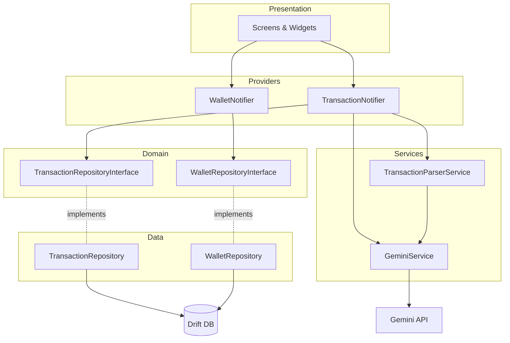
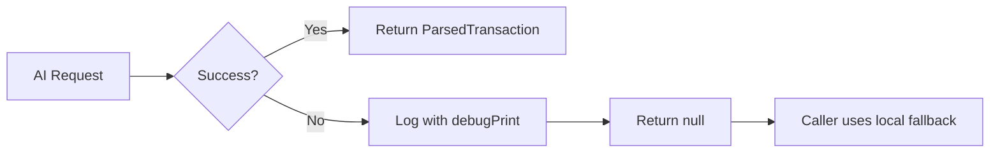

# Design Document: Codebase Refactoring

## Overview

This design covers a two-phase refactoring of the DuaSaku Flutter finance app:

**Phase 1 — Steering File Overhaul** (Requirements 1–7): Update `.kiro/steering/duasaku.md` with modern Riverpod 2.x patterns, service layer architecture, domain layer interfaces, error handling (Result pattern), database migration strategy, deep link schema, and background sync documentation.

**Phase 2 — Code Refactoring** (Requirements 8–13): Extract Gemini AI logic into a dedicated service, fix hardcoded colors in SecurityWrapper, strengthen lint rules, remove `print()` statements, add abstract repository interfaces, and implement baseline unit tests with property-based testing for critical logic.

### Design Rationale

The refactoring addresses technical debt identified during a full audit. The steering file updates ensure all developers follow consistent, modern patterns. The code changes enforce separation of concerns (AI logic out of repositories), theming compliance, and testability (abstract interfaces enable mocking).

---

## Architecture

### Current Architecture Issues

```
┌─────────────────────────────────────────────────┐
│ TransactionRepository (CURRENT - PROBLEMATIC)    │
├─────────────────────────────────────────────────┤
│ • Database CRUD operations                       │
│ • Wallet balance adjustments                     │
│ • Gemini AI text parsing  ← VIOLATION            │
│ • Gemini AI receipt scanning  ← VIOLATION        │
│ • Local fallback parsing  ← MISPLACED            │
└─────────────────────────────────────────────────┘
```

### Target Architecture



### Dependency Direction (Enforced)

```
Presentation → Providers → Domain (interfaces) ← Data (implementations)
                    ↓
               Services (AI, parsing)
```

---

## Components and Interfaces

### 1. GeminiService (`lib/services/gemini_service.dart`)

Encapsulates all Google Generative AI interactions.

```dart
class GeminiService {
  final String _apiKey;

  GeminiService(this._apiKey);

  /// Parses transaction text using Gemini AI.
  /// Returns structured data or null if AI is unavailable.
  Future<ParsedTransaction?> parseTransactionText({
    required String inputText,
    required List<WalletInfo> wallets,
    required List<CategoryInfo> categories,
  });

  /// Scans a receipt image and extracts transaction details.
  /// Returns structured data or null if AI is unavailable.
  Future<ParsedTransaction?> scanReceipt({
    required String base64Image,
    required String mimeType,
  });
}
```

### 2. TransactionParserService (`lib/services/transaction_parser_service.dart`)

Orchestrates parsing with AI-first, local-fallback strategy.

```dart
class TransactionParserService {
  final GeminiService _geminiService;

  TransactionParserService(this._geminiService);

  /// Parses transaction text. Tries AI first, falls back to local parsing.
  Future<ParsedTransaction> parseTransaction({
    required String inputText,
    required List<WalletInfo> wallets,
    required List<CategoryInfo> categories,
  });

  /// Local parsing fallback — pure function, fully testable.
  ParsedTransaction parseLocally({
    required String text,
    required List<WalletInfo> wallets,
    required List<CategoryInfo> categories,
  });
}
```

### 3. Abstract Repository Interfaces

**TransactionRepositoryInterface** (`lib/features/transactions/domain/transaction_repository_interface.dart`):

```dart
abstract class TransactionRepositoryInterface {
  Stream<List<TransactionModel>> fetchTransactions(String userId);
  Future<void> insertTransaction(TransactionModel transaction);
  Future<void> deleteTransaction(int id);
  Future<void> syncPendingTransactions();
}
```

**WalletRepositoryInterface** (`lib/features/wallets/domain/wallet_repository_interface.dart`):

```dart
abstract class WalletRepositoryInterface {
  Future<List<WalletModel>> getWallets(String userId);
  Stream<List<WalletModel>> watchWallets(String userId);
  Future<void> createWallet(WalletModel wallet);
  Future<void> updateWallet(WalletModel wallet);
  Future<void> deleteWallet(String walletId);
}
```

### 4. SecurityWrapper (Refactored)

Replace all hardcoded colors with theme-aware references:

| Current (Hardcoded) | Target (Theme-aware) |
|---------------------|---------------------|
| `Color(0xFF0D0E12)` | `Theme.of(context).colorScheme.surface` |
| `Color(0xFF06B6D4)` | `Theme.of(context).colorScheme.primary` |
| `Color(0xFFEF4444)` | `Theme.of(context).colorScheme.error` |
| `Colors.white` | `Theme.of(context).colorScheme.onSurface` |
| `Colors.white70` | `Theme.of(context).colorScheme.onSurface.withOpacity(0.7)` |

### 5. Result Pattern (`lib/core/utils/result.dart`)

```dart
sealed class Result<T, E> {
  const Result();
}

final class Success<T, E> extends Result<T, E> {
  final T value;
  const Success(this.value);
}

final class Failure<T, E> extends Result<T, E> {
  final E error;
  const Failure(this.error);
}
```

---

## Data Models

### ParsedTransaction (New — Service Layer Output)

```dart
class ParsedTransaction {
  final double amount;
  final String category;
  final String type; // 'income', 'expense'
  final String? walletId;
  final String notes;

  const ParsedTransaction({
    required this.amount,
    required this.category,
    required this.type,
    this.walletId,
    required this.notes,
  });
}
```

### WalletInfo / CategoryInfo (Lightweight DTOs for Service Layer)

```dart
class WalletInfo {
  final String id;
  final String name;
  final String type;
  const WalletInfo({required this.id, required this.name, required this.type});
}

class CategoryInfo {
  final String name;
  final String type;
  const CategoryInfo({required this.name, required this.type});
}
```

### Existing Models (Unchanged)

- `TransactionModel` — remains in `lib/features/transactions/domain/models/`
- `WalletModel` — remains in `lib/features/wallets/domain/models/`

---

## Correctness Properties

*A property is a characteristic or behavior that should hold true across all valid executions of a system — essentially, a formal statement about what the system should do. Properties serve as the bridge between human-readable specifications and machine-verifiable correctness guarantees.*

### Property 1: Amount Parsing Round-Trip

*For any* valid numeric amount and any supported multiplier format (plain number, "k"/"rb"/"ribu" for thousands, "jt"/"juta" for millions), formatting the amount as a transaction string and parsing it with the local parser SHALL extract a numeric value equal to the original amount.

**Validates: Requirements 13.4**

### Property 2: Transaction Type Detection from Keywords

*For any* input text containing at least one income keyword (from the defined set: "gaji", "salary", "bonus", "pemasukan", "income", etc.), the local parser SHALL classify the transaction type as "income". For any input text containing no income keywords, the parser SHALL classify it as "expense".

**Validates: Requirements 13.1**

### Property 3: Wallet Balance Conservation on Transfer

*For any* transfer transaction applied to a set of wallets, the sum of all wallet balance changes SHALL equal zero — money deducted from the source wallet equals money added to the destination wallet.

**Validates: Requirements 13.2, 13.5**

### Property 4: Income/Expense Balance Symmetry

*For any* income transaction of amount A applied to a wallet, the wallet balance SHALL increase by exactly A. For any expense transaction of amount A, the wallet balance SHALL decrease by exactly A. The net effect on the single wallet equals +A or -A respectively.

**Validates: Requirements 13.2, 13.5**

---

## Error Handling

### Strategy by Layer

| Layer | Error Handling |
|-------|---------------|
| **Services** (GeminiService) | Return `null` on AI failure; caller uses fallback. Catch all API exceptions internally. |
| **TransactionParserService** | Always returns a `ParsedTransaction` — uses local fallback if AI fails. Never throws for expected failures. |
| **Repositories** | Use `Result<T, AppError>` for operations that can fail expectedly (not found, constraint violation). Rethrow truly unexpected errors. |
| **Providers/Notifiers** | Catch `Result.Failure` and map to user-facing error states via `AsyncValue.error`. |
| **SecurityWrapper** | Graceful degradation — if NTP check fails (offline), do not lock user out. |

### GeminiService Error Flow



### Print Statement Replacement Strategy

| Current Pattern | Replacement |
|----------------|-------------|
| `print('debug info')` | Remove entirely |
| `print('Error: $e')` | `debugPrint('Context: $e')` |
| `print('Gemini Parsing Error: $e...')` | `debugPrint('[GeminiService] Parse failed: $e')` |
| `print('Gemini OCR Error: $e...')` | `debugPrint('[GeminiService] OCR failed: $e')` |

---

## Testing Strategy

### Dual Testing Approach

**Unit Tests (example-based):**
- Verify specific parsing examples (known inputs → expected outputs)
- Verify SecurityWrapper renders correctly with theme colors (widget test)
- Verify repository interface compliance (concrete class implements abstract)
- Verify analysis_options.yaml contains required rules

**Property-Based Tests:**
- Amount parsing round-trip (Property 1)
- Type detection from keywords (Property 2)
- Wallet balance conservation on transfers (Property 3)
- Income/expense balance symmetry (Property 4)

### Property-Based Testing Configuration

- **Library:** `dart_check` (Dart property-based testing library, or `glados` as alternative)
- **Minimum iterations:** 100 per property
- **Tag format:** `// Feature: codebase-refactoring, Property {N}: {description}`

### Test File Structure

```
test/
├── features/
│   ├── transactions/
│   │   ├── domain/
│   │   │   └── transaction_model_test.dart
│   │   └── services/
│   │       └── transaction_parser_service_test.dart  ← Properties 1, 2
│   └── wallets/
│       └── data/
│           └── wallet_balance_test.dart  ← Properties 3, 4
└── services/
    └── gemini_service_test.dart  ← Example-based (mocked)
```

### What Is NOT Tested with PBT

- Steering file content (Requirements 1–7) — manual review / smoke checks
- SecurityWrapper theming (Requirement 9) — widget tests with specific theme
- Lint rule configuration (Requirement 10) — `flutter analyze` pass/fail
- Print removal (Requirement 11) — grep verification
- Interface existence (Requirement 12) — compilation check

### Test Dependencies to Add

```yaml
dev_dependencies:
  flutter_test:
    sdk: flutter
  mockito: ^5.4.0
  build_runner: ^2.15.0
  glados: ^1.1.1  # Property-based testing for Dart
```
