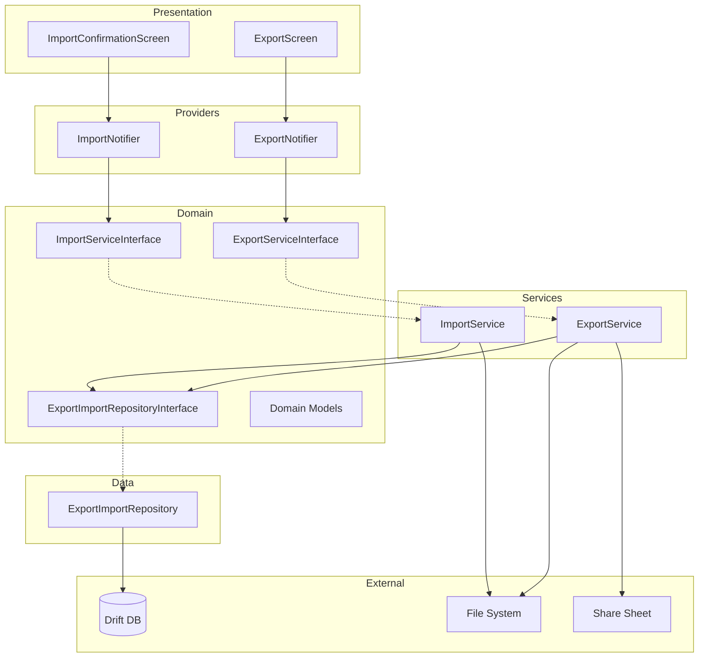

# Design Document: Export/Import Data

## Overview

Fitur Export/Import Data menyediakan mekanisme bagi pengguna DuaSaku untuk mengekspor data keuangan dalam dua format (CSV selektif dan JSON full backup) serta merestorasi data dari file JSON backup. Arsitektur fitur ini mengikuti Feature-based Clean Architecture yang sudah ada di proyek, dengan penambahan service layer khusus untuk operasi export/import yang berjalan di background isolate.

### Key Design Decisions

1. **Export Engine sebagai Service (bukan Repository)** — Export/import melibatkan file I/O, serialization, dan ZIP compression yang bukan operasi database murni. Sesuai aturan arsitektur, logic ini masuk ke service layer.
2. **Background Isolate untuk heavy operations** — Serialization JSON dan CSV generation dijalankan di `Isolate.run` agar UI tetap responsif. Data dikirim ke isolate sebagai plain Dart objects (Map/List).
3. **Repository tetap handle database reads** — Service memanggil repository untuk mengambil data, lalu memproses serialization sendiri.
4. **Temp file management** — File export disimpan di temporary directory dan dibersihkan setelah share selesai atau saat app lifecycle event.
5. **Destructive import dengan single transaction** — Restore menghapus semua data existing dan insert data baru dalam satu database transaction untuk menjamin atomicity.

## Architecture



### Dependency Flow

```
presentation → providers → domain (interfaces) ← services/data (implementations)
```

- `ExportNotifier` dan `ImportNotifier` depend on abstract interfaces
- `ExportService` dan `ImportService` implement domain interfaces
- `ExportImportRepository` handles all database read/write operations
- Background isolates receive raw data (Maps/Lists) — no Drift dependency in isolate

## Components and Interfaces

### Feature Directory Structure

```
lib/features/export_import/
├── data/
│   └── export_import_repository.dart       # Concrete repository (Drift operations)
├── domain/
│   ├── models/
│   │   ├── backup_metadata.dart            # BackupMetadata model
│   │   ├── export_config.dart              # ExportConfig (type, date range, format)
│   │   ├── export_progress.dart            # ExportProgress state
│   │   ├── export_result.dart              # ExportResult (file path, stats)
│   │   ├── import_preview.dart             # ImportPreview (summary counts)
│   │   ├── import_progress.dart            # ImportProgress state
│   │   └── data_type.dart                  # DataType enum
│   ├── export_service_interface.dart       # Abstract export service
│   ├── import_service_interface.dart       # Abstract import service
│   └── export_import_repository_interface.dart  # Abstract repository
├── presentation/
│   ├── screens/
│   │   ├── export_screen.dart              # Main export screen with tabs
│   │   └── import_confirmation_screen.dart # Import preview + confirm
│   └── widgets/
│       ├── data_type_selector.dart         # Checkbox list for CSV types
│       ├── date_range_picker.dart          # Date range filter widget
│       ├── export_progress_card.dart       # Progress indicator card
│       ├── import_summary_card.dart        # Data summary card
│       └── security_warning_dialog.dart    # Security warning for backup
├── providers/
│   ├── export_provider.dart                # ExportNotifier + providers
│   └── import_provider.dart                # ImportNotifier + providers
└── services/
    ├── export_service.dart                 # Export engine implementation
    ├── import_service.dart                 # Import engine implementation
    └── isolate_helpers.dart                # Isolate entry points for serialization
```

### Domain Interfaces

#### ExportServiceInterface

```dart
abstract class ExportServiceInterface {
  /// Exports selected data types as CSV files.
  /// Returns path to the generated file (CSV or ZIP).
  Future<Result<ExportResult, AppError>> exportCsv(ExportConfig config);

  /// Exports full database backup as JSON.
  /// Returns path to the generated JSON file.
  Future<Result<ExportResult, AppError>> exportJsonBackup();

  /// Opens native share sheet with the exported file.
  Future<Result<void, AppError>> shareFile(String filePath, String mimeType);

  /// Cleans up temporary export files.
  Future<void> cleanupTempFiles();
}
```

#### ImportServiceInterface

```dart
abstract class ImportServiceInterface {
  /// Validates and previews a backup file without importing.
  /// Returns summary of data counts for user confirmation.
  Future<Result<ImportPreview, AppError>> previewBackup(String filePath);

  /// Executes full restore from a validated backup file.
  /// Destructive: replaces all existing data.
  Future<Result<ImportResult, AppError>> restoreBackup(
    String filePath, {
    required void Function(ImportProgress) onProgress,
  });
}
```

#### ExportImportRepositoryInterface

```dart
abstract class ExportImportRepositoryInterface {
  // Read operations for export
  Future<Result<List<Map<String, dynamic>>, AppError>> getWalletsRaw(String userId);
  Future<Result<List<Map<String, dynamic>>, AppError>> getCategoriesRaw(String userId);
  Future<Result<List<Map<String, dynamic>>, AppError>> getTransactionsRaw(
    String userId, {
    DateTime? startDate,
    DateTime? endDate,
  });
  Future<Result<List<Map<String, dynamic>>, AppError>> getBudgetsRaw(
    String userId, {
    DateTime? startDate,
    DateTime? endDate,
  });
  Future<Result<List<Map<String, dynamic>>, AppError>> getRecurringTransactionsRaw(
    String userId, {
    DateTime? startDate,
    DateTime? endDate,
  });
  Future<Result<List<Map<String, dynamic>>, AppError>> getRecurringExecutionLogsRaw(String userId);
  Future<Result<List<Map<String, dynamic>>, AppError>> getGoalsRaw(
    String userId, {
    DateTime? startDate,
    DateTime? endDate,
  });
  Future<Result<List<Map<String, dynamic>>, AppError>> getGoalDepositsRaw(
    String userId, {
    DateTime? startDate,
    DateTime? endDate,
  });
  Future<Result<List<Map<String, dynamic>>, AppError>> getBudgetAlertsRaw(
    String userId, {
    DateTime? startDate,
    DateTime? endDate,
  });
  Future<Result<List<Map<String, dynamic>>, AppError>> getBudgetAlertPreferencesRaw(String userId);
  Future<Result<List<Map<String, dynamic>>, AppError>> getBudgetAlertThresholdStatusRaw(String userId);

  // Resolved names for CSV enrichment
  Future<Result<Map<String, String>, AppError>> getWalletNameMap(String userId);
  Future<Result<Map<String, String>, AppError>> getCategoryNameMap(String userId);

  // Destructive restore operation (single transaction)
  Future<Result<void, AppError>> restoreFullBackup(Map<String, List<Map<String, dynamic>>> data);
}
```

### Provider Architecture

```dart
// --- Export Providers ---

final exportImportRepositoryProvider = Provider<ExportImportRepositoryInterface>((ref) {
  final db = ref.watch(appDatabaseProvider);
  return ExportImportRepository(db);
});

final exportServiceProvider = Provider<ExportServiceInterface>((ref) {
  final repo = ref.watch(exportImportRepositoryProvider);
  return ExportService(repo);
});

final exportNotifierProvider = AsyncNotifierProvider<ExportNotifier, ExportState>(() {
  return ExportNotifier();
});

// --- Import Providers ---

final importServiceProvider = Provider<ImportServiceInterface>((ref) {
  final repo = ref.watch(exportImportRepositoryProvider);
  return ImportService(repo);
});

final importNotifierProvider = AsyncNotifierProvider<ImportNotifier, ImportState>(() {
  return ImportNotifier();
});
```

## Data Models

### BackupMetadata

```dart
class BackupMetadata {
  final String appVersion;
  final int schemaVersion;
  final String exportedAt;      // ISO 8601
  final String deviceId;
  final String exportedBy;      // Always "duasaku"

  const BackupMetadata({
    required this.appVersion,
    required this.schemaVersion,
    required this.exportedAt,
    required this.deviceId,
    this.exportedBy = 'duasaku',
  });

  factory BackupMetadata.fromJson(Map<String, dynamic> json);
  Map<String, dynamic> toJson();
}
```

### ExportConfig

```dart
class ExportConfig {
  final Set<DataType> selectedTypes;
  final DateRangeFilter dateRange;

  const ExportConfig({
    required this.selectedTypes,
    required this.dateRange,
  });
}
```

### DataType Enum

```dart
enum DataType {
  transactions,
  wallets,
  categories,
  budgets,
  recurringTransactions,
  goals,
  goalDeposits,
  budgetAlerts;

  /// Column used for date filtering per type.
  String get dateColumn => switch (this) {
    DataType.transactions => 'date',
    _ => 'createdAt',
  };
}
```

### DateRangeFilter

```dart
sealed class DateRangeFilter {
  const DateRangeFilter();

  DateTime? get startDate;
  DateTime? get endDate;
}

class AllTime extends DateRangeFilter { ... }
class ThisMonth extends DateRangeFilter { ... }
class LastMonth extends DateRangeFilter { ... }
class Last3Months extends DateRangeFilter { ... }
class ThisYear extends DateRangeFilter { ... }
class CustomRange extends DateRangeFilter {
  final DateTime start;
  final DateTime end;
  ...
}
```

### ExportProgress / ImportProgress

```dart
class ExportProgress {
  final double percentage;        // 0.0 - 1.0
  final String currentTable;      // Table being processed
  final Duration? estimatedRemaining;

  const ExportProgress({
    required this.percentage,
    required this.currentTable,
    this.estimatedRemaining,
  });
}

class ImportProgress {
  final double percentage;
  final String currentTable;
  final Duration? estimatedRemaining;

  const ImportProgress({
    required this.percentage,
    required this.currentTable,
    this.estimatedRemaining,
  });
}
```

### ImportPreview

```dart
class ImportPreview {
  final BackupMetadata metadata;
  final int walletCount;
  final int categoryCount;
  final int transactionCount;
  final int budgetCount;
  final int goalCount;
  final int recurringTransactionCount;
  final int budgetAlertCount;
  final int fileSizeBytes;

  const ImportPreview({ ... });
}
```

### ExportResult

```dart
class ExportResult {
  final String filePath;
  final String mimeType;
  final String fileName;
  final int recordCount;

  const ExportResult({
    required this.filePath,
    required this.mimeType,
    required this.fileName,
    required this.recordCount,
  });
}
```

### JSON Backup Structure

```json
{
  "metadata": {
    "appVersion": "1.0.0",
    "schemaVersion": 7,
    "exportedAt": "2024-01-15T10:30:00.000Z",
    "deviceId": "abc123",
    "exportedBy": "duasaku"
  },
  "data": {
    "wallets": [...],
    "categories": [...],
    "transactions": [...],
    "budgets": [...],
    "recurringTransactions": [...],
    "recurringExecutionLogs": [...],
    "goals": [...],
    "goalDeposits": [...],
    "budgetAlerts": [...],
    "budgetAlertPreferences": [...],
    "budgetAlertThresholdStatus": [...]
  }
}
```

### CSV File Naming

- Single type: `duasaku_{type}_{YYYY-MM-DD_HHmmss}.csv`
- Multiple types (ZIP): `duasaku_export_{YYYY-MM-DD_HHmmss}.zip`
- JSON backup: `duasaku_backup_{YYYY-MM-DD_HHmmss}.json`

### Background Isolate Strategy

Heavy operations run in `Isolate.run`:

```dart
// Export: serialize data to CSV/JSON string
final csvContent = await Isolate.run(() {
  return _generateCsvContent(rawData, headers);
});

// Import: parse and validate JSON
final parsedData = await Isolate.run(() {
  return _parseAndValidateBackup(jsonString);
});
```

Data passed to isolates must be plain Dart types (`Map`, `List`, `String`, `int`, `double`, `bool`) — no Drift objects or Flutter types.

### Temp File Management

- Export files are written to `getTemporaryDirectory()` path
- Files are cleaned up after share sheet completes or is cancelled
- A cleanup routine runs on app startup to remove stale temp files older than 24 hours
- File naming includes timestamp to avoid collisions

### Import Insertion Order (Foreign Key Constraints)

```
1. Wallets
2. Categories
3. Transactions (depends on Wallets, Categories)
4. Budgets (depends on Categories)
5. RecurringTransactions (depends on Wallets, Categories)
6. RecurringExecutionLogs (depends on RecurringTransactions, Transactions)
7. Goals (depends on Wallets)
8. GoalDeposits (depends on Goals)
9. BudgetAlerts
10. BudgetAlertPreferences
11. BudgetAlertThresholdStatus
```


## Correctness Properties

*A property is a characteristic or behavior that should hold true across all valid executions of a system — essentially, a formal statement about what the system should do. Properties serve as the bridge between human-readable specifications and machine-verifiable correctness guarantees.*

### Property 1: Full Database Round-Trip

*For any* valid database state (with consistent foreign key relationships across all 11 tables), exporting to JSON and then importing (restoring) the resulting file SHALL produce a database state where every table contains records equivalent to the original state — same field values, same record counts, same relationships.

**Validates: Requirements 8.1, 3.3, 4.5, 8.3, 8.5**

### Property 2: BackupMetadata Serialization Round-Trip

*For any* valid `BackupMetadata` object (with valid appVersion string, positive schemaVersion integer, ISO 8601 exportedAt timestamp, non-empty deviceId, and exportedBy = "duasaku"), serializing to JSON via `toJson()` and then deserializing via `fromJson()` SHALL produce an object with identical field values.

**Validates: Requirements 8.4**

### Property 3: CSV Output Count Matches Selection

*For any* non-empty subset of `DataType` values, the export engine SHALL produce exactly one CSV file per selected type when the subset has one element (output is a single CSV), or a ZIP archive containing exactly N CSV files when the subset has N > 1 elements.

**Validates: Requirements 1.2, 1.7**

### Property 4: CSV Structure Correctness

*For any* `DataType` and any non-empty dataset for that type, the generated CSV SHALL: (a) begin with UTF-8 BOM bytes (0xEF, 0xBB, 0xBF), (b) have a first row containing column headers matching the table schema, and (c) when the type is Transactions, include resolved wallet name and category name columns with non-null values for records that have valid walletId/categoryId references.

**Validates: Requirements 1.3, 1.4, 1.5**

### Property 5: Date Range Filter Correctness

*For any* `DataType`, any set of records with varying date values, and any `DateRangeFilter` with start and end dates, the exported CSV SHALL contain only records whose relevant date field (field `date` for Transactions, field `createdAt` for all other types) falls within the inclusive range [startDate, endDate]. When the filter is `AllTime`, all records SHALL be included.

**Validates: Requirements 2.3, 2.4, 2.5**

### Property 6: Backup Completeness

*For any* non-empty database state, the JSON backup export SHALL contain: (a) a root-level `metadata` object with all required fields (appVersion, schemaVersion, exportedAt, deviceId, exportedBy), and (b) a `data` object with keys for all 11 tables, where each table's array length equals the number of records in the corresponding database table.

**Validates: Requirements 3.1, 3.2, 3.5**

### Property 7: Backup Filename Format

*For any* export timestamp, the generated JSON backup filename SHALL match the pattern `duasaku_backup_{YYYY-MM-DD_HHmmss}.json` where the date and time components correspond to the export timestamp.

**Validates: Requirements 3.4**

### Property 8: Metadata Validation Rejects Invalid Files

*For any* JSON object that either (a) lacks a `metadata` field, (b) has a `metadata` field without `exportedBy`, or (c) has `exportedBy` with a value other than "duasaku", the import engine SHALL reject the file and return a validation error.

**Validates: Requirements 4.1, 4.2**

### Property 9: Schema Version Strict Match

*For any* backup file with a `schemaVersion` value that differs from the current app's schema version, the import engine SHALL reject the import. When backup schema > current schema, the error message SHALL indicate the user needs to update the app. When backup schema < current schema, the error message SHALL indicate the backup is from an older incompatible version.

**Validates: Requirements 4.7**

### Property 10: Foreign Key Consistency Validation

*For any* backup data where a record references a foreign key ID (walletId, categoryId, goalId, recurringTransactionId) that does not exist in the corresponding parent table's data within the same backup, the import engine SHALL reject the file and report which table and record has the inconsistent reference.

**Validates: Requirements 5.2**

### Property 11: Required Fields Validation

*For any* record in a backup file that is missing one or more required fields as defined by the table schema, the import engine SHALL reject the file and report which table, record, and fields are missing.

**Validates: Requirements 5.6**

### Property 12: MIME Type Mapping Correctness

*For any* export result, the MIME type SHALL be: "text/csv" when the output is a single CSV file, "application/zip" when the output contains multiple CSV files in a ZIP archive, and "application/json" when the output is a JSON backup file.

**Validates: Requirements 6.3, 6.4**

## Error Handling

### Error Types and Responses

| Error Scenario | AppError Type | User Message (i18n key) |
|---|---|---|
| Malformed JSON file | `ValidationError` | `export_import.error.malformed_json` |
| Missing/invalid metadata | `ValidationError` | `export_import.error.not_duasaku_backup` |
| Schema version mismatch (newer) | `ValidationError` | `export_import.error.update_app_required` |
| Schema version mismatch (older) | `ValidationError` | `export_import.error.backup_too_old` |
| FK consistency violation | `ValidationError` | `export_import.error.data_inconsistent` |
| Missing required fields | `ValidationError` | `export_import.error.missing_fields` |
| File not JSON format | `ValidationError` | `export_import.error.not_json_file` |
| Database transaction failure | `DatabaseError` | `export_import.error.restore_failed` |
| File system write failure | `UnknownError` | `export_import.error.file_write_failed` |
| Share sheet unavailable | `UnknownError` | `export_import.error.share_failed` |
| File too large (>50MB) | `ValidationError` | `export_import.error.file_too_large` |

### Error Flow

```dart
// In ExportNotifier
Future<void> exportData(ExportConfig config) async {
  state = const AsyncLoading();
  final service = ref.read(exportServiceProvider);
  
  final result = await service.exportCsv(config);
  switch (result) {
    case Success(:final value):
      // Share the file
      final shareResult = await service.shareFile(value.filePath, value.mimeType);
      switch (shareResult) {
        case Success():
          state = AsyncData(ExportState.success(value));
        case Failure(:final error):
          // Share failed — offer fallback to save to Downloads
          state = AsyncData(ExportState.shareFailed(value, error));
      }
    case Failure(:final error):
      state = AsyncError(error, StackTrace.current);
  }
}
```

### Rollback Strategy

The import restore operation uses Drift's `transaction()` method:

```dart
Future<Result<void, AppError>> restoreFullBackup(
  Map<String, List<Map<String, dynamic>>> data,
) async {
  try {
    await _db.transaction(() async {
      // 1. Delete all existing data (reverse FK order)
      await _deleteAllTables();
      
      // 2. Insert in FK-respecting order
      await _insertWallets(data['wallets']!);
      await _insertCategories(data['categories']!);
      await _insertTransactions(data['transactions']!);
      // ... remaining tables
    });
    return const Success(null);
  } on Exception catch (e, stack) {
    // Transaction automatically rolled back by Drift
    return Failure(AppError.database(
      'Restore failed: ${e.toString()}',
      stackTrace: stack,
    ));
  }
}
```

If any operation within the transaction throws, Drift automatically rolls back all changes, preserving the original database state.

### Provider Invalidation After Restore

After successful restore, all root providers must be invalidated to refresh UI:

```dart
void _invalidateAllProviders() {
  // Invalidate all feature providers that cache data
  ref.invalidate(walletProvider);
  ref.invalidate(transactionListProvider);
  ref.invalidate(budgetProvider);
  ref.invalidate(goalNotifierProvider);
  ref.invalidate(recurringTransactionProvider);
  // ... other data providers
}
```

## Testing Strategy

### Property-Based Testing

This feature is well-suited for property-based testing due to:
- Clear round-trip properties (serialize → deserialize)
- Data transformation logic (CSV generation, date filtering)
- Validation logic with varied inputs (malformed data, missing fields, broken FKs)

**Library:** `glados` (already in dev_dependencies)

**Configuration:**
- Minimum 100 iterations per property test
- Each test tagged with property reference comment

**Tag format:** `// Feature: export-import-data, Property {N}: {title}`

### Test Structure

```
test/features/export_import/
├── unit/
│   ├── backup_metadata_test.dart           # Property 2: metadata round-trip
│   ├── csv_generator_test.dart             # Property 3, 4: CSV output
│   ├── date_filter_test.dart               # Property 5: date range filtering
│   ├── backup_completeness_test.dart       # Property 6: backup structure
│   ├── filename_format_test.dart           # Property 7: filename pattern
│   ├── metadata_validation_test.dart       # Property 8: validation rejects invalid
│   ├── schema_version_test.dart            # Property 9: schema match
│   ├── fk_validation_test.dart             # Property 10: FK consistency
│   ├── required_fields_test.dart           # Property 11: required fields
│   └── mime_type_test.dart                 # Property 12: MIME mapping
├── property/
│   └── round_trip_test.dart                # Property 1: full round-trip
├── widget/
│   ├── export_screen_test.dart             # UI tests for export screen
│   └── import_confirmation_screen_test.dart # UI tests for import screen
└── integration/
    ├── export_flow_test.dart               # End-to-end export flow
    └── import_flow_test.dart               # End-to-end import flow
```

### Unit Tests (Example-Based)

Focus on:
- UI state transitions (export button disabled when no selection)
- Specific preset date range calculations (This Month, Last Month boundaries)
- File size threshold check (50MB boundary)
- Share sheet fallback behavior
- Security warning dialog display

### Property Tests

Each correctness property maps to one property-based test using `glados`:

```dart
// Example: Property 1 - Full Database Round-Trip
// Feature: export-import-data, Property 1: Full Database Round-Trip
Glados(any.validDatabaseState).test(
  'export then import produces equivalent database state',
  (dbState) async {
    // Arrange: populate database with generated state
    await repository.restoreFullBackup(dbState);
    
    // Act: export to JSON
    final exportResult = await exportService.exportJsonBackup();
    final jsonString = await File(exportResult.filePath).readAsString();
    
    // Act: clear and import
    final importResult = await importService.restoreBackup(exportResult.filePath);
    
    // Assert: all tables match original state
    final restoredState = await repository.getAllDataRaw(userId);
    expect(restoredState, equivalentTo(dbState));
  },
);
```

### Integration Tests

- Full export flow: select types → export → share sheet opens
- Full import flow: pick file → validate → preview → confirm → restore → UI refreshes
- Error scenarios: corrupt file, wrong schema version, FK violations
- Background isolate: verify export/import don't block UI thread

### Test Generators (for Glados)

Custom generators needed:
- `validDatabaseState` — generates consistent data across all tables with valid FK relationships
- `validBackupMetadata` — generates metadata with valid fields
- `validDateRange` — generates start/end date pairs where start ≤ end
- `randomDataTypeSubset` — generates non-empty subsets of DataType enum
- `malformedBackupJson` — generates JSON objects missing required structure
- `brokenFkBackup` — generates backup data with intentionally broken FK references
