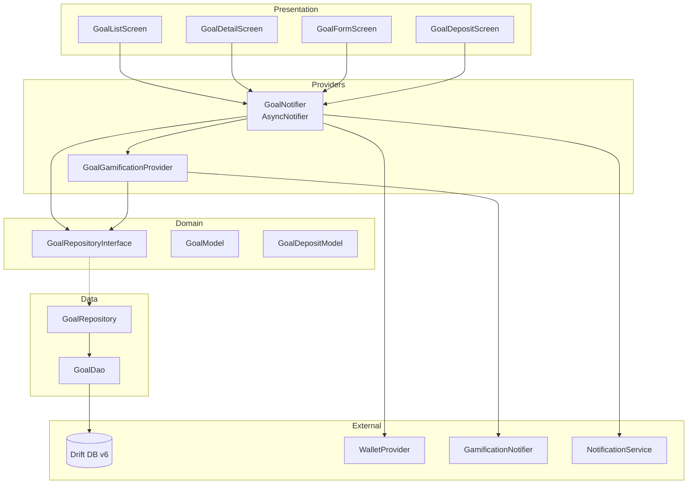
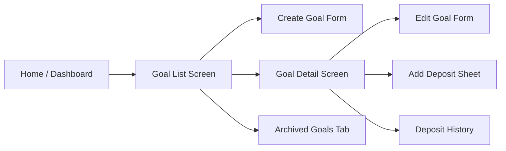

# Design Document: Financial Goals

## Overview

Financial Goals (Savings Target) memungkinkan pengguna DuaSaku menetapkan target tabungan, melacak progres secara visual, dan mendapatkan reward gamification saat mencapai milestone. Fitur ini mendukung dua mode tracking: **manual deposit** dan **automatic wallet balance tracking**.

Desain ini mengikuti arsitektur feature-based clean architecture yang sudah ada, menggunakan Riverpod `AsyncNotifier` untuk state management, Drift untuk persistence, dan mengintegrasikan dengan gamification system serta notification service yang sudah ada.

### Key Design Decisions

1. **Dual tracking mode** — Goal bisa di-track via manual deposit ATAU wallet balance sync, bukan keduanya sekaligus. Ini menyederhanakan state management dan menghindari konflik antara deposit manual dan perubahan saldo wallet.
2. **Completion is permanent** — Setelah goal marked completed, status tidak bisa revert meskipun wallet balance turun. Ini memberikan sense of achievement yang konsisten.
3. **Cap at target** — Current amount tidak pernah melebihi target amount. Over-funding ditolak untuk menjaga integritas progress calculation.
4. **Cascade delete** — Menghapus goal otomatis menghapus semua deposit records terkait (FK cascade).

## Architecture

### Feature Structure

```
lib/features/goals/
├── data/
│   ├── goal_repository.dart          # Concrete GoalRepositoryInterface impl
│   └── goal_dao.dart                 # Drift DAO for Goals & GoalDeposits
├── domain/
│   ├── models/
│   │   ├── goal_model.dart           # Domain model for Goal
│   │   ├── goal_deposit_model.dart   # Domain model for GoalDeposit
│   │   └── goal_status.dart          # Enum: active, completed, archived
│   └── goal_repository_interface.dart # Abstract repository interface
├── presentation/
│   ├── screens/
│   │   ├── goal_list_screen.dart     # Main goals list
│   │   ├── goal_detail_screen.dart   # Goal detail + deposit history
│   │   ├── goal_form_screen.dart     # Create/Edit goal form
│   │   └── goal_deposit_screen.dart  # Add deposit bottom sheet
│   └── widgets/
│       ├── goal_card.dart            # Goal summary card with progress
│       ├── goal_progress_bar.dart    # Animated progress bar + milestones
│       ├── milestone_marker.dart     # Individual milestone indicator
│       └── deposit_history_tile.dart # Deposit list item
├── providers/
│   ├── goal_provider.dart            # GoalNotifier (AsyncNotifier)
│   └── goal_gamification_provider.dart # S_goal score calculation
└── services/
    └── goal_notification_service.dart # Milestone & deadline notifications
```

### Component Diagram



## Components and Interfaces

### GoalRepositoryInterface

```dart
abstract class GoalRepositoryInterface {
  // Goal CRUD
  Future<Result<GoalModel, AppError>> createGoal(GoalModel goal);
  Future<Result<GoalModel, AppError>> getGoal(String goalId);
  Future<Result<void, AppError>> updateGoal(GoalModel goal);
  Future<Result<void, AppError>> deleteGoal(String goalId);

  // Goal queries
  Stream<List<GoalModel>> watchGoals(String userId, {GoalStatus? status});
  Future<Result<List<GoalModel>, AppError>> getGoals(String userId, {GoalStatus? status});

  // Deposit operations
  Future<Result<void, AppError>> addDeposit(GoalDepositModel deposit);
  Stream<List<GoalDepositModel>> watchDeposits(String goalId);
  Future<Result<List<GoalDepositModel>, AppError>> getDeposits(String goalId);

  // Wallet linking
  Future<Result<bool, AppError>> isWalletLinked(String walletId);
  Future<Result<GoalModel?, AppError>> getGoalByLinkedWallet(String walletId);

  // Completion
  Future<Result<void, AppError>> markCompleted(String goalId, DateTime completedAt);
  Future<Result<void, AppError>> archiveGoal(String goalId);
}
```

### GoalNotifier (AsyncNotifier)

```dart
class GoalNotifier extends AsyncNotifier<List<GoalModel>> {
  @override
  Future<List<GoalModel>> build() async {
    final repo = ref.watch(goalRepositoryProvider);
    final user = ref.watch(userProvider);
    // Subscribe to stream for real-time updates
    // Return initial data via completer pattern (same as TransactionNotifier)
  }

  Future<Result<GoalModel, AppError>> createGoal({...});
  Future<Result<void, AppError>> addDeposit(String goalId, double amount, {String? note});
  Future<Result<void, AppError>> updateGoal(GoalModel goal);
  Future<Result<void, AppError>> deleteGoal(String goalId);
  Future<void> syncWalletBalance(String goalId, double newBalance);
  Future<Result<void, AppError>> archiveGoal(String goalId);
}
```

### GoalGamificationProvider

Calculates `S_goal` score (max 5 points) and triggers badge awards:

```dart
final goalGamificationProvider = Provider<GoalGamificationService>((ref) {
  return GoalGamificationService(ref);
});

class GoalGamificationService {
  /// Calculate S_goal: average completion % across active goals × 5
  double calculateSGoal(List<GoalModel> goals);

  /// Check and award milestone badges
  Future<List<String>> checkMilestoneBadges(GoalModel goal);

  /// Check completion count badges (triple_saver, savings_master)
  Future<List<String>> checkCompletionBadges(int completedCount);
}
```

### GoalNotificationService

```dart
class GoalNotificationService {
  /// Schedule milestone notification
  Future<void> notifyMilestone(GoalModel goal, int milestonePercent);

  /// Schedule deadline reminder (7 days and 1 day before)
  Future<void> scheduleDeadlineReminders(GoalModel goal);

  /// Cancel all notifications for a goal (on delete)
  Future<void> cancelGoalNotifications(String goalId);

  /// Notify goal completion
  Future<void> notifyCompletion(GoalModel goal);
}
```

## Data Models

### Drift Tables (Schema v6)

```dart
@TableIndex(name: 'idx_goals_user_id', columns: {#userId})
@TableIndex(name: 'idx_goals_status', columns: {#status})
@TableIndex(name: 'idx_goals_linked_wallet', columns: {#linkedWalletId})
class Goals extends Table {
  TextColumn get id => text()();
  TextColumn get userId => text()();
  TextColumn get name => text().withLength(min: 1, max: 100)();
  RealColumn get targetAmount => real()();
  RealColumn get currentAmount => real().withDefault(const Constant(0.0))();
  DateTimeColumn get deadline => dateTime().nullable()();
  TextColumn get icon => text()();
  TextColumn get color => text()();
  TextColumn get linkedWalletId => text()
      .nullable()
      .references(Wallets, #id, onDelete: KeyAction.setNull)();
  TextColumn get trackingMode => text()(); // 'manual' or 'wallet'
  TextColumn get status => text().withDefault(const Constant('active'))(); // 'active', 'completed', 'archived'
  DateTimeColumn get completedAt => dateTime().nullable()();
  TextColumn get notifiedMilestones => text().withDefault(const Constant(''))(); // comma-separated: "25,50,75"
  DateTimeColumn get createdAt => dateTime()();

  @override
  Set<Column> get primaryKey => {id};
}

@TableIndex(name: 'idx_goal_deposits_goal_id', columns: {#goalId})
class GoalDeposits extends Table {
  TextColumn get id => text()();
  TextColumn get goalId => text()
      .references(Goals, #id, onDelete: KeyAction.cascade)();
  RealColumn get amount => real()();
  TextColumn get note => text().nullable()();
  DateTimeColumn get createdAt => dateTime()();

  @override
  Set<Column> get primaryKey => {id};
}
```

### Domain Models

```dart
enum GoalStatus { active, completed, archived }

enum TrackingMode { manual, wallet }

class GoalModel {
  final String id;
  final String userId;
  final String name;
  final double targetAmount;
  final double currentAmount;
  final DateTime? deadline;
  final String icon;
  final String color;
  final String? linkedWalletId;
  final TrackingMode trackingMode;
  final GoalStatus status;
  final DateTime? completedAt;
  final Set<int> notifiedMilestones; // {25, 50, 75, 100}
  final DateTime createdAt;

  // Computed properties
  double get progressPercentage =>
      targetAmount > 0 ? (currentAmount / targetAmount).clamp(0.0, 1.0) : 0.0;

  int? get remainingDays =>
      deadline != null ? deadline!.difference(DateTime.now()).inDays : null;

  bool get isCompleted => status == GoalStatus.completed;

  int get currentMilestone {
    final pct = (progressPercentage * 100).floor();
    if (pct >= 100) return 100;
    if (pct >= 75) return 75;
    if (pct >= 50) return 50;
    if (pct >= 25) return 25;
    return 0;
  }
}

class GoalDepositModel {
  final String id;
  final String goalId;
  final double amount;
  final String? note;
  final DateTime createdAt;
}
```

### Database Migration (v5 → v6)

```dart
@override
int get schemaVersion => 6;

// In onUpgrade:
if (from < 6) {
  await m.createTable(goals);
  await m.createTable(goalDeposits);
  await m.createIndex(idxGoalsUserId);
  await m.createIndex(idxGoalsStatus);
  await m.createIndex(idxGoalsLinkedWallet);
  await m.createIndex(idxGoalDepositsGoalId);
}
```

Non-destructive migration — only adds new tables and indexes. No existing data is affected.

### Wallet Linking Mechanism

When a goal has `trackingMode == TrackingMode.wallet`:

1. **On goal creation**: `currentAmount` is set to the linked wallet's current balance.
2. **On wallet balance change**: `GoalNotifier` listens to `walletProvider` changes. When a linked wallet's balance changes, `syncWalletBalance` updates the goal's `currentAmount` to match.
3. **On wallet deletion**: The FK `onDelete: KeyAction.setNull` nullifies `linkedWalletId`. The `GoalNotifier` detects this and switches `trackingMode` to `manual`, retaining the last known amount.
4. **Constraint**: A wallet can only be linked to ONE active goal. `isWalletLinked()` checks this before allowing a link.

```dart
// In GoalNotifier.build():
ref.listen(walletProvider, (previous, next) {
  final wallets = next.valueOrNull ?? [];
  _syncLinkedGoals(wallets);
});

Future<void> _syncLinkedGoals(List<WalletModel> wallets) async {
  final goals = state.valueOrNull ?? [];
  for (final goal in goals) {
    if (goal.trackingMode == TrackingMode.wallet && goal.linkedWalletId != null) {
      final wallet = wallets.firstWhereOrNull((w) => w.id == goal.linkedWalletId);
      if (wallet != null && wallet.balance != goal.currentAmount) {
        await syncWalletBalance(goal.id, wallet.balance);
      }
    }
  }
}
```

### Gamification Integration

**S_goal calculation** (max 5 points):
```
S_goal = (average_completion_percentage_of_active_goals) × 5
```

Where `average_completion_percentage` = sum of all active goals' `progressPercentage` / count of active goals. If no active goals exist, `S_goal = 0`.

**Badge triggers:**
| Badge | Condition |
|-------|-----------|
| `quarter_saver` | Any goal reaches 25% |
| `half_way` | Any goal reaches 50% |
| `goal_achieved` | Any goal reaches 100% |
| `triple_saver` | 3 goals completed total |
| `savings_master` | 5 goals completed total |

The `GoalNotifier` calls `GoalGamificationService.checkMilestoneBadges()` after every deposit or wallet sync that changes `currentAmount`.

### Notification Scheduling

| Event | Timing | Condition |
|-------|--------|-----------|
| Milestone reached | Immediate | Progress crosses 25/50/75% AND milestone not already notified |
| Goal completed | Immediate | Progress reaches 100% |
| Deadline reminder | 7 days before | Goal < 75% complete |
| Urgent deadline | 1 day before | Goal not complete |

**Deduplication**: The `notifiedMilestones` field in the Goals table tracks which milestones have already triggered notifications. Before sending, the service checks this set.

**Deadline reminders** are scheduled via `flutter_local_notifications` zonedSchedule when a goal with a deadline is created or edited. They are cancelled on goal deletion or completion.

### UI Screen Flow



**GoalListScreen**: TabBar with "Active" and "Completed" tabs. FAB to create new goal. Each goal shown as a card with progress bar.

**GoalDetailScreen**: Full progress visualization, milestone markers, deposit history list, action buttons (deposit, edit, archive, delete).

**GoalFormScreen**: Form fields for name, target amount, deadline (optional date picker), icon picker, color picker, wallet selector (optional). Validation inline.

**GoalDepositScreen**: Bottom sheet with amount input, optional note, and submit button.

## Correctness Properties

*A property is a characteristic or behavior that should hold true across all valid executions of a system — essentially, a formal statement about what the system should do. Properties serve as the bridge between human-readable specifications and machine-verifiable correctness guarantees.*

### Property 1: Goal creation round-trip

*For any* valid goal creation input (valid name, positive target amount, optional future deadline, icon, color, optional wallet), creating the goal then reading it back from the repository SHALL produce an equivalent goal object with all fields preserved.

**Validates: Requirements 1.1, 1.8, 11.5**

### Property 2: Deposit sum invariant

*For any* sequence of valid deposit amounts applied to a goal, the goal's current amount SHALL equal the minimum of the sum of all deposits and the target amount: `currentAmount == min(sum(deposits), targetAmount)`.

**Validates: Requirements 3.1, 3.4, 11.1**

### Property 3: Progress percentage formula

*For any* goal with targetAmount > 0, the progress percentage SHALL equal `(currentAmount / targetAmount).clamp(0.0, 1.0)`. For targetAmount == 0 (invalid state), progress SHALL be 0.0.

**Validates: Requirements 5.1, 11.2**

### Property 4: Current amount cap invariant

*For any* sequence of deposits or wallet balance syncs applied to a goal, the current amount SHALL remain less than or equal to the target amount at all times: `currentAmount <= targetAmount`.

**Validates: Requirements 3.4, 6.2, 11.3**

### Property 5: Wallet-linked goal synchronization

*For any* goal with tracking mode "wallet" and a linked wallet, after a wallet balance change, the goal's current amount SHALL equal `min(wallet.balance, goal.targetAmount)`.

**Validates: Requirements 4.1, 4.2, 11.4**

### Property 6: Milestone check idempotence

*For any* goal at any progress level, applying the milestone check function N times (N ≥ 1) SHALL produce the same set of unlocked milestones as applying it once: `checkMilestones(goal) == checkMilestones(checkMilestones(goal))`.

**Validates: Requirements 8.5, 11.6**

### Property 7: Completed goal invariant

*For any* goal with status == completed, the current amount SHALL equal the target amount: `goal.currentAmount == goal.targetAmount`.

**Validates: Requirements 10.1, 11.7**

### Property 8: Input validation rejects invalid data

*For any* goal name with length < 1 or > 100 characters, OR target amount ≤ 0, OR deadline in the past, OR deposit amount ≤ 0, the system SHALL reject the operation and return a validation error without modifying state.

**Validates: Requirements 1.2, 1.3, 1.4, 3.2**

### Property 9: Tracking mode assignment

*For any* goal creation, if linkedWalletId is null then trackingMode SHALL be "manual", and if linkedWalletId is non-null then trackingMode SHALL be "wallet".

**Validates: Requirements 1.6, 1.7**

### Property 10: Completion permanence

*For any* goal that has been marked as completed, subsequent decreases in the linked wallet balance SHALL NOT change the goal status back to active. The status SHALL remain "completed" regardless of wallet balance changes.

**Validates: Requirements 10.5, 10.6**

### Property 11: S_goal health score calculation

*For any* set of active goals, the S_goal score SHALL equal `(average_progress_percentage × 5).clamp(0, 5)` where average_progress_percentage is the mean of all active goals' progress percentages. If no active goals exist, S_goal SHALL be 0.

**Validates: Requirements 7.6, 7.7**

### Property 12: Milestone badge awarding

*For any* goal whose progress crosses a milestone threshold (25%, 50%, 75%, 100%), the corresponding badge SHALL be added to the unlocked badges set if not already present. Badges already in the set SHALL not be duplicated.

**Validates: Requirements 7.1, 7.2, 7.3**

## Error Handling

### Error Categories

| Error Type | Scenario | Handling |
|-----------|----------|----------|
| `ValidationError` | Invalid name length, non-positive amount, past deadline, duplicate wallet link | Return `Failure(AppError.validation(...))`, display inline error in form |
| `NotFoundError` | Goal or wallet not found during operation | Return `Failure(AppError.notFound(...))`, show error message |
| `DatabaseError` | Drift constraint violation, write failure | Return `Failure(AppError.database(...))`, show retry option |
| Unexpected | Out of memory, corrupted DB | Rethrow — caught by global error handler |

### Validation Rules

```dart
Result<void, AppError> validateGoalCreation(GoalModel goal) {
  if (goal.name.isEmpty || goal.name.length > 100) {
    return Failure(AppError.validation('Goal name must be 1-100 characters'));
  }
  if (goal.targetAmount <= 0) {
    return Failure(AppError.validation('Target amount must be greater than zero'));
  }
  if (goal.deadline != null && goal.deadline!.isBefore(DateTime.now())) {
    return Failure(AppError.validation('Deadline cannot be in the past'));
  }
  return const Success(null);
}

Result<void, AppError> validateDeposit(double amount) {
  if (amount <= 0) {
    return Failure(AppError.validation('Deposit amount must be greater than zero'));
  }
  return const Success(null);
}
```

### Error Flow in Notifier

```dart
Future<Result<void, AppError>> addDeposit(String goalId, double amount, {String? note}) async {
  // 1. Validate
  final validation = validateDeposit(amount);
  if (validation case Failure(:final error)) return Failure(error);

  // 2. Get current goal
  final goalResult = await _repository.getGoal(goalId);
  if (goalResult case Failure(:final error)) return Failure(error);
  final goal = (goalResult as Success).value;

  // 3. Check cap
  final effectiveAmount = (goal.currentAmount + amount > goal.targetAmount)
      ? goal.targetAmount - goal.currentAmount
      : amount;
  if (effectiveAmount <= 0) {
    return Failure(AppError.validation('Goal is already fully funded'));
  }

  // 4. Persist deposit
  final deposit = GoalDepositModel(
    id: uuid.v4(),
    goalId: goalId,
    amount: effectiveAmount,
    note: note,
    createdAt: DateTime.now(),
  );
  final result = await _repository.addDeposit(deposit);
  if (result case Failure(:final error)) return Failure(error);

  // 5. Update goal currentAmount
  final updatedGoal = goal.copyWith(
    currentAmount: goal.currentAmount + effectiveAmount,
  );
  await _repository.updateGoal(updatedGoal);

  // 6. Check completion & milestones
  await _checkCompletionAndMilestones(updatedGoal);

  return const Success(null);
}
```

## Testing Strategy

### Property-Based Testing (PBT)

**Library**: `dart_check` (Dart property-based testing library)

**Configuration**: Minimum 100 iterations per property test.

**Tag format**: `// Feature: financial-goals, Property {N}: {property_text}`

Each of the 12 correctness properties above will be implemented as a single property-based test. Generators will produce:
- Random valid goal names (1-100 chars, various Unicode)
- Random positive doubles for amounts (0.01 to 999,999,999.0)
- Random future DateTimes for deadlines
- Random sequences of deposits
- Random wallet balance values

### Unit Tests (Example-Based)

| Area | Tests |
|------|-------|
| GoalModel computed properties | progressPercentage, remainingDays, currentMilestone |
| Validation edge cases | Empty string, exactly 100 chars, amount = 0.0, deadline = now |
| Wallet deletion handling | trackingMode switches to manual |
| Cascade delete | Goal deletion removes deposits |
| Status transitions | active → completed, active → archived |
| Badge count triggers | triple_saver at 3, savings_master at 5 |
| Notification scheduling | 7-day and 1-day reminders |

### Integration Tests

| Area | Tests |
|------|-------|
| Database migration v5→v6 | Tables created, indexes exist, FK constraints work |
| Stream reactivity | Deposit triggers UI update via watchGoals |
| Wallet provider integration | Wallet balance change propagates to goal |
| Gamification integration | S_goal updates in health score |
| Notification delivery | flutter_local_notifications receives correct payloads |

### Test File Structure

```
test/features/goals/
├── domain/
│   ├── goal_model_test.dart           # Unit tests for computed properties
│   └── goal_validation_test.dart      # Validation logic tests
├── data/
│   ├── goal_repository_test.dart      # Repository with in-memory DB
│   └── goal_dao_test.dart             # DAO query tests
├── providers/
│   ├── goal_notifier_test.dart        # Notifier state transitions
│   └── goal_gamification_test.dart    # S_goal and badge logic
├── services/
│   └── goal_notification_test.dart    # Notification scheduling logic
├── presentation/
│   ├── goal_list_screen_test.dart     # Widget tests
│   └── goal_progress_bar_test.dart    # Progress bar rendering
└── properties/
    └── goal_properties_test.dart      # All 12 PBT properties
```

