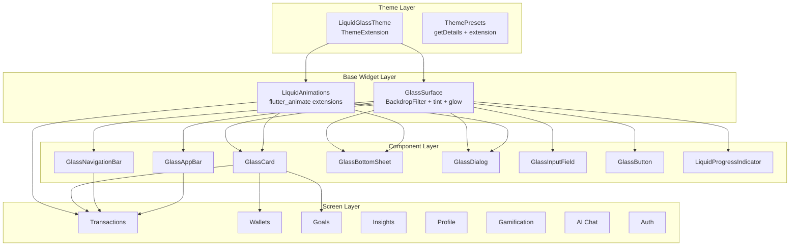

# Design Document: Liquid Glass UI

## Overview

This design implements a comprehensive "Liquid Glass" design system for the DuaSaku app — replacing the current opaque card-with-border approach with translucent, blurred glass surfaces and fluid liquid animations. The system is built as a layered architecture: a ThemeExtension provides design tokens, a base `GlassSurface` widget handles all glassmorphism rendering, and specialized widgets (GlassCard, GlassNavigationBar, etc.) extend it for specific use cases.

The design prioritizes:
- **Performance**: BackdropFilter is GPU-expensive — blur is limited to max 3 layers per screen and disabled entirely for list items in scrollable contexts.
- **Accessibility**: OS "Reduce Motion" and "Reduce Transparency" settings are respected. Dynamic contrast (4.5:1) is guaranteed even with animated backgrounds.
- **Theme consistency**: All glass tokens are theme-aware and adapt to the 3 existing presets (defaultPurple, rosePine, cyberpunk) in both dark and light modes.

## Architecture

The Liquid Glass system follows the existing feature-based clean architecture with components placed in `lib/core/` since they are shared across all features.



### File Structure

```
lib/core/
├── theme/
│   ├── theme_provider.dart          (existing — modified to register extension)
│   ├── premium_background.dart      (existing — wrapped with RepaintBoundary)
│   └── liquid_glass_theme.dart      (NEW — ThemeExtension class)
├── widgets/
│   ├── animated_card.dart           (existing — deprecated, replaced by GlassCard)
│   ├── glass/
│   │   ├── glass_surface.dart       (NEW — base glass container)
│   │   ├── glass_card.dart          (NEW — tappable glass card)
│   │   ├── glass_navigation_bar.dart (NEW — floating bottom nav)
│   │   ├── glass_app_bar.dart       (NEW — scroll-reactive app bar)
│   │   ├── glass_bottom_sheet.dart  (NEW — modal sheet)
│   │   ├── glass_dialog.dart        (NEW — alert/confirmation dialog)
│   │   ├── glass_input_field.dart   (NEW — text input with glass bg)
│   │   ├── glass_button.dart        (NEW — button with glass treatment)
│   │   └── liquid_progress_indicator.dart (NEW — liquid fill progress)
│   └── animations/
│       └── liquid_animations.dart   (NEW — flutter_animate extensions)
```

## Components and Interfaces

### LiquidGlassTheme (ThemeExtension)

```dart
@immutable
class LiquidGlassTheme extends ThemeExtension<LiquidGlassTheme> {
  final double blurSigma;
  final double surfaceOpacity;
  final Color borderGlowColor;
  final Color surfaceTintColor;
  final double innerHighlightOpacity;
  final Duration animationDuration;
  final Duration animationDurationFast;
  final Duration animationDurationSlow;
  final Curve animationCurve;

  const LiquidGlassTheme({
    required this.blurSigma,
    required this.surfaceOpacity,
    required this.borderGlowColor,
    required this.surfaceTintColor,
    required this.innerHighlightOpacity,
    required this.animationDuration,
    required this.animationDurationFast,
    required this.animationDurationSlow,
    required this.animationCurve,
  });

  @override
  LiquidGlassTheme copyWith({...});

  @override
  LiquidGlassTheme lerp(LiquidGlassTheme? other, double t);
}
```

**Access pattern:**
```dart
final glassTheme = Theme.of(context).extension<LiquidGlassTheme>()!;
```

### GlassSurface (Base Widget)

```dart
class GlassSurface extends StatelessWidget {
  final Widget child;
  final double? blurSigma;        // Override theme default
  final double? surfaceOpacity;   // Override theme default
  final double borderRadius;      // Default: 16.0
  final bool enableBlur;          // Default: true (false for list items)
  final EdgeInsetsGeometry? padding;

  // Reads MediaQuery for accessibility:
  // - boldText / highContrast → increase surfaceOpacity
  // - disableAnimations → skip animated transitions
  // Reads platform accessibility via MediaQuery.accessibleNavigation
}
```

**Key behavior:**
- When `enableBlur: false`, renders a solid semi-transparent surface (no BackdropFilter) — used for list items.
- Wraps itself in `RepaintBoundary` for GPU isolation.
- Checks `MediaQuery.of(context).accessibleNavigation` and platform "Reduce Transparency" to disable blur and increase opacity.

### GlassCard

```dart
class GlassCard extends StatefulWidget {
  final Widget child;
  final VoidCallback? onTap;
  final EdgeInsetsGeometry padding;  // Default: EdgeInsets.all(16)
  final bool enableBlur;             // Default: true
}
```

- Extends GlassSurface behavior with tap animation (scale 0.96, glow intensification).
- Provides haptic feedback on press (HapticFeedback.lightImpact).
- Enforces minimum 48x48dp touch target via `ConstrainedBox`.

### GlassNavigationBar

```dart
class GlassNavigationBar extends StatelessWidget {
  final int selectedIndex;
  final ValueChanged<int> onDestinationSelected;
  final List<NavigationDestination> destinations;
}
```

- Floating glass surface with 16px horizontal margin, 12px bottom margin.
- Animated active indicator using `AnimatedPositioned` with `Curves.easeOutCubic` (300ms).
- Preserves existing `NavigationBarThemeData` icon/label styles from each preset.

### GlassAppBar

```dart
class GlassAppBar extends StatelessWidget implements PreferredSizeWidget {
  final Widget? title;
  final List<Widget>? actions;
  final Widget? leading;
  final bool pinned;    // Default: true
  final bool floating;  // Default: false
  final ScrollController? scrollController;  // For opacity tracking
}
```

- Transparent by default, transitions to blurred glass over 50px scroll distance.
- Opacity interpolation: `opacity = clamp(scrollOffset / 50.0, 0.0, 1.0) * surfaceOpacity`.

### GlassBottomSheet

```dart
class GlassBottomSheet extends StatelessWidget {
  final Widget child;
  final bool showDragHandle;  // Default: true
}

// Helper function:
Future<T?> showGlassBottomSheet<T>(BuildContext context, {required Widget child});
```

- Uses 1.5x standard blur sigma.
- Entry animation: slide-up + scale(0.95→1.0) + fade-in, 300ms.
- Scrim: black at 40% opacity.

### GlassDialog

```dart
class GlassDialog extends StatelessWidget {
  final Widget? title;
  final Widget? content;
  final List<Widget> actions;  // Rendered as GlassButton
}

// Helper function:
Future<T?> showGlassDialog<T>(BuildContext context, {required GlassDialog dialog});
```

- Entry animation: scale(0.9→1.0) + fade-in, 250ms.
- Scrim: black at 50% opacity.

### GlassInputField

```dart
class GlassInputField extends StatefulWidget {
  final TextEditingController? controller;
  final String? hintText;
  final String? labelText;
  final String? errorText;
  final bool obscureText;
  final TextInputType? keyboardType;
  final ValueChanged<String>? onChanged;
  final VoidCallback? onEditingComplete;
  final Widget? prefixIcon;
  final Widget? suffixIcon;
}
```

- Background: GlassSurface with 0.5x blur sigma.
- Focus animation: border glow transitions to full primary opacity (200ms).
- Error state: border glow uses `colorScheme.error`.
- Minimum height: 48dp.

### GlassButton

```dart
enum GlassButtonVariant { primary, secondary, text }

class GlassButton extends StatefulWidget {
  final Widget child;
  final VoidCallback? onPressed;
  final GlassButtonVariant variant;  // Default: primary
  final bool isLoading;
}
```

- Primary: filled glass with primary tint.
- Secondary: outlined glass (border only, transparent fill).
- Text: no surface, glow on press only.
- Press animation: scale 0.95, glow intensification (100ms down, 150ms up).
- Haptic feedback on press.

### LiquidProgressIndicator

```dart
enum LiquidProgressVariant { linear, circular }

class LiquidProgressIndicator extends StatefulWidget {
  final double? value;  // null = indeterminate
  final LiquidProgressVariant variant;  // Default: linear
  final Color? color;
  final Color? trackColor;
}
```

- Determinate: value clamped to [0.0, 1.0], smooth interpolation over 400ms.
- Indeterminate: continuous wave/wobble animation.
- Track rendered as subtle glass surface, fill uses theme primary color.

### LiquidAnimations (Extension Methods)

```dart
extension LiquidAnimateExtensions on Widget {
  Widget liquidFadeIn({Duration? delay});
  Widget liquidSlideUp({Duration? delay});
  Widget liquidScaleIn({Duration? delay});
  Widget liquidShimmer({Duration? delay});
}

// Staggered list utility
extension LiquidListAnimations on Widget {
  Widget liquidStagger(int index, {Duration itemDelay = const Duration(milliseconds: 50)});
}

// Page transition builder
Route<T> liquidPageRoute<T>(Widget page);
```

All animations read duration/curve from `LiquidGlassTheme` via context. When `MediaQuery.disableAnimations` is true, all animations use `Duration.zero`.

## Data Models

This feature does not introduce new data models or database changes. It operates purely at the presentation/theme layer.

**Theme token values per preset:**

| Token | defaultPurple (dark) | defaultPurple (light) | rosePine (dark) | rosePine (light) | cyberpunk (dark) | cyberpunk (light) |
|-------|---------------------|----------------------|-----------------|------------------|------------------|-------------------|
| blurSigma | 12.0 | 10.0 | 12.0 | 10.0 | 15.0 | 12.0 |
| surfaceOpacity | 0.65 | 0.70 | 0.60 | 0.72 | 0.55 | 0.68 |
| borderGlowColor | primary@0.3 | primary@0.2 | love@0.3 | love@0.2 | neonPink@0.5 | neonPink@0.3 |
| innerHighlightOpacity | 0.08 | 0.05 | 0.08 | 0.05 | 0.10 | 0.06 |
| animationDuration | 300ms | 300ms | 300ms | 300ms | 250ms | 250ms |
| animationDurationFast | 150ms | 150ms | 150ms | 150ms | 100ms | 100ms |
| animationDurationSlow | 500ms | 500ms | 500ms | 500ms | 400ms | 400ms |

**Design rationale for opacity values:**
- Dark mode uses lower surfaceOpacity (more translucent) because the PremiumBackground glows are more visible and the dark surface tint provides sufficient contrast.
- Light mode uses higher surfaceOpacity to prevent bright background colors from washing out text.
- Cyberpunk uses lower opacity in dark mode for maximum neon glow visibility, but higher blur sigma to compensate for readability.


## Correctness Properties

*A property is a characteristic or behavior that should hold true across all valid executions of a system — essentially, a formal statement about what the system should do. Properties serve as the bridge between human-readable specifications and machine-verifiable correctness guarantees.*

### Property 1: Surface tint color derivation

*For any* valid surface color from a theme's `colorScheme.surface` and any `surfaceOpacity` value in (0.0, 1.0], the computed tint color applied to the GlassSurface SHALL equal the surface color with alpha set to `surfaceOpacity`. Specifically: `resultColor == surfaceColor.withOpacity(surfaceOpacity)`.

**Validates: Requirements 2.2**

### Property 2: Dynamic contrast guarantee

*For any* theme preset (defaultPurple, rosePine, cyberpunk), mode (dark, light), and any possible background color from the PremiumBackground gradient palette, the composite color visible beneath text on a GlassSurface (computed as alpha-blend of background color with surface tint at `surfaceOpacity`) SHALL produce a contrast ratio of at least 4.5:1 with the theme's `onSurface` text color, as computed by the WCAG relative luminance formula.

**Validates: Requirements 2.6, 9.5, 14.1**

### Property 3: Scroll-based opacity interpolation

*For any* scroll offset value >= 0, the GlassAppBar's surface opacity SHALL equal `clamp(scrollOffset / 50.0, 0.0, 1.0) * standardSurfaceOpacity`. At offset 0 the opacity is 0 (fully transparent), at offset 50 or greater the opacity equals the theme's standard `surfaceOpacity`, and for any offset in between the opacity is linearly proportional.

**Validates: Requirements 5.2**

### Property 4: Progress value clamping

*For any* double value provided to LiquidProgressIndicator in determinate mode, the rendered fill proportion SHALL equal `clamp(value, 0.0, 1.0)`. Values below 0.0 render as empty, values above 1.0 render as full, and the widget SHALL NOT throw an error for out-of-range values.

**Validates: Requirements 8.5**

### Property 5: Staggered animation delay computation

*For any* list index `n` (where n >= 0) and any configured item delay duration `d` (where d > 0), the animation start delay for the nth list item SHALL equal `n * d`. The delays SHALL be monotonically increasing across list indices.

**Validates: Requirements 11.2**

### Property 6: No blur in scrollable list items

*For any* GlassCard rendered as a child of a scrollable list widget (ListView, CustomScrollView, etc.), the GlassCard SHALL NOT contain a BackdropFilter in its widget subtree. Instead, it SHALL render with a solid semi-transparent background (surfaceTintColor at surfaceOpacity, no blur).

**Validates: Requirements 13.5**

### Property 7: Minimum touch target for interactive components

*For any* interactive glass component (GlassCard with onTap, GlassButton, GlassInputField) regardless of its child content size, the rendered widget's hit test area SHALL be at least 48x48 density-independent pixels.

**Validates: Requirements 3.4, 14.5**

## Error Handling

### Graceful Degradation Strategy

| Scenario | Handling |
|----------|----------|
| `LiquidGlassTheme` extension not found in theme | Fall back to hardcoded default values (blurSigma: 12, surfaceOpacity: 0.65). Log warning in debug mode. |
| BackdropFilter causes frame drops < 50fps | `GlassSurface` checks `SchedulerBinding.instance.framesEnabled` and can be configured to disable blur globally via a `ValueNotifier<bool>` performance flag. |
| Device does not support GPU-accelerated blur | `GlassSurface` renders solid semi-transparent surface (same as `enableBlur: false`). |
| Null scroll controller for GlassAppBar | App bar remains fully transparent (no scroll-reactive behavior). |
| Invalid progress value (NaN, infinity) | LiquidProgressIndicator treats as 0.0 in determinate mode, switches to indeterminate if null. |

### Accessibility Error States

- If `MediaQuery.boldTextOf(context)` is true → increase `surfaceOpacity` by 0.15 (clamped to 1.0).
- If `MediaQuery.highContrastOf(context)` is true → set `surfaceOpacity` to 0.9, disable blur.
- If platform "Reduce Transparency" is enabled → set `surfaceOpacity` to 0.92, disable BackdropFilter.
- If platform "Reduce Motion" is enabled → all `LiquidAnimation` durations become `Duration.zero`.

### GlassInputField Error State

When `errorText` is non-null:
- Border glow color transitions to `colorScheme.error` over 200ms.
- Error text displayed below the field using `colorScheme.error` with standard 12sp size.
- The glass surface tint does NOT change (only the border glow indicates error).

## Testing Strategy

### Unit Tests (Example-Based)

Focus on specific widget rendering and interaction behavior:

- **Theme tokens**: Verify each preset/mode combination provides correct token values.
- **GlassSurface rendering**: Verify BackdropFilter presence, border, inner highlight.
- **GlassCard tap animation**: Simulate tap, verify scale animation triggers.
- **GlassAppBar scroll behavior**: Verify opacity at scroll offsets 0, 25, 50, 100.
- **GlassNavigationBar**: Verify floating margins, active indicator animation.
- **GlassBottomSheet/Dialog**: Verify entry animations, scrim opacity.
- **GlassInputField focus**: Verify glow animation on focus/blur, error state color.
- **GlassButton variants**: Verify each variant renders correctly.
- **Accessibility**: Verify behavior with Reduce Motion and Reduce Transparency enabled.

### Property-Based Tests

Using the `glados` package (already in dev_dependencies) for property-based testing:

- **Property 1**: Generate random Color values and opacity doubles, verify tint computation.
- **Property 2**: Generate random background colors from each preset's glow palette, compute alpha-blend with surface tint, verify WCAG contrast ratio >= 4.5:1.
- **Property 3**: Generate random scroll offsets (0 to 1000), verify opacity formula.
- **Property 4**: Generate random doubles (-100 to 100), verify clamping behavior.
- **Property 5**: Generate random (index, delay) pairs, verify delay = index * itemDelay.
- **Property 6**: Render GlassCard with `enableBlur: false` (list context), verify no BackdropFilter in tree.
- **Property 7**: Generate random child sizes (0x0 to 200x200), verify rendered size >= 48x48.

**Configuration:**
- Minimum 100 iterations per property test.
- Each test tagged with: `// Feature: liquid-glass-ui, Property {N}: {title}`

### Integration Tests

- **Screen migration regression**: Run existing widget tests for all feature screens after migration to verify no functionality regression.
- **Performance**: Profile on mid-range device, verify 60fps with max 3 blur layers.
- **Full flow**: Navigate through all screens, verify glass components render correctly with PremiumBackground visible through blur.

### Test File Structure

```
test/
├── core/
│   ├── theme/
│   │   └── liquid_glass_theme_test.dart
│   └── widgets/
│       └── glass/
│           ├── glass_surface_test.dart
│           ├── glass_card_test.dart
│           ├── glass_navigation_bar_test.dart
│           ├── glass_app_bar_test.dart
│           ├── glass_bottom_sheet_test.dart
│           ├── glass_dialog_test.dart
│           ├── glass_input_field_test.dart
│           ├── glass_button_test.dart
│           ├── liquid_progress_indicator_test.dart
│           └── liquid_animations_test.dart
├── properties/
│   └── liquid_glass_properties_test.dart  (all PBT tests)
```
