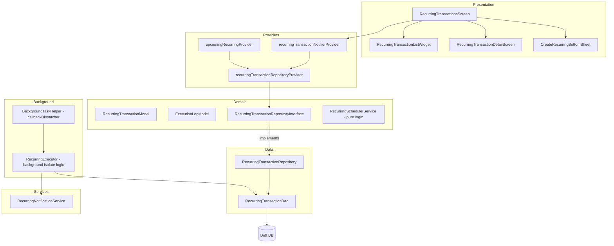

# Design Document: Recurring Transactions

## Overview

Fitur Recurring Transactions menambahkan kemampuan untuk menjadwalkan transaksi berulang (gaji, tagihan, langganan) yang dieksekusi otomatis di background. Fitur ini terintegrasi dengan infrastruktur workmanager yang sudah ada, menggunakan Drift untuk persistence, dan menyediakan UI premium dengan animasi flutter_animate dan Lottie.

### Key Design Decisions

1. **Background Execution via Existing Workmanager**: Memanfaatkan `callbackDispatcher` yang sudah ada di `background_task_helper.dart` — menambahkan logic recurring execution ke periodic task yang sudah terdaftar (15 menit).
2. **Idempotent Execution**: Scheduler menggunakan `nextExecutionDate` comparison + execution log check untuk mencegah duplikasi, karena workmanager bisa trigger callback lebih dari sekali.
3. **Manual Dependency Initialization in Background Isolate**: Background isolate tidak memiliki akses ke Riverpod — database diinisialisasi langsung di isolate.
4. **Separation of Concerns**: Domain logic (next date calculation, validation) adalah pure Dart functions yang mudah di-test secara independen dari UI dan database.

## Architecture



### Feature Directory Structure

```
lib/features/recurring_transactions/
├── data/
│   ├── recurring_transaction_repository.dart
│   └── recurring_transaction_dao.dart
├── domain/
│   ├── models/
│   │   ├── recurring_transaction_model.dart
│   │   ├── execution_log_model.dart
│   │   ├── frequency.dart
│   │   └── recurring_status.dart
│   ├── recurring_transaction_repository_interface.dart
│   └── recurring_scheduler_logic.dart
├── presentation/
│   ├── screens/
│   │   ├── recurring_transactions_screen.dart
│   │   └── recurring_transaction_detail_screen.dart
│   └── widgets/
│       ├── recurring_transaction_card.dart
│       ├── progress_ring_widget.dart
│       ├── create_recurring_bottom_sheet.dart
│       ├── frequency_selector_widget.dart
│       ├── execution_timeline_widget.dart
│       └── upcoming_recurring_dashboard_widget.dart
├── providers/
│   └── recurring_transaction_provider.dart
└── services/
    └── recurring_notification_service.dart
```

### Background Execution Module (in core)

```
lib/core/background/
├── background_task_helper.dart  (modified — add recurring execution)
└── recurring_executor.dart      (new — isolated execution logic)
```

## Components and Interfaces

### Domain Layer

#### RecurringTransactionRepositoryInterface

```dart
// lib/features/recurring_transactions/domain/recurring_transaction_repository_interface.dart
import '../../../core/utils/result.dart';
import '../../../core/utils/app_error.dart';
import 'models/recurring_transaction_model.dart';
import 'models/execution_log_model.dart';

abstract class RecurringTransactionRepositoryInterface {
  // CRUD
  Future<Result<void, AppError>> create(RecurringTransactionModel model);
  Future<Result<void, AppError>> update(RecurringTransactionModel model);
  Future<Result<void, AppError>> delete(String id);
  Future<Result<RecurringTransactionModel, AppError>> getById(String id);

  // Queries
  Stream<List<RecurringTransactionModel>> watchAll(String userId);
  Future<List<RecurringTransactionModel>> getActive(String userId);
  Future<List<RecurringTransactionModel>> getDueForExecution(DateTime now);
  Future<List<RecurringTransactionModel>> getUpcoming(String userId, int days, int limit);

  // Execution
  Future<Result<void, AppError>> updateNextExecutionDate(String id, DateTime? nextDate);
  Future<Result<void, AppError>> updateStatus(String id, RecurringStatus status);
  Future<Result<void, AppError>> incrementRetryCount(String id);
  Future<Result<void, AppError>> resetRetryCount(String id);

  // Execution Logs
  Future<Result<void, AppError>> insertExecutionLog(ExecutionLogModel log);
  Future<List<ExecutionLogModel>> getExecutionLogs(String recurringTransactionId, {int? limit});

  // Locking (for concurrent execution prevention)
  Future<bool> tryAcquireLock(String recurringTransactionId);
  Future<void> releaseLock(String recurringTransactionId);
}
```

#### RecurringSchedulerLogic (Pure Dart)

```dart
// lib/features/recurring_transactions/domain/recurring_scheduler_logic.dart
// Pure functions for date calculations — no external dependencies

class RecurringSchedulerLogic {
  /// Computes the next execution date given current date, frequency, and custom interval.
  static DateTime? computeNextExecutionDate({
    required DateTime currentExecutionDate,
    required Frequency frequency,
    required int customInterval,
    DateTime? endDate,
  });

  /// Computes a preview list of N upcoming execution dates.
  static List<DateTime> computePreviewDates({
    required DateTime startDate,
    required Frequency frequency,
    required int customInterval,
    required int count,
    DateTime? endDate,
  });

  /// Computes the progress ring value (0.0 to 1.0).
  /// 1.0 = just executed (full ring), 0.0 = about to execute (empty ring).
  static double computeProgressRing({
    required DateTime lastExecutionDate,
    required DateTime nextExecutionDate,
    required DateTime now,
  });

  /// Validates custom interval against frequency bounds.
  static bool isValidCustomInterval(Frequency frequency, int interval);

  /// Computes all missed execution dates between lastExecution and now.
  static List<DateTime> computeMissedExecutions({
    required DateTime lastExecutionDate,
    required Frequency frequency,
    required int customInterval,
    required DateTime now,
    DateTime? endDate,
    int maxCatchUp = 90,
  });
}
```

### Data Layer

#### RecurringTransactionDao

```dart
// lib/features/recurring_transactions/data/recurring_transaction_dao.dart
@DriftAccessor(tables: [RecurringTransactions, RecurringExecutionLogs])
class RecurringTransactionDao extends DatabaseAccessor<AppDatabase>
    with _$RecurringTransactionDaoMixin {

  RecurringTransactionDao(super.db);

  // Watch all recurring transactions for a user
  Stream<List<RecurringTransaction>> watchByUser(String userId);

  // Get active recurring transactions due for execution
  Future<List<RecurringTransaction>> getDueForExecution(DateTime now);

  // Get upcoming transactions within N days, limited to `limit` results
  Future<List<RecurringTransaction>> getUpcoming(String userId, int days, int limit);

  // CRUD operations
  Future<void> insertRecurring(RecurringTransactionsCompanion entry);
  Future<void> updateRecurring(RecurringTransactionsCompanion entry);
  Future<void> deleteRecurring(String id);
  Future<RecurringTransaction?> getById(String id);

  // Execution logs
  Future<void> insertLog(RecurringExecutionLogsCompanion entry);
  Future<List<RecurringExecutionLog>> getLogsByRecurringId(String id, {int? limit});
}
```

### Services Layer

#### RecurringNotificationService

```dart
// lib/features/recurring_transactions/services/recurring_notification_service.dart
class RecurringNotificationService {
  final FlutterLocalNotificationsPlugin _notifications;

  /// Schedule a reminder notification before execution.
  Future<void> scheduleReminder({
    required String recurringTransactionId,
    required String transactionName,
    required DateTime executionDate,
    required ReminderTiming timing, // dayBefore or sameDay
  });

  /// Show immediate notification after successful execution.
  Future<void> showExecutionSuccess({
    required String recurringTransactionId,
    required String transactionName,
    required double amount,
    required String walletName,
  });

  /// Show immediate notification after failed execution.
  Future<void> showExecutionFailure({
    required String recurringTransactionId,
    required String transactionName,
    required String errorCategory,
  });

  /// Cancel all notifications for a recurring transaction (on delete).
  Future<void> cancelNotifications(String recurringTransactionId);
}
```

### Background Execution

#### RecurringExecutor

```dart
// lib/core/background/recurring_executor.dart
/// Handles recurring transaction execution in background isolate.
/// This class does NOT use Riverpod — it initializes its own DB instance.
class RecurringExecutor {
  final AppDatabase _db;

  RecurringExecutor(this._db);

  /// Main entry point called from callbackDispatcher.
  /// Returns true if all operations completed successfully.
  Future<bool> execute() async {
    final now = DateTime.now();
    final dueTransactions = await _getDueTransactions(now);

    for (final recurring in dueTransactions) {
      // Try to acquire lock to prevent concurrent execution
      if (!await _tryLock(recurring.id)) continue;

      try {
        await _executeRecurring(recurring, now);
      } finally {
        await _releaseLock(recurring.id);
      }
    }
    return true;
  }

  Future<void> _executeRecurring(RecurringTransaction recurring, DateTime now);
  Future<void> _handleCatchUp(RecurringTransaction recurring, DateTime now);
  Future<void> _createTransaction(RecurringTransaction recurring, DateTime executionDate);
  Future<void> _logExecution(String recurringId, int transactionId, String status);
  Future<void> _updateNextDate(RecurringTransaction recurring, DateTime executedDate);
  Future<void> _handleFailure(RecurringTransaction recurring, String errorType);
}
```

### Providers

```dart
// lib/features/recurring_transactions/providers/recurring_transaction_provider.dart

// Repository provider — depends on abstract interface
final recurringTransactionRepositoryProvider =
    Provider<RecurringTransactionRepositoryInterface>((ref) {
  final db = ref.watch(appDatabaseProvider);
  return RecurringTransactionRepository(db);
});

// Main list notifier with mutations
final recurringTransactionNotifierProvider =
    AsyncNotifierProvider<RecurringTransactionNotifier, List<RecurringTransactionModel>>(() {
  return RecurringTransactionNotifier();
});

// Dashboard upcoming widget (read-only, auto-dispose)
final upcomingRecurringProvider =
    FutureProvider.autoDispose<List<RecurringTransactionModel>>((ref) async {
  final repo = ref.watch(recurringTransactionRepositoryProvider);
  final user = ref.watch(userProvider);
  if (user == null) return [];
  return repo.getUpcoming(user.id, 7, 5);
});

// Single recurring transaction by ID (for detail view)
final recurringTransactionByIdProvider =
    FutureProvider.autoDispose.family<RecurringTransactionModel?, String>((ref, id) async {
  final repo = ref.watch(recurringTransactionRepositoryProvider);
  final result = await repo.getById(id);
  return switch (result) {
    Success(:final value) => value,
    Failure() => null,
  };
});
```

## Data Models

### Drift Table: RecurringTransactions

```dart
// Added to lib/core/local_db/app_database.dart

@TableIndex(name: 'idx_recurring_user_id', columns: {#userId})
@TableIndex(name: 'idx_recurring_next_execution', columns: {#nextExecutionDate})
class RecurringTransactions extends Table {
  TextColumn get id => text()();
  TextColumn get userId => text()();
  TextColumn get walletId => text().references(Wallets, #id, onDelete: KeyAction.restrict)();
  TextColumn get categoryId => text().references(Categories, #id, onDelete: KeyAction.setNull)();
  RealColumn get amount => real()();
  TextColumn get type => text()(); // 'income' or 'expense'
  TextColumn get frequency => text()(); // 'daily', 'weekly', 'monthly', 'yearly'
  IntColumn get customInterval => integer().withDefault(const Constant(1))();
  DateTimeColumn get startDate => dateTime()();
  DateTimeColumn get endDate => dateTime().nullable()();
  DateTimeColumn get nextExecutionDate => dateTime()();
  TextColumn get status => text().withDefault(const Constant('active'))(); // 'active', 'paused', 'completed'
  TextColumn get notes => text().nullable()();
  IntColumn get retryCount => integer().withDefault(const Constant(0))();
  BoolColumn get notifyBefore => boolean().withDefault(const Constant(false))();
  TextColumn get reminderTiming => text().withDefault(const Constant('same_day'))(); // 'day_before', 'same_day'
  DateTimeColumn get createdAt => dateTime().withDefault(currentDateAndTime)();

  @override
  Set<Column> get primaryKey => {id};
}
```

### Drift Table: RecurringExecutionLogs

```dart
@TableIndex(name: 'idx_exec_log_recurring_id', columns: {#recurringTransactionId})
class RecurringExecutionLogs extends Table {
  IntColumn get id => integer().autoIncrement()();
  TextColumn get recurringTransactionId => text().references(RecurringTransactions, #id, onDelete: KeyAction.cascade)();
  DateTimeColumn get executedAt => dateTime()();
  TextColumn get status => text()(); // 'success', 'failed'
  IntColumn get transactionId => integer().nullable().references(Transactions, #id, onDelete: KeyAction.setNull)();
  TextColumn get errorMessage => text().nullable()();
}
```

### Domain Models (Pure Dart)

```dart
// lib/features/recurring_transactions/domain/models/frequency.dart
enum Frequency {
  daily,
  weekly,
  monthly,
  yearly;

  int get maxInterval => switch (this) {
    Frequency.daily => 365,
    Frequency.weekly => 52,
    Frequency.monthly => 12,
    Frequency.yearly => 10,
  };

  static Frequency fromString(String value) =>
      Frequency.values.firstWhere((f) => f.name == value);
}

// lib/features/recurring_transactions/domain/models/recurring_status.dart
enum RecurringStatus {
  active,
  paused,
  completed;

  static RecurringStatus fromString(String value) =>
      RecurringStatus.values.firstWhere((s) => s.name == value);
}

// lib/features/recurring_transactions/domain/models/recurring_transaction_model.dart
class RecurringTransactionModel {
  final String id;
  final String userId;
  final String walletId;
  final String categoryId;
  final double amount;
  final String type; // 'income' or 'expense'
  final Frequency frequency;
  final int customInterval;
  final DateTime startDate;
  final DateTime? endDate;
  final DateTime nextExecutionDate;
  final RecurringStatus status;
  final String? notes;
  final int retryCount;
  final bool notifyBefore;
  final ReminderTiming reminderTiming;
  final DateTime createdAt;

  // constructor, copyWith, fromDriftRow, toDriftCompanion...
}

// lib/features/recurring_transactions/domain/models/execution_log_model.dart
class ExecutionLogModel {
  final int? id;
  final String recurringTransactionId;
  final DateTime executedAt;
  final String status; // 'success' or 'failed'
  final int? transactionId;
  final String? errorMessage;
}
```

### Database Migration (v4 → v5)

```dart
// In AppDatabase class:
@override
int get schemaVersion => 5;

// In onUpgrade:
if (from < 5) {
  await m.createTable(recurringTransactions);
  await m.createTable(recurringExecutionLogs);
  await m.createIndex(idxRecurringUserId);
  await m.createIndex(idxRecurringNextExecution);
  await m.createIndex(idxExecLogRecurringId);
}
```

### Transactions Table Modification

Add a `badge` column to the existing `Transactions` table to mark recurring-generated transactions:

```dart
// In Transactions table definition, add:
TextColumn get badge => text().nullable()(); // 'recurring' or null

// Migration step:
if (from < 5) {
  await m.addColumn(transactions, transactions.badge);
  // ... create new tables
}
```

## Correctness Properties

*A property is a characteristic or behavior that should hold true across all valid executions of a system — essentially, a formal statement about what the system should do. Properties serve as the bridge between human-readable specifications and machine-verifiable correctness guarantees.*

### Property 1: Frequency/Interval Round-Trip

*For any* valid RecurringTransactionModel with a valid frequency and custom interval, computing the next execution date from a given date and then verifying that the interval between the two dates matches the expected duration for that frequency × customInterval SHALL produce consistent results.

**Validates: Requirements 8.6**

### Property 2: Custom Interval Validation Boundaries

*For any* (frequency, interval) pair, the validation function SHALL accept the interval if and only if 1 ≤ interval ≤ frequency.maxInterval (365 for daily, 52 for weekly, 12 for monthly, 10 for yearly).

**Validates: Requirements 1.2**

### Property 3: Amount Validation Boundaries

*For any* numeric amount value, the validation function SHALL accept the amount if and only if 0.01 ≤ amount ≤ 999,999,999.99.

**Validates: Requirements 1.6**

### Property 4: Preview Dates Computation

*For any* valid (startDate, frequency, customInterval) tuple with no end date, computing preview dates with count=5 SHALL return exactly 5 dates, all strictly increasing, with each consecutive pair separated by exactly the interval defined by frequency × customInterval.

**Validates: Requirements 1.5**

### Property 5: Execution Creates Transaction and Log

*For any* active recurring transaction that is due for execution, running the scheduler logic SHALL produce exactly one new transaction entry (with badge "recurring") and exactly one execution log entry with status "success", and the transaction's amount, type, walletId, and categoryId SHALL match the recurring template.

**Validates: Requirements 2.1, 5.1**

### Property 6: Catch-Up Executes Missed Transactions Chronologically

*For any* active recurring transaction with N missed executions (where N > 0), the catch-up logic SHALL execute min(N, 90) transactions in strictly chronological order (oldest first), each with the correct execution date.

**Validates: Requirements 2.2**

### Property 7: Paused Transactions Are Never Executed

*For any* recurring transaction with status "paused" and any due date (past or present), the scheduler SHALL produce zero executions and zero log entries.

**Validates: Requirements 2.3, 8.2**

### Property 8: End Date Enforcement

*For any* recurring transaction with an end date, no computed next execution date SHALL exceed the end date. When the next computed date would exceed the end date, the status SHALL become "completed" and next_execution_date SHALL be null. Conversely, for any recurring transaction without an end date, a valid next_execution_date SHALL always be computed.

**Validates: Requirements 1.3, 1.4, 2.5**

### Property 9: No Duplicate Executions

*For any* recurring transaction and any scheduler run, if an execution log entry already exists for the current interval's expected execution date, the scheduler SHALL not create another transaction or log entry for that same date.

**Validates: Requirements 8.1, 8.5**

### Property 10: Next Execution Date Invariant

*For any* recurring transaction after successful execution, the new next_execution_date SHALL be strictly greater than the just-executed date (always in the future relative to the execution point).

**Validates: Requirements 8.4, 2.4**

### Property 11: Historical Transactions Immutability

*For any* set of transactions created by recurring execution, deleting or editing the recurring transaction template SHALL not modify, delete, or alter any field of those historical transaction records.

**Validates: Requirements 5.7, 8.3, 9.2**

### Property 12: Dashboard Upcoming Query

*For any* set of recurring transactions with varying next_execution_dates, querying upcoming transactions with (days=7, limit=5) SHALL return at most 5 results, all with next_execution_date within 7 days from now, sorted in ascending order by next_execution_date.

**Validates: Requirements 5.2**

### Property 13: Progress Ring Computation

*For any* (lastExecutionDate, nextExecutionDate, now) triple where lastExecutionDate ≤ now ≤ nextExecutionDate, the progress ring value SHALL be between 0.0 and 1.0 inclusive, where 1.0 represents just-executed (now == lastExecutionDate) and 0.0 represents about-to-execute (now == nextExecutionDate).

**Validates: Requirements 3.9**

### Property 14: Retry Logic

*For any* recurring transaction that fails execution due to a database error, the retry count SHALL increment by 1 per failed attempt. When retry count reaches 3, the status SHALL change to "paused" and no further automatic execution attempts SHALL occur.

**Validates: Requirements 2.7**

## Error Handling

### Error Categories

| Error Type | Handling | Retry? |
|-----------|----------|--------|
| Database error (SqliteException) | Log to ExecutionLog with "failed", increment retryCount | Yes (max 3) |
| Wallet not found/deleted | Log to ExecutionLog with "failed", pause immediately | No |
| Category not found/deleted | Log to ExecutionLog with "failed", pause immediately | No |
| Invalid data (amount, dates) | Log to ExecutionLog with "failed", pause immediately | No |
| Concurrent execution conflict | Skip (lock not acquired) | Next cycle |

### Result Pattern Usage

All repository methods return `Result<T, AppError>`:

```dart
Future<Result<void, AppError>> create(RecurringTransactionModel model) async {
  try {
    // Validate wallet exists
    final wallet = await _db.select(_db.wallets)
      ..where((w) => w.id.equals(model.walletId));
    if (wallet.isEmpty) {
      return Failure(AppError.validation('Wallet not found'));
    }

    // Validate category exists
    final category = await _db.select(_db.categories)
      ..where((c) => c.id.equals(model.categoryId));
    if (category.isEmpty) {
      return Failure(AppError.validation('Category not found'));
    }

    await _dao.insertRecurring(model.toDriftCompanion());
    return const Success(null);
  } on SqliteException catch (e) {
    return Failure(AppError.database(e.message));
  }
}
```

### Background Isolate Error Handling

```dart
// In RecurringExecutor
Future<void> _handleFailure(RecurringTransaction recurring, String errorType) async {
  await _logExecution(recurring.id, null, 'failed', errorMessage: errorType);

  if (errorType == 'database_error') {
    final newRetryCount = recurring.retryCount + 1;
    if (newRetryCount >= 3) {
      await _updateStatus(recurring.id, 'paused');
      await _sendFailureNotification(recurring, 'Max retries exceeded');
    } else {
      await _incrementRetryCount(recurring.id);
    }
  } else {
    // Non-database errors: pause immediately
    await _updateStatus(recurring.id, 'paused');
    await _sendFailureNotification(recurring, errorType);
  }
}
```

## Testing Strategy

### Property-Based Tests (dart_test + glados)

The project will use the **glados** package for property-based testing in Dart. Each property test runs a minimum of 100 iterations.

**Target: Pure domain logic in `recurring_scheduler_logic.dart`**

```dart
// test/features/recurring_transactions/domain/recurring_scheduler_logic_test.dart
// Feature: recurring-transactions, Property 1: Frequency/Interval Round-Trip
// Feature: recurring-transactions, Property 2: Custom Interval Validation Boundaries
// Feature: recurring-transactions, Property 3: Amount Validation Boundaries
// Feature: recurring-transactions, Property 4: Preview Dates Computation
// Feature: recurring-transactions, Property 8: End Date Enforcement
// Feature: recurring-transactions, Property 10: Next Execution Date Invariant
// Feature: recurring-transactions, Property 13: Progress Ring Computation
```

**Target: Repository + Executor logic (with in-memory DB)**

```dart
// test/features/recurring_transactions/data/recurring_executor_test.dart
// Feature: recurring-transactions, Property 5: Execution Creates Transaction and Log
// Feature: recurring-transactions, Property 6: Catch-Up Executes Missed Transactions
// Feature: recurring-transactions, Property 7: Paused Transactions Are Never Executed
// Feature: recurring-transactions, Property 9: No Duplicate Executions
// Feature: recurring-transactions, Property 11: Historical Transactions Immutability
// Feature: recurring-transactions, Property 12: Dashboard Upcoming Query
// Feature: recurring-transactions, Property 14: Retry Logic
```

### Unit Tests (Example-Based)

- Validation edge cases (past start date, deleted wallet/category)
- UI widget tests (empty state, shimmer loading, swipe actions)
- Notification scheduling timing calculations
- Deep link handling (valid route, deleted transaction fallback)

### Integration Tests

- Full execution flow: create → schedule → execute → verify transaction + log
- Notification delivery after execution
- Budget tracking integration after expense execution
- Database migration from v4 → v5

### Test Configuration

```yaml
# pubspec.yaml (dev_dependencies)
dev_dependencies:
  glados: ^1.1.1
  drift_dev: ^2.33.0
  build_runner: ^2.4.0
  mocktail: ^1.0.0
```

Property tests use `Glados` with custom arbitraries for `Frequency`, `RecurringTransactionModel`, and date ranges. Each test is tagged with the corresponding property number for traceability.
