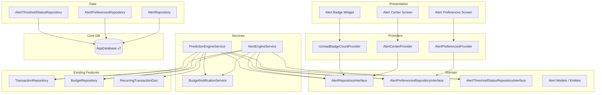
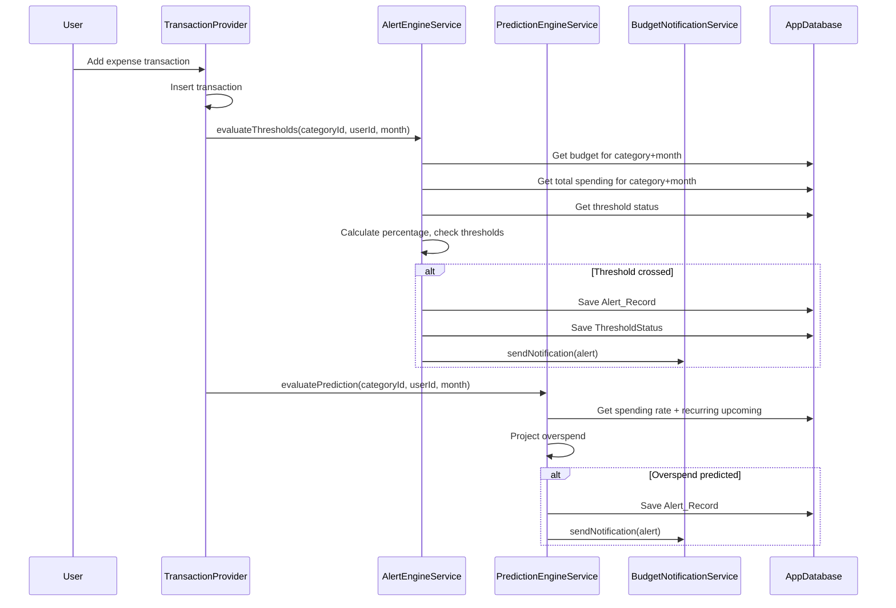

# Design Document: Smart Budget Alerts

## Overview

Smart Budget Alerts menambahkan sistem notifikasi proaktif ke DuaSaku yang memantau pengeluaran pengguna terhadap budget yang dikonfigurasi. Fitur ini terdiri dari dua engine utama: **Alert Engine** (evaluasi threshold-based) dan **Prediction Engine** (proyeksi spending berdasarkan tren), didukung oleh **Notification Service** untuk push notifications dan **Alert Center** sebagai in-app history.

Fitur ini terintegrasi dengan sistem budget dan transaksi yang sudah ada, menggunakan event-driven approach dimana setiap transaksi baru (manual atau recurring) memicu evaluasi alert. Data disimpan di 3 tabel Drift baru dengan migration ke schema version 7.

### Key Design Decisions

1. **Event-driven evaluation**: Alert dievaluasi saat transaksi ditambahkan/diubah/dihapus, bukan polling periodik — memastikan real-time accuracy tanpa battery drain.
2. **Service layer untuk logic**: Alert Engine dan Prediction Engine ditempatkan di `services/` karena berisi business logic yang bukan database operations.
3. **Threshold status tracking**: Tabel terpisah (`BudgetAlertThresholdStatus`) mencegah duplikasi alert dan mendukung reset saat spending turun.
4. **Quiet Hours queue**: Notifikasi ditahan selama quiet hours dan dikirim sebagai batch/individual setelah berakhir, menggunakan workmanager periodic check.

## Architecture



### Integration Flow



## Components and Interfaces

### Feature Directory Structure

```
lib/features/smart_budget_alerts/
├── data/
│   ├── alert_repository.dart
│   ├── alert_preferences_repository.dart
│   └── alert_threshold_status_repository.dart
├── domain/
│   ├── models/
│   │   ├── budget_alert_model.dart
│   │   ├── alert_preference_model.dart
│   │   ├── alert_threshold_status_model.dart
│   │   └── alert_type.dart
│   ├── alert_repository_interface.dart
│   ├── alert_preferences_repository_interface.dart
│   └── alert_threshold_status_repository_interface.dart
├── presentation/
│   ├── screens/
│   │   ├── alert_center_screen.dart
│   │   └── alert_preferences_screen.dart
│   └── widgets/
│       ├── alert_card_widget.dart
│       ├── alert_badge_widget.dart
│       └── alert_empty_state_widget.dart
├── providers/
│   ├── alert_center_provider.dart
│   ├── alert_preferences_provider.dart
│   └── unread_badge_provider.dart
└── services/
    ├── alert_engine_service.dart
    ├── prediction_engine_service.dart
    └── budget_notification_service.dart
```

### Domain Layer Interfaces

#### AlertRepositoryInterface

```dart
abstract class AlertRepositoryInterface {
  Future<List<BudgetAlertModel>> getAlerts(String userId, {int? limit, int? offset});
  Stream<List<BudgetAlertModel>> watchAlerts(String userId);
  Future<int> getUnreadCount(String userId);
  Stream<int> watchUnreadCount(String userId);
  Future<void> insertAlert(BudgetAlertModel alert);
  Future<void> markAsRead(List<String> alertIds);
  Future<void> markAllVisibleAsRead(String userId);
  Future<void> deleteAlert(String alertId);
  Future<void> deleteAllRead(String userId);
}
```

#### AlertPreferencesRepositoryInterface

```dart
abstract class AlertPreferencesRepositoryInterface {
  Future<AlertPreferenceModel> getGlobalPreferences(String userId);
  Future<AlertPreferenceModel?> getCategoryPreferences(String userId, String categoryId);
  Future<List<AlertPreferenceModel>> getAllPreferences(String userId);
  Future<void> savePreferences(AlertPreferenceModel preferences);
  Future<void> initializeDefaults(String userId);
  Stream<AlertPreferenceModel> watchGlobalPreferences(String userId);
}
```

#### AlertThresholdStatusRepositoryInterface

```dart
abstract class AlertThresholdStatusRepositoryInterface {
  Future<List<AlertThresholdStatusModel>> getTriggeredThresholds(
    String userId, String categoryId, String budgetMonth);
  Future<void> markThresholdTriggered(AlertThresholdStatusModel status);
  Future<void> resetThreshold(String userId, String categoryId, String budgetMonth, int thresholdValue);
  Future<void> resetAllForNewPeriod(String userId, String budgetMonth);
}
```

### Service Layer

#### AlertEngineService

```dart
class AlertEngineService {
  final AlertRepositoryInterface _alertRepo;
  final AlertPreferencesRepositoryInterface _prefsRepo;
  final AlertThresholdStatusRepositoryInterface _statusRepo;
  final BudgetRepository _budgetRepo;
  final AppDatabase _db;
  final BudgetNotificationService _notificationService;

  /// Evaluates all thresholds for a given category after a transaction change.
  /// Returns list of newly triggered alerts.
  Future<List<BudgetAlertModel>> evaluateThresholds({
    required String userId,
    required String categoryId,
    required String budgetMonth,
  });

  /// Evaluates overall monthly budget thresholds (cross-category).
  Future<List<BudgetAlertModel>> evaluateOverallThresholds({
    required String userId,
    required String budgetMonth,
  });

  /// Re-evaluates thresholds after transaction deletion/update.
  /// Resets threshold statuses if spending dropped below previously triggered thresholds.
  Future<void> reevaluateAfterSpendingDecrease({
    required String userId,
    required String categoryId,
    required String budgetMonth,
  });
}
```

#### PredictionEngineService

```dart
class PredictionEngineService {
  final AlertRepositoryInterface _alertRepo;
  final AlertPreferencesRepositoryInterface _prefsRepo;
  final AlertThresholdStatusRepositoryInterface _statusRepo;
  final BudgetRepository _budgetRepo;
  final AppDatabase _db;
  final BudgetNotificationService _notificationService;

  /// Calculates spending rate and projects overspend.
  /// Only generates alert if elapsed days >= 3 and projected overspend is within current period.
  Future<BudgetAlertModel?> evaluatePrediction({
    required String userId,
    required String categoryId,
    required String budgetMonth,
  });

  /// Calculates daily spending rate for a category.
  double calculateSpendingRate(double totalSpent, int elapsedDays);

  /// Projects total spending by end of period including upcoming recurring transactions.
  double projectTotalSpending({
    required double currentSpent,
    required double dailyRate,
    required int remainingDays,
    required double upcomingRecurring,
  });

  /// Calculates the projected overspend date.
  DateTime? calculateOverspendDate({
    required double currentSpent,
    required double dailyRate,
    required double budgetLimit,
    required DateTime periodStart,
  });
}
```

#### BudgetNotificationService

```dart
class BudgetNotificationService {
  final FlutterLocalNotificationsPlugin _notifications;
  final AlertPreferencesRepositoryInterface _prefsRepo;

  static const String channelId = 'budget_alerts';
  static const String channelName = 'Budget Alerts';

  /// Sends a push notification for a budget alert, respecting quiet hours.
  Future<void> sendAlertNotification({
    required BudgetAlertModel alert,
    required String userId,
  });

  /// Processes queued notifications after quiet hours end.
  /// If queue > 3: sends summary notification.
  /// If queue <= 3: sends individual notifications with 10s interval.
  Future<void> processQueuedNotifications(String userId);

  /// Checks if current time is within quiet hours.
  bool isQuietHoursActive(AlertPreferenceModel prefs);

  /// Queues a notification for later delivery.
  Future<void> queueNotification(BudgetAlertModel alert);
}
```

### Provider Layer

```dart
// Alert Center — watches all alerts for current user
final alertCenterProvider = StreamProvider.autoDispose<List<BudgetAlertModel>>((ref) {
  final user = ref.watch(userProvider);
  if (user == null) return Stream.value([]);
  final repo = ref.watch(alertRepositoryProvider);
  return repo.watchAlerts(user.id);
});

// Unread badge count
final unreadBadgeCountProvider = StreamProvider.autoDispose<int>((ref) {
  final user = ref.watch(userProvider);
  if (user == null) return Stream.value(0);
  final repo = ref.watch(alertRepositoryProvider);
  return repo.watchUnreadCount(user.id);
});

// Alert preferences notifier
final alertPreferencesProvider =
    AsyncNotifierProvider<AlertPreferencesNotifier, AlertPreferenceModel>(
  AlertPreferencesNotifier.new,
);

// Alert engine provider (service)
final alertEngineProvider = Provider<AlertEngineService>((ref) {
  return AlertEngineService(
    alertRepo: ref.watch(alertRepositoryProvider),
    prefsRepo: ref.watch(alertPreferencesRepositoryProvider),
    statusRepo: ref.watch(alertThresholdStatusRepositoryProvider),
    budgetRepo: ref.watch(budgetRepositoryProvider),
    db: ref.watch(appDatabaseProvider),
    notificationService: ref.watch(budgetNotificationServiceProvider),
  );
});

// Prediction engine provider (service)
final predictionEngineProvider = Provider<PredictionEngineService>((ref) {
  return PredictionEngineService(
    alertRepo: ref.watch(alertRepositoryProvider),
    prefsRepo: ref.watch(alertPreferencesRepositoryProvider),
    statusRepo: ref.watch(alertThresholdStatusRepositoryProvider),
    budgetRepo: ref.watch(budgetRepositoryProvider),
    db: ref.watch(appDatabaseProvider),
    notificationService: ref.watch(budgetNotificationServiceProvider),
  );
});
```

## Data Models

### BudgetAlertModel (Domain Entity)

```dart
enum AlertType { threshold, prediction, overBudget }

class BudgetAlertModel {
  final String id;
  final String userId;
  final String categoryId;
  final AlertType alertType;
  final int? thresholdValue;       // e.g., 50, 75, 90, 100 (null for prediction)
  final double actualPercentage;   // current spending percentage
  final String message;            // localized alert message
  final bool isRead;
  final DateTime createdAt;

  // Computed fields (not stored)
  final String? categoryName;      // joined from Categories table
  final double? remainingBudget;   // budget limit - current spending
  final double? overAmount;        // amount over budget (for overBudget type)
  final DateTime? projectedOverspendDate; // for prediction type

  const BudgetAlertModel({...});

  Map<String, dynamic> toJson();
  factory BudgetAlertModel.fromJson(Map<String, dynamic> json);

  BudgetAlertModel copyWith({...});
}
```

### AlertPreferenceModel (Domain Entity)

```dart
class AlertPreferenceModel {
  final String id;
  final String userId;
  final String? categoryId;        // null = global settings
  final bool isEnabled;
  final List<int> thresholds;      // e.g., [50, 75, 90, 100]
  final bool predictionsEnabled;
  final TimeOfDay? quietHoursStart;
  final TimeOfDay? quietHoursEnd;

  const AlertPreferenceModel({...});

  /// Default preferences: all thresholds active, predictions on, no quiet hours
  factory AlertPreferenceModel.defaults(String userId);

  Map<String, dynamic> toJson();
  factory AlertPreferenceModel.fromJson(Map<String, dynamic> json);

  AlertPreferenceModel copyWith({...});
}
```

### AlertThresholdStatusModel (Domain Entity)

```dart
class AlertThresholdStatusModel {
  final String id;
  final String userId;
  final String categoryId;
  final String budgetMonth;        // format 'YYYY-MM'
  final int thresholdValue;        // 50, 75, 90, or 100
  final DateTime triggeredAt;

  const AlertThresholdStatusModel({...});

  Map<String, dynamic> toJson();
  factory AlertThresholdStatusModel.fromJson(Map<String, dynamic> json);
}
```

### Database Tables (Drift)

```dart
// In lib/core/local_db/app_database.dart

@TableIndex(name: 'idx_budget_alerts_user_created', columns: {#userId, #createdAt})
class BudgetAlerts extends Table {
  TextColumn get id => text()();
  TextColumn get userId => text()();
  TextColumn get categoryId => text().nullable()();  // nullable — retain alert history if category deleted
  TextColumn get alertType => text()();  // 'threshold', 'prediction', 'over_budget'
  IntColumn get thresholdValue => integer().nullable()();
  RealColumn get actualPercentage => real()();
  TextColumn get message => text()();
  BoolColumn get isRead => boolean().withDefault(const Constant(false))();
  DateTimeColumn get createdAt => dateTime()();

  @override
  Set<Column> get primaryKey => {id};
}

@TableIndex(name: 'idx_alert_prefs_user', columns: {#userId})
class BudgetAlertPreferences extends Table {
  TextColumn get id => text()();
  TextColumn get userId => text()();
  TextColumn get categoryId => text().nullable()();  // nullable for global settings; setNull on category delete
  BoolColumn get isEnabled => boolean().withDefault(const Constant(true))();
  TextColumn get thresholds => text()();  // JSON encoded: "[50,75,90,100]"
  BoolColumn get predictionsEnabled => boolean().withDefault(const Constant(true))();
  TextColumn get quietHoursStart => text().nullable()();  // "HH:mm" format
  TextColumn get quietHoursEnd => text().nullable()();    // "HH:mm" format

  @override
  Set<Column> get primaryKey => {id};
}

@TableIndex(name: 'idx_threshold_status_user_cat_month', columns: {#userId, #categoryId, #budgetMonth})
class BudgetAlertThresholdStatus extends Table {
  TextColumn get id => text()();
  TextColumn get userId => text()();
  TextColumn get categoryId => text()();  // cascade delete OK — status is ephemeral per-period
  TextColumn get budgetMonth => text()();  // 'YYYY-MM'
  IntColumn get thresholdValue => integer()();
  DateTimeColumn get triggeredAt => dateTime()();

  @override
  Set<Column> get primaryKey => {id};
}
```

### Migration (Schema Version 7)

```dart
@override
int get schemaVersion => 7;

// In onUpgrade:
if (from < 7) {
  // Schema v7: Add smart budget alerts feature
  await m.createTable(budgetAlerts);
  await m.createTable(budgetAlertPreferences);
  await m.createTable(budgetAlertThresholdStatus);
  await m.createIndex(idxBudgetAlertsUserCreated);
  await m.createIndex(idxAlertPrefsUser);
  await m.createIndex(idxThresholdStatusUserCatMonth);
}
```


## Correctness Properties

*A property is a characteristic or behavior that should hold true across all valid executions of a system — essentially, a formal statement about what the system should do. Properties serve as the bridge between human-readable specifications and machine-verifiable correctness guarantees.*

### Property 1: Alert correctness — threshold and over-budget alerts contain accurate financial data

*For any* budget limit > 0 and any total spending amount that crosses a configured threshold, the generated alert SHALL have:
- `actualPercentage` equal to `(totalSpent / budgetLimit) * 100`
- `remainingBudget` equal to `max(0, budgetLimit - totalSpent)`
- `alertType` equal to `overBudget` when `totalSpent > budgetLimit`, otherwise `threshold`
- `overAmount` equal to `totalSpent - budgetLimit` when alertType is `overBudget`

**Validates: Requirements 1.1, 1.3**

### Property 2: No duplicate alerts per threshold per category per period

*For any* sequence of expense transactions added to the same category within the same budget period, the Alert Engine SHALL produce at most one alert per threshold value. Specifically, for each unique tuple `(categoryId, thresholdValue, budgetMonth)`, the count of generated alerts SHALL be ≤ 1.

**Validates: Requirements 1.5**

### Property 3: Threshold reset on spending decrease

*For any* state where a threshold has been triggered for a `(categoryId, budgetMonth, thresholdValue)` tuple, if the total spending subsequently drops below `thresholdValue% * budgetLimit` (due to transaction deletion or amount decrease), the threshold status SHALL be reset, allowing the alert to be triggered again if spending rises back above the threshold.

**Validates: Requirements 1.7, 6.6**

### Property 4: Projection calculation correctness

*For any* valid inputs where `elapsedDays >= 3`, `totalSpent >= 0`, `remainingDays >= 0`, and `upcomingRecurring >= 0`:
- `spendingRate` SHALL equal `totalSpent / elapsedDays`
- `projectedTotal` SHALL equal `totalSpent + (spendingRate * remainingDays) + upcomingRecurring`

**Validates: Requirements 2.1, 2.2**

### Property 5: Prediction alert generation with correct overspend date

*For any* scenario where `projectedTotal > budgetLimit` and `elapsedDays >= 3`, the Prediction Engine SHALL generate an alert containing:
- A `projectedOverspendDate` that equals the date when cumulative spending (at the current daily rate) first exceeds the budget limit
- An `estimatedOverAmount` equal to `projectedTotal - budgetLimit`

**Validates: Requirements 2.3**

### Property 6: Prediction alerts only generated within current budget period

*For any* prediction calculation, if the `projectedOverspendDate` falls after the end of the current budget period (last day of the month), the Prediction Engine SHALL NOT generate a prediction alert.

**Validates: Requirements 2.5**

### Property 7: Threshold value validation

*For any* integer value provided as a custom threshold:
- Values in the set {10, 15, 20, 25, ..., 95, 100} (multiples of 5 between 10 and 100 inclusive) SHALL be accepted
- All other values SHALL be rejected

**Validates: Requirements 3.2**

### Property 8: Quiet hours detection

*For any* `(currentTime, quietHoursStart, quietHoursEnd)` tuple where quiet hours are configured:
- If `quietHoursStart <= currentTime < quietHoursEnd` (same-day range), `isQuietHoursActive` SHALL return `true`
- If quiet hours span midnight (e.g., 22:00–07:00), `isQuietHoursActive` SHALL return `true` when `currentTime >= quietHoursStart OR currentTime < quietHoursEnd`
- Otherwise, `isQuietHoursActive` SHALL return `false`

**Validates: Requirements 3.4**

### Property 9: Master toggle disables all alerts and notifications

*For any* spending scenario (regardless of threshold crossings or prediction results), when the global `isEnabled` master toggle is `false`, the Alert Engine and Prediction Engine SHALL produce zero alerts and the Notification Service SHALL send zero notifications.

**Validates: Requirements 3.7, 5.5**

### Property 10: Alerts sorted descending by creation timestamp

*For any* list of alerts returned by `getAlerts()` or `watchAlerts()`, for all consecutive pairs `(alerts[i], alerts[i+1])`, `alerts[i].createdAt >= alerts[i+1].createdAt` SHALL hold.

**Validates: Requirements 4.1**

### Property 11: Unread count accuracy

*For any* set of alerts belonging to a user, the `getUnreadCount()` result SHALL equal the number of alerts where `isRead == false`.

**Validates: Requirements 4.4**

### Property 12: Notification queue batch logic

*For any* set of queued notifications processed after quiet hours end:
- If queue size > 3, exactly one summary notification SHALL be sent
- If queue size ≤ 3 and > 0, exactly `queue.size` individual notifications SHALL be sent

**Validates: Requirements 5.2**

### Property 13: BudgetAlertModel serialization round-trip

*For any* valid `BudgetAlertModel` instance, `BudgetAlertModel.fromJson(model.toJson())` SHALL produce an object that is equivalent to the original (all fields equal).

**Validates: Requirements 7.6**

### Property 14: AlertPreferenceModel serialization round-trip

*For any* valid `AlertPreferenceModel` instance, `AlertPreferenceModel.fromJson(model.toJson())` SHALL produce an object that is equivalent to the original (all fields equal).

**Validates: Requirements 7.7**

## Error Handling

### Expected Failures (Return `Failure`)

| Scenario | Error Type | Handling |
|----------|-----------|----------|
| Budget not found for category/month | `AppError.notFound` | Skip evaluation silently (Req 6.4) |
| Invalid threshold value (not 10-100, not multiple of 5) | `AppError.validation` | Reject save, show validation message |
| Category not found | `AppError.notFound` | Skip evaluation, log warning |
| Quiet hours parse error (invalid time format) | `AppError.validation` | Fall back to no quiet hours |
| Alert insertion fails (DB constraint) | `AppError.database` | Log error, don't send notification |

### Unexpected Failures (Rethrow)

| Scenario | Handling |
|----------|----------|
| Database corruption | Rethrow — unrecoverable |
| Out of memory during batch processing | Rethrow — system-level |

### Notification Failures

- If `flutter_local_notifications` fails to send, log the error but still persist the alert in the database. The user can see it in Alert Center even if push notification failed.
- If notification permission is denied by OS, alerts are still generated and visible in Alert Center.

### Background Task Error Handling

- Budget alert evaluation in background (via workmanager) follows the same retry pattern as recurring transactions: return `false` to trigger exponential backoff retry.
- Quiet hours queue processing runs as part of the periodic background task.
- **Timing caveat**: Android WorkManager periodic tasks have a minimum interval of 15 minutes and are subject to battery optimization (Doze mode). Queued notifications after Quiet Hours end will be delivered at the next available WorkManager execution window, not precisely at the configured end time. This is an acceptable trade-off documented for testing expectations.

## Testing Strategy

### Property-Based Tests (dart_test + glados)

Library: **glados** (Dart property-based testing library, sudah digunakan di fitur Recurring Transactions)
Configuration: Minimum 100 iterations per property test.

Each property test references its design document property with tag format:
`Feature: smart-budget-alerts, Property {N}: {title}`

**Properties to implement:**
1. Alert correctness (percentage, remaining, over-amount calculations)
2. No duplicate alerts per threshold/category/period
3. Threshold reset on spending decrease
4. Projection calculation (spending rate + projected total)
5. Prediction alert overspend date calculation
6. Prediction only within current period
7. Threshold value validation (10-100, multiples of 5)
8. Quiet hours detection (including midnight-spanning ranges)
9. Master toggle disables all alerts
10. Alert list ordering (descending by createdAt)
11. Unread count accuracy
12. Notification queue batch logic
13. BudgetAlertModel serialization round-trip
14. AlertPreferenceModel serialization round-trip

### Unit Tests (Example-Based)

- Default preferences initialization (thresholds = [50, 75, 90, 100])
- Per-category enable/disable independence from predictions toggle
- Empty alert center shows Lottie empty state
- Alert card displays all required fields
- Navigation from alert tap to budget detail screen
- Period reset clears all threshold statuses for new month
- Notification channel configuration (name, priority)

### Integration Tests

- Transaction insertion triggers alert engine evaluation
- Transaction deletion triggers re-evaluation and threshold reset
- Recurring transaction execution triggers same evaluation as manual
- Preference change persists to DB and applies immediately
- Overall monthly budget evaluation across categories
- Background task processes quiet hours queue correctly

### Widget Tests

- Alert Center screen renders alert list with correct ordering
- Alert badge shows correct unread count
- Swipe-to-delete gesture removes alert
- "Clear all" button removes only read alerts
- Alert Preferences screen toggles save correctly
- Empty state animation displays when no alerts

### Test File Structure

```
test/features/smart_budget_alerts/
├── services/
│   ├── alert_engine_service_test.dart
│   ├── prediction_engine_service_test.dart
│   └── budget_notification_service_test.dart
├── data/
│   ├── alert_repository_test.dart
│   ├── alert_preferences_repository_test.dart
│   └── alert_threshold_status_repository_test.dart
├── domain/
│   ├── budget_alert_model_test.dart
│   └── alert_preference_model_test.dart
├── presentation/
│   ├── alert_center_screen_test.dart
│   └── alert_preferences_screen_test.dart
└── properties/
    ├── alert_engine_properties_test.dart
    ├── prediction_engine_properties_test.dart
    ├── threshold_validation_properties_test.dart
    ├── quiet_hours_properties_test.dart
    ├── alert_list_properties_test.dart
    ├── notification_queue_properties_test.dart
    └── serialization_properties_test.dart
```
