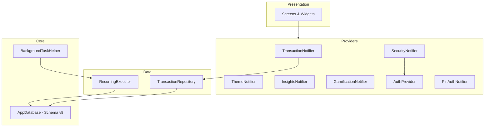

# Design Document: System Audit Fixes

## Overview

This design addresses critical findings from a system audit of the DuaSaku Flutter finance app. The fixes span four categories:

1. **Data Integrity** — RecurringExecutor does not adjust wallet balances when creating transactions in the background, causing balance drift over time.
2. **Data Correction** — A one-time Drift migration (schema v8) recalculates all wallet balances from transaction history to fix accumulated drift.
3. **Provider Compliance** — Six providers still use banned patterns (`StateNotifierProvider`, `ChangeNotifierProvider`) and must be migrated to modern Riverpod 2.x equivalents.
4. **Operational Safety** — Background periodic tasks lack `requiresBatteryNotLow` constraint, and `TransactionNotifier` throws exceptions instead of using `AsyncError` state for failures.

All changes are backward-compatible at the data layer (no schema structure changes beyond the balance recalculation) and maintain identical observable behavior for end users.

## Architecture

The fixes touch three architectural layers:



**Key architectural decisions:**

1. **RecurringExecutor balance logic mirrors TransactionRepository** — Rather than extracting a shared utility, the executor replicates the same balance adjustment pattern inline within its `_db.transaction()` block. This avoids introducing a shared dependency that would complicate the background isolate (no Riverpod access).

2. **Migration uses raw SQL for performance** — The balance recalculation migration uses `customStatement` with aggregate SQL queries rather than Dart-level iteration, ensuring O(1) queries per wallet regardless of transaction count.

3. **AuthRepository keeps ChangeNotifier** — Only the `ChangeNotifierProvider` wrapper is banned. The class itself retains `ChangeNotifier` to serve as GoRouter's `refreshListenable`. The provider wrapper changes to a plain `Provider<AuthRepository>`.

4. **Error handling uses AsyncValue.error with previous data** — `TransactionNotifier` sets `AsyncError` while preserving `previousData` so the UI can show both the error and the last-known-good transaction list.

## Components and Interfaces

### 1. RecurringExecutor (Modified)

**File:** `lib/core/background/recurring_executor.dart`

**Changes:** Add wallet balance adjustment logic inside `_createTransaction()`, wrapping the insert + balance update in a single `_db.transaction()` block.

```dart
/// Creates a transaction and adjusts wallet balance atomically.
Future<int> _createTransactionWithBalanceUpdate(
  RecurringTransaction recurring,
  DateTime executionDate,
) async {
  return await _db.transaction(() async {
    // 1. Insert transaction
    final id = await _db.into(_db.transactions).insert(
      TransactionsCompanion.insert(
        userId: recurring.userId,
        walletId: Value(recurring.walletId),
        categoryId: Value(recurring.categoryId),
        amount: recurring.amount,
        notes: Value(recurring.notes),
        date: executionDate,
        type: recurring.type,
        badge: const Value('recurring'),
      ),
    );

    // 2. Adjust wallet balance based on type
    if (recurring.type == 'transfer') {
      await _adjustTransferBalances(recurring);
    } else {
      await _adjustWalletBalance(
        walletId: recurring.walletId,
        amount: recurring.amount,
        type: recurring.type,
      );
    }

    return id;
  });
}

/// Adjusts a single wallet's balance for income/expense.
Future<void> _adjustWalletBalance({
  required String walletId,
  required double amount,
  required String type,
}) async {
  final wallet = await (_db.select(_db.wallets)
        ..where((w) => w.id.equals(walletId)))
      .getSingleOrNull();

  if (wallet == null) {
    throw StateError('Wallet $walletId not found');
  }

  final newBalance = type == 'income'
      ? wallet.balance + amount
      : wallet.balance - amount;

  await (_db.update(_db.wallets)..where((w) => w.id.equals(walletId)))
      .write(WalletsCompanion(balance: Value(newBalance)));
}
```

**Failure handling:** When the wallet is not found, the `StateError` propagates out of the `_db.transaction()` block causing a rollback. The catch in `_executeRecurring` classifies this as a non-retryable `'other_error'`, which pauses the recurring transaction.

### 2. Balance Recalculation Migration (New)

**File:** `lib/core/local_db/app_database.dart` (within `onUpgrade`)

**Schema version:** 7 → 8

```dart
if (from < 8) {
  // One-time balance recalculation to fix drift from background executor bug.
  // Uses a single SQL UPDATE with subquery for performance.
  await customStatement('''
    UPDATE wallets SET balance = (
      SELECT COALESCE(
        (SELECT SUM(amount) FROM transactions 
         WHERE type = 'income' AND wallet_id = wallets.id), 0)
        -
        COALESCE(
        (SELECT SUM(amount) FROM transactions 
         WHERE type = 'expense' AND wallet_id = wallets.id), 0)
        +
        COALESCE(
        (SELECT SUM(amount) FROM transactions 
         WHERE type = 'transfer' AND to_wallet_id = wallets.id), 0)
        -
        COALESCE(
        (SELECT SUM(amount) FROM transactions 
         WHERE type = 'transfer' AND from_wallet_id = wallets.id), 0)
    )
  ''');
}
```

The entire `onUpgrade` callback runs within Drift's implicit migration transaction, satisfying the atomicity requirement.

### 3. Provider Migrations

#### 3a. SecurityNotifier → Notifier

**File:** `lib/core/security/security_service.dart`

```dart
final securityProvider = NotifierProvider<SecurityNotifier, SecurityState>(() {
  return SecurityNotifier();
});

class SecurityNotifier extends Notifier<SecurityState> with WidgetsBindingObserver {
  DateTime? _lastBackgroundTime;
  final LocalAuthentication _auth = LocalAuthentication();
  static const String _biometricPrefKey = 'biometric_lock_enabled';

  @override
  SecurityState build() {
    WidgetsBinding.instance.addObserver(this);
    ref.onDispose(() {
      WidgetsBinding.instance.removeObserver(this);
    });
    _init();
    return SecurityState();
  }

  // All existing public methods retained with identical signatures...
}
```

#### 3b. ThemeNotifier → Notifier

**File:** `lib/core/theme/theme_provider.dart`

```dart
final themeNotifierProvider = NotifierProvider<ThemeNotifier, ThemeState>(() {
  return ThemeNotifier();
});

class ThemeNotifier extends Notifier<ThemeState> {
  static const _keyPreset = 'theme_preset';
  static const _keyMode = 'theme_mode';

  @override
  ThemeState build() {
    _loadFromPrefs();
    return ThemeState(
      preset: AppThemePreset.defaultPurple,
      themeMode: PlatformDispatcher.instance.platformBrightness == Brightness.dark
          ? ThemeMode.dark
          : ThemeMode.light,
    );
  }
  // Existing methods retained...
}
```

#### 3c. InsightsNotifier → Notifier

**File:** `lib/features/insights/providers/insights_provider.dart`

```dart
final insightsProvider = NotifierProvider<InsightsNotifier, InsightsState>(() {
  return InsightsNotifier();
});

class InsightsNotifier extends Notifier<InsightsState> {
  @override
  InsightsState build() {
    return InsightsState();
  }

  Future<void> generateAiAnalysis() async {
    state = state.copyWith(aiAdvice: const AsyncValue.loading());
    try {
      final aiClient = ref.read(aiClientServiceProvider);
      // ... identical logic using ref directly ...
    } catch (e, st) {
      state = state.copyWith(aiAdvice: AsyncValue.error(e, st));
    }
  }
}
```

#### 3d. GamificationNotifier → Notifier

**File:** `lib/features/gamification/providers/gamification_provider.dart`

```dart
final gamificationProvider = NotifierProvider<GamificationNotifier, GamificationState>(() {
  return GamificationNotifier();
});

class GamificationNotifier extends Notifier<GamificationState>
    implements GamificationServiceInterface {
  @override
  GamificationState build() {
    _initStreakAndScore();
    _listenToDependencies();
    return GamificationState();
  }

  void _listenToDependencies() {
    ref.listen(budgetNotifierProvider, (_, __) => _calculateScore());
    ref.listen(transactionNotifierProvider, (_, __) => _calculateScore());
    ref.listen(walletProvider, (_, __) => _calculateScore());
  }
  // All existing methods retained, replacing _ref with ref...
}
```

#### 3e. AuthRepository Provider → Provider (not ChangeNotifierProvider)

**File:** `lib/features/auth/providers/auth_provider.dart`

```dart
/// Single instance of AuthRepository.
/// AuthRepository still extends ChangeNotifier for GoRouter refreshListenable.
/// Only the provider wrapper changes from ChangeNotifierProvider to Provider.
final authRepositoryProvider = Provider<AuthRepository>((ref) {
  final repo = AuthRepository();
  ref.onDispose(() => repo.dispose());
  return repo;
});

/// Convenience provider — watches the repository for auth state changes.
final userProvider = Provider<User?>((ref) {
  final authRepo = ref.watch(authRepositoryProvider);
  return authRepo.currentUser;
});

final authStateProvider = Provider<AuthState>((ref) {
  final authRepo = ref.watch(authRepositoryProvider);
  return authRepo.currentAuthState;
});
```

**GoRouter integration:**
```dart
// In router configuration
final router = GoRouter(
  refreshListenable: ref.read(authRepositoryProvider),
  // ...
);
```

Since `AuthRepository` extends `ChangeNotifier`, it is a valid `Listenable` for `refreshListenable`. The `Provider` wrapper simply holds the instance without the banned `ChangeNotifierProvider` semantics.

**Note on reactivity:** With `ChangeNotifierProvider`, Riverpod automatically listened to `notifyListeners()` and rebuilt dependents. With a plain `Provider`, the `userProvider` and `authStateProvider` will not automatically rebuild when `AuthRepository` calls `notifyListeners()`. To maintain reactivity, we need to either:
- Use a `StreamProvider` that listens to a stream exposed by `AuthRepository`, or
- Keep a manual listener pattern where `AuthRepository` exposes a `ValueNotifier<User?>` that derived providers watch.

The simplest approach: expose a `Stream<AuthState>` from `AuthRepository` and have `authStateProvider` be a `StreamProvider` that watches it. Alternatively, since `ChangeNotifierProvider` is banned but the class can still be a `ChangeNotifier`, we can use `ref.listen` on a `ChangeNotifierProvider`-like mechanism. The cleanest solution is:

```dart
final authRepositoryProvider = Provider<AuthRepository>((ref) {
  return AuthRepository();
});

/// Rebuilds when AuthRepository notifies listeners.
final authStateProvider = StreamProvider<AuthState>((ref) {
  final repo = ref.watch(authRepositoryProvider);
  return repo.authStateStream;
});
```

Where `AuthRepository` exposes a `StreamController<AuthState>` that emits on `notifyListeners()`.

#### 3f. PinAuthNotifier → AutoDisposeFamilyNotifier

**File:** `lib/features/auth/presentation/screens/pin_auth_screen.dart`

```dart
final pinAuthNotifierProvider = NotifierProvider.family
    .autoDispose<PinAuthNotifier, PinAuthState, bool>(() {
  return PinAuthNotifier();
});

class PinAuthNotifier extends AutoDisposeFamilyNotifier<PinAuthState, bool> {
  @override
  PinAuthState build(bool isChangePinMode) {
    final authRepo = ref.watch(authRepositoryProvider);
    // Initialize state based on isChangePinMode
    return PinAuthState(
      mode: PinMode.checking,
      pin: '',
      // ...
    );
  }
  // All existing methods retained, using ref instead of _ref...
}
```

### 4. BackgroundTaskHelper (Modified)

**File:** `lib/core/background/background_task_helper.dart`

```dart
class BackgroundTaskHelper {
  static Future<void> initialize() async {
    await Workmanager().initialize(callbackDispatcher);

    await Workmanager().registerPeriodicTask(
      "1",
      recurringTaskName,
      frequency: const Duration(minutes: 15),
      existingWorkPolicy: ExistingPeriodicWorkPolicy.keep,
      constraints: Constraints(
        requiresBatteryNotLow: true,
      ),
    );

    await Workmanager().registerPeriodicTask(
      "2",
      budgetAlertQueueTaskName,
      frequency: const Duration(minutes: 15),
      existingWorkPolicy: ExistingPeriodicWorkPolicy.keep,
      constraints: Constraints(
        requiresBatteryNotLow: true,
      ),
    );
  }
}
```

### 5. TransactionNotifier Error Handling (Modified)

**File:** `lib/features/transactions/providers/transaction_provider.dart`

```dart
Future<void> addTransaction(TransactionModel transaction) async {
  final result = await _repository.insertTransaction(transaction);
  switch (result) {
    case Success():
      await loadTransactions();
      if (transaction.type == 'expense') {
        _triggerAlertEvaluationAfterInsert(transaction);
      }
    case Failure(:final error):
      // Preserve previous data while surfacing error
      final previousData = state.valueOrNull ?? [];
      state = AsyncValue<List<TransactionModel>>.error(
        error,
        StackTrace.current,
      ).copyWithPrevious(AsyncData(previousData));
  }
}

Future<void> deleteTransaction(int id) async {
  final previousState = state.valueOrNull;
  final deletedTx = previousState?.where((tx) => tx.id == id).firstOrNull;

  // Optimistic UI update
  if (previousState != null) {
    state = AsyncValue.data(
      previousState.where((tx) => tx.id != id).toList(),
    );
  }

  final result = await _repository.deleteTransaction(id);
  switch (result) {
    case Success():
      await loadTransactions();
      if (deletedTx != null && deletedTx.type == 'expense') {
        _triggerAlertEvaluationAfterDelete(deletedTx);
      }
    case Failure(:final error):
      // Restore previous data, then set error with previous data available
      state = AsyncValue<List<TransactionModel>>.error(
        error,
        StackTrace.current,
      ).copyWithPrevious(AsyncData(previousState ?? []));
  }
}
```

## Data Models

No new tables or columns are introduced. The only data change is the balance recalculation in the schema v8 migration.

### Affected Models

| Model | Change |
|-------|--------|
| `Wallets.balance` | Recalculated from transaction history during migration v8 |
| `RecurringTransactions.status` | May be set to `'paused'` if wallet not found during execution |

### Schema Version Progression

| Version | Change |
|---------|--------|
| 7 (current) | Smart budget alerts tables |
| 8 (this spec) | Balance recalculation migration (no structural changes) |

## Correctness Properties

*A property is a characteristic or behavior that should hold true across all valid executions of a system — essentially, a formal statement about what the system should do. Properties serve as the bridge between human-readable specifications and machine-verifiable correctness guarantees.*

### Property 1: Balance adjustment correctness by transaction type

*For any* wallet with a valid initial balance and *for any* positive transaction amount, when RecurringExecutor creates a transaction:
- If type is 'expense', the wallet balance SHALL equal `initialBalance - amount`
- If type is 'income', the wallet balance SHALL equal `initialBalance + amount`
- If type is 'transfer', the source wallet balance SHALL equal `initialSourceBalance - amount` AND the destination wallet balance SHALL equal `initialDestBalance + amount`

**Validates: Requirements 1.1, 1.2, 1.3**

### Property 2: Catch-up executions produce individual balance adjustments

*For any* recurring transaction with N missed execution dates (where 1 ≤ N ≤ 90) and *for any* positive amount, after catch-up execution completes, the wallet balance SHALL equal `initialBalance - (N × amount)` for expenses (or `+ (N × amount)` for income), AND exactly N transaction rows SHALL exist in the database for that recurring transaction.

**Validates: Requirements 1.6**

### Property 3: RecurringExecutor and TransactionRepository produce equivalent balance changes

*For any* valid transaction parameters (type ∈ {income, expense, transfer}, amount > 0, valid walletId), the wallet balance delta produced by `RecurringExecutor._createTransactionWithBalanceUpdate()` SHALL be identical to the wallet balance delta produced by `TransactionRepository.insertTransaction()` with the same parameters.

**Validates: Requirements 1.7**

### Property 4: Balance recalculation formula correctness

*For any* set of wallets and *for any* transaction history containing income, expense, and transfer transactions, after the balance recalculation migration executes, each wallet's balance SHALL equal:
`SUM(income to wallet) - SUM(expense from wallet) + SUM(transfers into wallet) - SUM(transfers out of wallet)`

**Validates: Requirements 2.1, 2.3**

### Property 5: Migration preserves all non-balance data

*For any* database state, after the balance recalculation migration executes, all rows in all tables SHALL remain unchanged except for the `balance` column of the `Wallets` table. No rows SHALL be inserted, deleted, or have non-balance columns modified.

**Validates: Requirements 2.4**

### Property 6: Health score is bounded within [0, 100]

*For any* combination of budget utilization ratios, saving ratios, streak counts, wallet counts, and goal scores, the computed `healthScore` SHALL be within the range [0, 100] inclusive.

**Validates: Requirements 6.3**

### Property 7: Repository failures produce AsyncError state without throwing

*For any* `AppError` instance returned as a `Failure` from the repository, when `addTransaction()` or `deleteTransaction()` processes that failure, the `TransactionNotifier` SHALL set `state` to `AsyncValue.error(appError, stackTrace)` AND SHALL NOT throw an exception.

**Validates: Requirements 10.1, 10.2, 10.3**

### Property 8: Failure preserves previous transaction data

*For any* non-empty transaction list held in state, when `addTransaction()` or `deleteTransaction()` receives a `Failure` result, the resulting state SHALL have `hasValue == true` AND `value` SHALL equal the transaction list as it was before the failed operation was attempted.

**Validates: Requirements 10.4, 10.5**

## Error Handling

### RecurringExecutor Errors

| Scenario | Handling |
|----------|----------|
| Wallet not found | `StateError` → caught as `'other_error'` → recurring transaction paused immediately |
| SQLite constraint violation | `SqliteException` → caught as `'database_error'` → retry up to 3 times, then pause |
| Unexpected error | Generic catch → logged, lock released, executor continues to next recurring transaction |

### Migration Errors

| Scenario | Handling |
|----------|----------|
| SQL execution failure | Drift's migration transaction rolls back → schema stays at v7 → error propagated to framework |
| Partial failure | Impossible — single SQL UPDATE statement is atomic |

### TransactionNotifier Errors

| Scenario | Handling |
|----------|----------|
| `addTransaction` Failure | State set to `AsyncError` with previous data preserved via `copyWithPrevious` |
| `deleteTransaction` Failure | Optimistic removal reverted, state set to `AsyncError` with original list preserved |
| Network/connectivity issues | Handled by existing connectivity listener — no change |

### Provider Migration Errors

Provider migrations are structural refactors with no new error paths. All existing error handling is preserved identically.

## Testing Strategy

### Unit Tests (Example-Based)

| Component | Test Cases |
|-----------|-----------|
| SecurityNotifier | Lifecycle callbacks, biometric toggle, NTP verification, lock/unlock |
| ThemeNotifier | Preset update, theme mode update, SharedPreferences persistence |
| InsightsNotifier | Loading state, AI response handling, error state |
| GamificationNotifier | Streak tracking, badge awarding, dependency listening |
| PinAuthNotifier | PIN entry, verification, change-PIN flow |
| AuthRepository Provider | GoRouter refreshListenable integration, auth state derivation |
| BackgroundTaskHelper | Constraint verification (requiresBatteryNotLow present) |
| RecurringExecutor | Wallet-not-found pausing, idempotency guard, retry logic |

### Property-Based Tests

**Library:** `dart_check` (or `glados` for Dart property-based testing)

**Configuration:** Minimum 100 iterations per property test.

| Property | Tag |
|----------|-----|
| Property 1 | `Feature: system-audit-fixes, Property 1: Balance adjustment correctness by transaction type` |
| Property 2 | `Feature: system-audit-fixes, Property 2: Catch-up executions produce individual balance adjustments` |
| Property 3 | `Feature: system-audit-fixes, Property 3: RecurringExecutor and TransactionRepository produce equivalent balance changes` |
| Property 4 | `Feature: system-audit-fixes, Property 4: Balance recalculation formula correctness` |
| Property 5 | `Feature: system-audit-fixes, Property 5: Migration preserves all non-balance data` |
| Property 6 | `Feature: system-audit-fixes, Property 6: Health score is bounded within [0, 100]` |
| Property 7 | `Feature: system-audit-fixes, Property 7: Repository failures produce AsyncError state without throwing` |
| Property 8 | `Feature: system-audit-fixes, Property 8: Failure preserves previous transaction data` |

### Integration Tests

| Test | Purpose |
|------|---------|
| Migration v7 → v8 | Verify balance recalculation on real SQLite in-memory database |
| RecurringExecutor atomicity | Verify rollback when wallet not found (no partial inserts) |
| GoRouter + AuthRepository | Verify route re-evaluation on auth state change |

### Test Environment

- **Database tests:** Use `AppDatabase.forTesting(NativeDatabase.memory())` for isolated in-memory databases
- **Provider tests:** Use `ProviderContainer` with overrides for mocking repositories
- **Background task tests:** Mock `Workmanager` to verify constraint parameters
