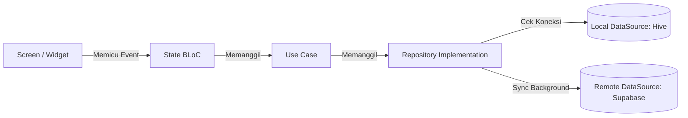
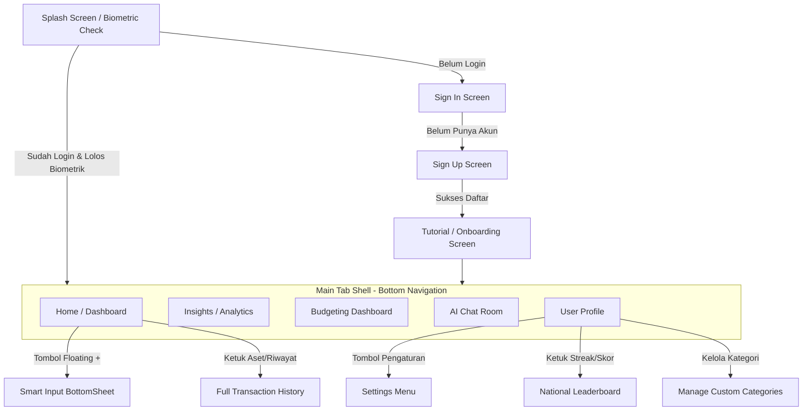

# Dokumentasi Master Spesifikasi & Arsitektur DuaSaku

Dokumen ini merupakan spesifikasi teknis lengkap dari aplikasi **DuaSaku** dari awal hingga akhir. Spesifikasi ini dirancang sebagai panduan komprehensif (single source of truth) untuk proses migrasi sistem secara penuh dari platform **React Native/Expo** ke **Flutter**.

---

## 1. PENDAHULUAN & RINGKASAN SISTEM
DuaSaku adalah aplikasi pelacak keuangan personal cerdas (*personal finance tracker*) bertema futuristik gelap (*Darkmatter*). Aplikasi ini didesain dengan konsep **Local-First, Sync-when-Online** yang terintegrasi erat dengan ekosistem database cloud Supabase, model kecerdasan buatan Google Gemini, dan layanan native Android (pembaca notifikasi bank).

### Fitur Utama DuaSaku:
1.  **Dashboard Keuangan Premium**: Visualisasi total aset lintas dompet, prakiraan arus kas bulanan, grafik analitik pengeluaran/pemasukan.
2.  **Mesin Sinkronisasi Offline**: Pencatatan instan tanpa latensi melalui antrean lokal MMKV, disinkronkan secara paralel saat mendeteksi koneksi internet.
3.  **Penyadap Notifikasi Bank**: Otomatisasi pencatatan transaksi dengan menyadap notifikasi bank lokal Indonesia (BCA, Livin Mandiri, BRImo, Jago) dan E-Wallet (Dana, OVO, ShopeePay, GoPay).
4.  **AI Financial Advisor**: Asisten virtual pintar bertenaga Gemini 1.5 Flash untuk analisis budget, saran keuangan, pencatatan draft transaksi via teks/suara/foto struk belanja, dan pencarian riwayat dengan bahasa alami.
5.  **Gamifikasi & Health Score**: Perhitungan skor kesehatan finansial harian berdasarkan kedisiplinan budget, rasio tabungan, konsistensi pencatatan (streak), keanekaragaman dompet, dan target menabung (wishlist).
6.  **Homescreen Widget**: Widget Android dinamis yang memperlihatkan sisa anggaran terhitung secara langsung dari cache lokal.

---

## 2. ARSITEKTUR BOOTSTRAP & NAVIGASI
Aplikasi DuaSaku dibangun di atas Expo SDK 52 dengan skema routing berbasis file (**Expo Router**).

### A. Alur Inisialisasi Aplikasi (`app/_layout.tsx`)
Setiap kali aplikasi dinyalakan, proses bootstrap berikut akan dieksekusi secara berurutan:
1.  **Loading Resources**: Memuat font eksternal Google Fonts (`Inter` dan `Manrope`) menggunakan hook `useFonts`. Splash screen ditahan secara asinkron menggunakan `SplashScreen.preventAutoHideAsync()` hingga semua sumber daya termuat.
2.  **Global Error Handling**: Di luar mode *development*, dipasang handler global lewat `ErrorUtils.setGlobalHandler` untuk mendeteksi crash tidak tertangani dan mengirim log kegagalan fatal ke sistem penyimpanan log cloud (`logger.fatal`).
3.  **Supabase Session Checker**: Aplikasi mengambil sesi autentikasi pengguna secara asinkron (`supabase.auth.getSession()`). Sesi tersebut didaftarkan ke `useUserStore`.
4.  **Biometric Lock (Cold Start Guard)**: Jika user memiliki sesi aktif dan mengaktifkan fitur biometric, aplikasi akan memanggil `LocalAuthentication.authenticateAsync()` untuk memverifikasi sidik jari/wajah sebelum menyembunyikan splash screen.
5.  **Setup Notification Permissions & Token**:
    *   Meminta izin notifikasi ke OS Android (`Notifications.requestPermissionsAsync`).
    *   Jika diizinkan, mengambil token push notification Expo menggunakan ID proyek (`db27d986-6bf8-4dad-9139-1d11fd36ce05`).
    *   Mengunggah token tersebut ke Supabase pada tabel `profiles.expo_push_token` agar perangkat dapat menerima peringatan anggaran otomatis dari cloud.
6.  **Sync Local Categories**: Menyinkronkan kategori kustom lokal pengguna dengan data di cloud Supabase (`useCategoryStore.syncWithCloud`).
7.  **Auto Process Due Recurrences**: Memanggil `processDueRecurrences()` untuk mengeksekusi transaksi berulang yang jatuh tempo saat aplikasi mati.
8.  **Register Background Fetch**: Mendaftarkan task latar belakang Android untuk melakukan sinkronisasi berkala.

### B. Guard Navigasi & AppState
*   **Routing Guard**:
    *   Jika pengguna tidak memiliki sesi aktif dan berada di luar grup rute `(auth)`, aplikasi akan dialihkan paksa (*force redirect*) ke `/(auth)/sign-in`.
    *   Jika pengguna memiliki sesi aktif namun belum menyelesaikan tutorial onboarding, aplikasi dialihkan ke `/tutorial`.
    *   Jika pengguna sudah login dan menyelesaikan tutorial tetapi mencoba masuk ke rute auth/tutorial, mereka dialihkan langsung ke halaman utama `/(tabs)`.
*   **Grace Period Biometric**:
    Aplikasi memantau perubahan status aplikasi (`AppStateStatus`). Saat aplikasi masuk ke `background`, aplikasi mencatat timestamp saat ini (`lastBackgroundTime`). Ketika aplikasi kembali ke `active` (foreground):
    *   Jika `Date.now() - lastBackgroundTime >= biometricGracePeriod` (default 30 detik), aplikasi akan terkunci kembali secara otomatis dan memicu sensor biometrik ulang. Jika di bawah grace period, aplikasi langsung terbuka tanpa interupsi.
    *   Setiap kali aplikasi masuk ke background, widget layar depan (`updateDuaSakuWidget`) akan diperbarui secara paksa untuk mencerminkan saldo terbaru.

---

## 3. SKEMA PENYIMPANAN DATA (STATE MANAGEMENT & LOCAL CACHE)
DuaSaku membagi state management menjadi beberapa store modular menggunakan library **Zustand** dengan middleware `persist` yang didukung oleh **MMKV** terenkripsi standar industri perbankan (AES-256) menggunakan kunci enkripsi unik (`EXPO_PUBLIC_MMKV_ENCRYPTION_KEY`).

### A. Store-Store Utama

#### 1. `useUserStore` (Manajemen Sesi & Profil)
*   **State**:
    *   `session`: Objek session Supabase (`Session | null`).
    *   `userProfile`: Nama pengguna (`string`) dan tautan avatar (`string | null`).
    *   `biometricEnabled`: Status keaktifan login sidik jari (`boolean`).
*   **Aksi**:
    *   `setSession(session)`: Memperbarui data sesi.
    *   `setUserProfile(name, avatarUrl)`: Memperbarui detail profil.
    *   `toggleBiometric()`: Mengaktifkan/menonaktifkan biometric guard.

#### 2. `useSettingsStore` (Pengaturan & Preferensi)
*   **State**:
    *   `isAutoRecordEnabled`: Flag perekaman otomatis dari notifikasi (`boolean`).
    *   `isPrivacyModeEnabled`: Mode privasi menyembunyikan nominal saldo (`boolean`).
    *   `useGasWebhook`: Flag pengiriman notifikasi bank ke Google Apps Script Webhook (`boolean`).
    *   `gasWebhookUrl`: URL webhook Google Apps Script.
    *   `customBankApps`: Daftar package name aplikasi Android yang disadap (e.g. `com.gojek.app`, `id.dana`).
    *   `customIncomeKeywords`: Kata kunci untuk deteksi dana masuk (e.g. `"masuk"`, `"menerima"`, `"top up"`).
    *   `aiPersonality`: Kepribadian AI (`'strict'` | `'casual'` | `'coach'`).
    *   `financialGoal`: Target finansial bulanan global (`{ name, targetAmount, currentAmount }`).
    *   `wishlist`: Target barang impian (Array dari `WishlistItem`: `{ id, name, price, savedAmount, icon, createdAt }`).
    *   `hasCompletedTutorial`: Menandakan onboarding selesai (`boolean`).
    *   `budgetAlertThreshold`: Ambang batas notifikasi peringatan anggaran (default 0.8 atau 80%).
    *   `biometricGracePeriod`: Durasi jeda biometric lock dalam detik (default 30).
*   **Aksi Utama**:
    *   `addToWishlist(item)`, `removeFromWishlist(id)`, `addFundsToWishlist(id, amount)`.
    *   `addCustomApp(packageName)`, `removeCustomApp(packageName)` untuk menambah/menghapus bank target.

#### 3. `useGamificationStore` (Kedisiplinan & Penghargaan)
*   **State**:
    *   `streakDays`: Jumlah hari pencatatan keuangan berurutan (`number`).
    *   `lastActiveDate`: Tanggal keaktifan terakhir (Format `"YYYY-MM-DD"`).
    *   `healthScore`: Nilai kesehatan finansial (`number`, rentang 1-100).
    *   `unlockedBadges`: Daftar lencana penghargaan yang diraih (Array dari string, contoh: `['saver_master', 'streak_7', 'transfer_expert']`).
*   **Aksi**:
    *   `incrementStreak()`: Menambah streak hari jika tanggal pencatatan hari ini berbeda dengan `lastActiveDate`.
    *   `setHealthScore(score)`: Memperbarui nilai kesehatan keuangan.
    *   `unlockBadge(badgeId)`: Membuka lencana baru dan memicu haptic feedback sukses.

#### 4. `useCategoryStore` (Pengelompokan & Kategori Kustom)
*   **State**:
    *   `categories`: Kategori default + kustom (Array dari `{ name, emoji, color, targetAmount }`).
*   **Aksi**:
    *   `syncWithCloud(userId)`: Mengunduh kategori kustom dari tabel Supabase `custom_categories` dan mem-merge-nya dengan data lokal.

#### 5. `useNotificationLogStore` (Riwayat Sadapan Notifikasi)
*   **State**:
    *   `logs`: Catatan performa parser notifikasi (Array dari `{ id, app, title, body, status, reason, extractedAmount, timestamp }`).
    *   `status` bernilai: `'parsed'` (sukses), `'failed'` (gagal ekstraksi nominal), `'ignored'` (debounce / duplikat).

---

## 4. OFFLINE SYNC ENGINE & MAGIC MERGE

Aplikasi ini mengadopsi prinsip ketahanan tinggi terhadap koneksi internet yang tidak stabil.

### A. Antrean Transaksi Offline (`src/lib/offlineSync.ts`)
*   **Struktur Data Item Antrean (`QueuedTransaction`)**:
    ```typescript
    interface QueuedTransaction {
      localId: string; // ID lokal acak
      remoteId?: string; // ID UUID dari Supabase (untuk update/delete)
      action: 'INSERT' | 'UPDATE' | 'DELETE';
      title?: string;
      amount?: number;
      type?: 'expense' | 'income';
      category?: string;
      latitude?: number | null;
      longitude?: number | null;
      location_name?: string | null;
      wallet_id?: string | null;
      is_transfer?: boolean | null;
      transfer_group_id?: string | null;
      user_id?: string | null;
      retryCount: number;
      queuedAt: string;
    }
    ```
*   **Fungsi `enqueueTransaction(tx, action)`**:
    1.  Membuat `localId` unik berformat `local_[timestamp]_[random_string]`.
    2.  Menyimpan objek transaksi baru ke antrean di penyimpanan lokal `offline_sync_queue`.
    3.  Mengirimkan event `sync_queue_changed` ke seluruh aplikasi untuk menampilkan UI indikator sinkronisasi.
*   **Fungsi `processSyncQueue()` (Sync Engine)**:
    1.  Membaca seluruh item di antrean lokal.
    2.  Memroses setiap item secara paralel menggunakan `Promise.allSettled` untuk menghindari hambatan berantai (*waterfall delay*).
    3.  Tergantung pada `action`:
        *   `INSERT`: Mengirim objek ke `.insert()` tabel Supabase `transactions`.
        *   `UPDATE`: Mengirim pembaruan data ke `.update().eq('id', remoteId)`.
        *   `DELETE`: Menghapus data fisik dari server menggunakan `.delete().eq('id', remoteId)`.
    4.  Jika operasi sukses, transaksi dikeluarkan dari antrean lokal via `dequeueTransaction()`.
    5.  Jika gagal, `retryCount` bertambah. Aplikasi akan mencoba sinkronisasi otomatis kembali saat koneksi internet terdeteksi pulih.

### B. Smart Conflict Resolution / Magic Merge (`src/lib/conflictResolution.ts`)
Untuk menghindari pencatatan ganda ketika notifikasi bank dibaca otomatis, sementara pengguna baru saja merekam transaksi yang sama secara manual, sistem melakukan validasi tiga lapis:
*   **Aturan Kemiripan**: Transaksi dianggap duplikat jika nilai absolut `amount` sama, `type` sama, `user_id` sama, dan dibuat dalam selisih waktu **≤ 15 menit** (`CONFLICT_WINDOW_MS`).
*   **Fungsi `isDuplicateTransaction(newTx)`**:
    1.  **Lapis 1 (Local Queue)**: Memindai antrean lokal `offline_sync_queue` yang belum terkirim. Jika ada kesamaan, kembalikan `true`.
    2.  **Lapis 2 (Local History)**: Memindai cache histori transaksi lokal `offline_transactions` di MMKV. Jika ada kesamaan, kembalikan `true`.
    3.  **Lapis 3 (Cloud Server)**: Melakukan pengecekan langsung ke Supabase dengan query terfilter rentang waktu:
        ```sql
        SELECT id FROM transactions 
        WHERE user_id = :userId 
          AND amount = :amount 
          AND type = :type 
          AND created_at >= :startTime (txTime - 15m) 
          AND created_at <= :endTime (txTime + 15m)
        LIMIT 1;
        ```
        Jika baris ditemukan, kembalikan `true`.

---

## 5. TRANSFER ANTAR DOMPET (INTER-WALLET TRANSFER)
Fitur transfer antar dompet dikelola oleh `src/lib/transferService.ts`. Fitur ini memanipulasi saldo dompet secara dinamis:
1.  **Validasi**: Memastikan nominal > 0 dan dompet asal berbeda dengan dompet tujuan.
2.  **Grup Transfer**: Membuat ID grup acak `transfer_group_id` dengan format `tg_[timestamp]_[random_string]`.
3.  **Pembuatan Baris Data**:
    *   **Baris Pengeluaran (Out)**:
        *   `wallet_id`: ID dompet asal.
        *   `amount`: Nominal transfer.
        *   `title`: `[Judul Transfer] (Out)`.
        *   `type`: `'expense'`.
        *   `is_transfer`: `true`.
        *   `transfer_group_id`: ID grup yang sama.
    *   **Baris Pemasukan (In)**:
        *   `wallet_id`: ID dompet tujuan.
        *   `amount`: Nominal transfer.
        *   `title`: `[Judul Transfer] (In)`.
        *   `type`: `'income'`.
        *   `is_transfer`: `true`.
        *   `transfer_group_id`: ID grup yang sama.
4.  **Eksekusi Transaksi**:
    *   **Online**: Mengirimkan kedua baris tersebut sekaligus dalam satu request `.insert([...])` di Supabase untuk menjaga konsistensi database (atomik).
    *   **Offline**: Meng-enqueue kedua transaksi tersebut secara terpisah ke antrean lokal.

---

## 6. LOGIKA PENGANGGARAN (BUDGETING & FORECASTING)

Penganggaran dilakukan per bulan dalam format `"YYYY-MM"` di file `src/lib/budgetService.ts`.

### A. Peramalan Pengeluaran (Smart Budget Forecasting)
Menganalisis pengeluaran berjalan untuk memprediksi total pengeluaran di akhir bulan berdasarkan kecepatan konsumsi uang pengguna.
*   **Formula**:
    1.  Ambil total pengeluaran dari seluruh kategori di bulan berjalan (`currentExpense`).
    2.  Ambil hari aktif saat ini (`currentDay = new Date().getDate()`).
    3.  Hitung total hari dalam bulan berjalan (`daysInMonth`).
    4.  Hitung kecepatan pengeluaran harian:
        $$\text{velocity} = \frac{\text{currentExpense}}{\text{currentDay}}$$
    5.  Hitung prediksi akhir pengeluaran:
        $$\text{forecastedExpense} = \text{velocity} \times \text{daysInMonth}$$

### B. Simulator Finansial "What-If"
Membantu pengguna memvisualisasikan dampak pembelian barang mewah sekali bayar (*one-time large purchase*) terhadap tabungan mereka dalam $N$ bulan mendatang.
*   **Formula Proyeksi**:
    Untuk setiap bulan ke-$i$ (dari 1 hingga $N$):
    $$\text{balance}(i) = (\text{saldoSaatIni} - \text{nominalBeli}) + (\text{pemasukanBulanan} - \text{pengeluaranBulanan}) \times i$$
*   Hasil simulasi dikembalikan dalam bentuk array objek data tren koordinat `{ month: i, balance: amount }` untuk ditampilkan langsung ke dalam grafik visualisasi.

### C. Salin Budget Bulan Lalu (Copy Budget QoL)
Menghemat waktu pengaturan budget pengguna.
1.  Mengambil semua budget aktif di bulan sebelumnya (`getLastMonthYear()`).
2.  Melakukan looping dan memanggil fungsi `upsertBudget()` untuk memasukkan nominal anggaran yang sama ke bulan berjalan (`getCurrentMonthYear()`).
3.  Jika di bulan berjalan kategori anggaran tersebut sudah diatur, nilainya akan di-update (*overwrite*), sedangkan kategori baru akan di-insert secara otomatis.

---

## 7. PENYADAP NOTIFIKASI BANK (ANDROID ONLY)
Layanan latar belakang (`src/lib/notificationService.ts`) berjalan secara native menggunakan library `react-native-android-notification-listener`.

```mermaid
graph TD
    A[Notifikasi OS Android Masuk] --> B{Apakah Auto-Record Aktif?}
    B -- Tidak -- C[Abaikan]
    B -- Ya --> D{Apakah Package Aplikasi Terdaftar?}
    D -- Tidak --> C
    D -- Ya --> E[Ekstraksi Nominal dengan Regex]
    E --> F{Apakah Nominal > 0?}
    F -- Tidak --> G[Catat Log Gagal Ekstraksi]
    F -- Ya --> H[Deteksi Jenis Transaksi: Pemasukan / Pengeluaran]
    H --> I[Cek Lokal Debounce 60 Detik]
    I -- Duplikat --> J[Catat Log Diabaikan]
    I -- Unik --> K[Cek Smart Conflict Resolution dengan Input Manual]
    K -- Duplikat --> J
    K -- Unik --> L[Prediksi Kategori Otomatis via Regex Kata Kunci]
    L --> M[Masukkan ke Offline Sync Queue]
    M --> N[Kirim Pemicu Peringatan Anggaran]
    N --> O[Sync ke Supabase & Simpan Ke Cache Debounce]
```

### A. Deteksi Transaksi Pemasukan (Income Keywords Check)
Jika teks isi notifikasi bank dibaca sebagai huruf kecil dan mengandung salah satu string di dalam array `settings.customIncomeKeywords` (default: `"masuk"`, `"menerima"`, `"top up"`, `"refund"`, `"berhasil ditambahkan"`, `"terima"`), maka transaksi dikategorikan sebagai **`income`**. Jika tidak, dikategorikan sebagai **`expense`**.

### B. Algoritma Debounce Notifikasi
Bank sering kali mengirimkan SMS ganda atau notifikasi ganda untuk satu transaksi. Sistem mengatasinya dengan:
1.  Membuat tanda pengenal unik (`signature` = `appName_nominal`).
2.  Mengambil objek penanda transaksi terakhir dari MMKV (`LAST_TX_KEY`).
3.  Jika `signature === lastSignature` dan selisih waktu masuk **< 60 detik (60.000 ms)**, notifikasi tersebut dibuang secara diam-diam dan dicatat sebagai `'ignored'` di log.

---

## 8. SENSOR TRANSAKSI BERULANG (RECURRING ENGINE)
Dikelola di `src/lib/recurringService.ts` untuk mengotomatisasi pengeluaran wajib bulanan seperti sewa kos, langganan internet, atau pemasukan rutin seperti gaji.

### A. Rumus Siklus Masa Depan (`calculateNextDue`)
*   **Daily**:
    $$\text{nextDue} = \text{hariIni} + 1\text{ hari}$$
*   **Weekly** (Target hari $W \in [0..6]$, Minggu=0):
    1.  Dapatkan hari dalam seminggu saat ini ($C$).
    2.  Hitung sisa hari menuju target: $\text{daysUntil} = W - C$.
    3.  Jika $\text{daysUntil} \le 0$, maka $\text{daysUntil} = \text{daysUntil} + 7$.
    4.  $$\text{nextDue} = \text{hariIni} + \text{daysUntil}$$
*   **Monthly** (Target tanggal $D \in [1..31]$):
    1.  Tentukan tanggal target di bulan ini: $\text{targetDate} = (\text{tahunIni}, \text{bulanIni}, D)$.
    2.  Jika $\text{targetDate} \le \text{hariIni}$, maka:
        $$\text{nextDue} = (\text{tahunIni}, \text{bulanIni} + 1, D)$$
    3.  Jika tidak, $\text{nextDue} = \text{targetDate}$.

### B. Pemrosesan Otomatis & Pemajuan Tanggal
Saat dipicu (startup aplikasi atau background fetch rutin):
1.  Query semua template berulang yang aktif (`is_active: true`) dan memiliki tanggal jatuh tempo `next_due <= hariIni`.
2.  Untuk setiap template yang cocok:
    *   Memicu `enqueueTransaction` secara otomatis dengan judul ditambahkan label ` (auto)`.
    *   Meneruskan parameter ke fungsi `advanceNextDue()` untuk memajukan target jatuh tempo berikutnya (ditambah 1 hari untuk daily, ditambah 7 hari untuk weekly, atau ditambah 1 bulan untuk monthly dengan validasi hari maksimal dalam bulan).
    *   Memperbarui tanggal `next_due` baru ke database.---

## 9. TASK LATAR BELAKANG & CACHE OFFLINE (BACKGROUND FETCH)
Layanan latar belakang berkala dikelola di `src/lib/backgroundTasks.ts` menggunakan `expo-background-fetch` dan `expo-task-manager`.

### A. Alur Kerja `BACKGROUND_FETCH_TASK`
Task ini didaftarkan dengan nama `BACKGROUND_FETCH_TASK` dan diatur untuk berjalan secara berkala di latar belakang OS (minimal setiap 15 menit, `minimumInterval: 60 * 15`). Ketika dipicu, task mengeksekusi langkah-langkah berikut secara asinkron:
1.  **Sinkronisasi Antrean Lokal**: Memeriksa antrean mutasi lokal. Jika terdapat transaksi tunda (`getPendingCount() > 0`), panggil `processSyncQueue()` untuk menyinkronkannya ke cloud Supabase.
2.  **Pemrosesan Transaksi Berulang**: Mengambil sesi pengguna aktif, lalu mengeksekusi `processDueRecurrences(userId)` untuk memproses transaksi terjadwal yang telah jatuh tempo selama perangkat dalam kondisi standby.
3.  **Pre-Caching Transaksi Terbaru**: Mengambil 50 transaksi terbaru milik pengguna dari tabel Supabase `transactions` dan menyimpannya ke dalam MMKV storage dengan ID `'background-tasks'` di bawah key `'offline_transactions'`. Ini memastikan pengguna dapat langsung melihat data transaksi terbaru mereka saat membuka aplikasi dalam keadaan offline (*zero loading time*).

---

## 10. GEOFENCING & RADAR TEMPAT PENGELUARAN (SPEND AREAS)
Fitur geofencing dikelola di `src/lib/geofencing.ts` menggunakan layanan lokasi latar belakang OS (`expo-location`) dan pengelola tugas (`expo-task-manager`).

### A. Alur Deteksi Lokasi (`GEOFENCE_TASK`)
1.  Aplikasi mengidentifikasi koordinat wilayah (geofence region) tempat pengguna paling sering melakukan pengeluaran uang (diperoleh dari data historis transaksi yang memiliki koordinat).
2.  Daftar wilayah ini disimpan di cache lokal `'geofencing-storage'` di bawah key `'cached_geofences'`.
3.  Sistem mendaftarkan radar geofencing menggunakan `Location.startGeofencingAsync`.
4.  Ketika pengguna secara fisik memasuki radius wilayah terdaftar tersebut (`Location.GeofencingEventType.Enter` dipicu oleh OS):
    *   Sistem memanggil task latar belakang `GEOFENCE_TASK`.
    *   Mengirimkan notifikasi lokal instan ke perangkat pengguna:
        *   **Judul**: `⚠️ Watch your wallet!`
        *   **Isi**: `You've entered a frequent spending area.`
    *   Notifikasi ini berfungsi sebagai pengingat psikologis (*nudge*) agar pengguna menahan diri untuk tidak membelanjakan uang secara impulsif di area tersebut.

---

## 11. PERINGATAN ANGGARAN LOKAL (LOCAL BUDGET ALERTS)
Peringatan anggaran dijalankan secara lokal di file `src/lib/notifications.ts` untuk memberikan notifikasi instan begitu batas anggaran terlampaui.

### A. Mekanisme `checkBudgetAlert(category)`
Setiap kali transaksi baru berhasil direkam (baik manual maupun otomatis dari notifikasi bank), aplikasi secara paralel memanggil fungsi ini:
1.  Mengambil anggaran bulanan terpasang (`fetchBudgets`) dan total pengeluaran berjalan bulan ini (`fetchMonthlySpending`) untuk kategori transaksi tersebut.
2.  Menghitung persentase pemakaian anggaran:
    $$\text{percentage} = \left( \frac{\text{Total Pengeluaran Kategori}}{\text{Limit Anggaran Kategori}} \right) \times 100$$
3.  **Evaluasi Threshold (Ambang Batas)**:
    *   **Level Bahaya (Persentase ≥ 100%)**: Mengirimkan notifikasi lokal instan berbunyi:
        *   **Judul**: `[Emoji Kategori] Budget [Nama Kategori] Habis!`
        *   **Isi**: `Kamu sudah melebihi budget sebesar Rp [Selisih nominal]. Pertimbangkan untuk mengurangi pengeluaran.`
    *   **Level Peringatan (Persentase ≥ 80%)**: Mengirimkan notifikasi lokal instan berbunyi:
        *   **Judul**: `[Emoji Kategori] Awas! Budget [Nama Kategori] Menipis`
        *   **Isi**: `Budget [Nama Kategori] kamu sisa Rp [Sisa nominal] ([Persentase sisa]% tersisa). Hati-hati ya!`
4.  **Daily Reminder (Pengingat Harian)**:
    Fungsi `refreshDailyReminder()` menjadwalkan notifikasi lokal harian otomatis menggunakan trigger OS pada pukul 20:00 (8 malam) setiap hari:
    *   **Isi**: `Jangan lupa catat pengeluaranmu hari ini!`

---

## 12. PEMBERSIHAN DATA AMAN (CLEANUP SERVICE)
Keamanan data keuangan pengguna saat keluar dari aplikasi dikelola secara ketat oleh `src/lib/cleanupService.ts`.

### A. Mekanisme `clearAllCaches()`
Ketika pengguna memilih untuk keluar dari akun (*logout*) atau menghapus akun mereka, layanan ini dipanggil untuk melakukan penghapusan menyeluruh data sensitif yang tersimpan secara fisik di memori perangkat:
1.  **Hapus Antrean Offline**: Menghapus seluruh instansi antrean sinkronisasi transaksi tunda pada MMKV `'offline-sync'`.
2.  **Hapus Preferensi & Pengaturan**: Menghapus konfigurasi bank aplikasi, kata kunci bank masuk, wishlist, target keuangan, dan ambang notifikasi pada MMKV `'settings-storage'`.
3.  **Hapus Sesi & Profil**: Menghapus token autentikasi jwt, data profil, dan penanda biometric pada MMKV `'user-storage'`.
4.  **Hapus Cache Lottie**: Memanggil `clearLottieCache()` untuk membersihkan file cache json animasi antarmuka guna mengembalikan ruang penyimpanan perangkat pengguna.

---

## 13. INTEGRASI AI & EDGE FUNCTIONS
DuaSaku memadukan model AI Gemini 1.5 Flash untuk analisis teks/suara/gambar dengan database Supabase.

### A. Struktur Data Masukan Cerdas (AI Input Types)
*   **Edge Function `parse-transaction`**: Menerima parameter `prompt` berupa kalimat masukan bebas (contoh: *"tadi siang makan bakso habis 25ribu di warung"*), daftar kategori aktif, dan konteks user. Mengembalikan objek JSON:
    ```json
    {
      "title": "Makan Bakso",
      "amount": 25000,
      "category": "Food",
      "type": "expense"
    }
    ```
*   **Edge Function `parse-audio`**: Menerima file audio berformat Base64, memprosesnya melalui API multimodal Gemini untuk transkripsi sekaligus ekstraksi transaksi, dan mengembalikan objek JSON serupa.
*   **Edge Function `scan-receipt`**: Menerima berkas gambar struk/nota belanja Base64, mengekstrak teks menggunakan OCR multimodal AI, dan mengembalikan nominal transaksi total, tanggal belanja, serta item yang dibeli.

### B. Pemrosesan Action Tag di Chat AI
Pada layar `app/(tabs)/ai.tsx`, ketika pengguna berinteraksi lewat ruang obrolan, asisten AI diprogram untuk menyisipkan instruksi otomatis bernama **Action Tag**:
*   **Format Tag**: `[ACTION:ADD_TRANSACTION|title:NamaBarang|amount:NominalUang|category:NamaKategori]`
*   **Pemrosesan di UI**:
    1.  Aplikasi menggunakan ekspresi reguler untuk memisahkan teks normal dengan tag aksi:
        ```typescript
        const actionRegex = /\[ACTION:ADD_TRANSACTION\|title:([^|]+)\|amount:([^|]+)\|category:([^\]]+)\]/;
        ```
    2.  Jika tag terdeteksi, teks tag disembunyikan dari balon chat.
    3.  Aplikasi merender kartu visual khusus bertema neon di bawah balon chat dengan detail: Judul, Kategori, Jumlah Uang, dan tombol "Simpan ke Catatan".
    4.  Menekan tombol tersebut akan memicu `DeviceEventEmitter.emit('open_smart_input')` untuk membuka lembar pengisian transaksi instan.

### C. Pencarian Riwayat Keuangan Bahasa Alami (NLP Search)
Asisten AI dapat memfilter database transaksi Supabase secara langsung berdasarkan pertanyaan pengguna:
1.  User bertanya: *"tunjukkan total belanja shopee saya selama bulan mei ini"*.
2.  Aplikasi memanggil `parseSearchQuery(userMsgContent)` ke Edge Function.
3.  Edge Function menerjemahkan pertanyaan menjadi filter terstruktur:
    `{ category: "Shopping", startDate: "2026-05-01T00:00:00Z", endDate: "2026-05-31T23:59:59Z", keyword: "shopee", type: "expense" }`.
4.  Aplikasi mengeksekusi filter tersebut ke database Supabase `transactions`.
5.  Data hasil query dikirimkan ke Edge Function `answerSearchQuery` untuk merumuskan balasan yang informatif (contoh: *"Berdasarkan catatan saya, kamu belanja 3 kali di Shopee pada bulan Mei dengan total Rp 320.000"*).

---

## 14. ALGORITMA SKOR KESEHATAN (FINANCIAL HEALTH SCORE)
Setiap hari, aplikasi menghitung Skor Kesehatan Finansial pengguna (rentang 1-100) di file `src/lib/gamificationService.ts`.

$$\text{Health Score} = S_{\text{budget}} (40) + S_{\text{saving}} (30) + S_{\text{streak}} (20) + S_{\text{wallet}} (5) + S_{\text{goal}} (5)$$

### Rincian Poin:
1.  **Kedisiplinan Anggaran ($S_{\text{budget}}$ - Max 40 Poin)**:
    Menganalisis pengeluaran aktual terhadap limit kategori budget bulan ini.
    *   Jika jumlah kategori budget > 0:
        $$S_{\text{budget}} = \left( \frac{\text{Jumlah Kategori Di Bawah Limit}}{\text{Total Kategori Budget}} \right) \times 40$$
    *   Jika pengguna belum mengatur anggaran sama sekali: diberikan poin dasar **30**.
2.  **Rasio Tabungan ($S_{\text{saving}}$ - Max 30 Poin)**:
    Menganalisis margin tabungan dari pemasukan berjalan bulan ini.
    *   Hitung margin: $\text{Rasio} = \frac{\text{Total Pemasukan} - \text{Total Pengeluaran}}{\text{Total Pemasukan}}$.
    *   Jika $\text{Rasio} \ge 30\%$ ($0.3$): mendapat **30** poin penuh (dan membuka lencana `saver_master`).
    *   Jika $0 < \text{Rasio} < 30\%$: mendapat poin proporsional:
        $$S_{\text{saving}} = \left( \frac{\text{Rasio}}{0.3} \right) \times 30$$
    *   Jika Rasio ≤ 0: mendapat **0** poin.
3.  **Konsistensi Pencatatan ($S_{\text{streak}}$ - Max 20 Poin)**:
    Menghitung keaktifan beruntun hari pencatatan transaksi yang tersimpan di `useGamificationStore`.
    *   Skor:
        $$S_{\text{streak}} = \min(\text{streakDays} \times 2.8, 20)$$
        *(Pencatatan 7 hari berturut-turut setara dengan 19.6 poin, dibulatkan menjadi 20 poin penuh).*
4.  **Diversifikasi Dompet ($S_{\text{wallet}}$ - Max 5 Poin)**:
    Memiliki kebiasaan memisahkan uang.
    *   Dapatkan jumlah dompet aktif dari Supabase. Jika jumlah dompet $\ge 2$, dapatkan **5** poin penuh. Jika kurang, mendapat **0** poin.
5.  **Progres Target Impian ($S_{\text{goal}}$ - Max 5 Poin)**:
    Menganalisis keaktifan menabung untuk wishlist di `useSettingsStore`.
    *   Jika pengguna memiliki barang di wishlist dengan nilai saldo tabungan berjalan `savedAmount > 0`, dapatkan **5** poin penuh. Jika tidak, mendapat **0** poin.

---

## 15. ANDROID HOMESCREEN WIDGET
Widget Android dikelola via `react-native-android-widget`.

### A. Rupa Visual (`src/widgets/DuaSakuWidget.tsx`)
Widget berukuran 2x2 or 4x1 yang diletakkan di homescreen Android. Merender komponen FlexWidget berisi:
*   Judul anggaran aktif (contoh: *"Tabungan Menikah"* atau *"Budget Liburan"*).
*   Jumlah saldo tersimpan terformat Rupiah.
*   **Progress Bar Dinamis**:
    *   Panjang bar dihitung dari: `percentage = (currentAmount / targetAmount) * 100`.
    *   **Perubahan Warna Sinyal**: Jika penggunaan budget target `percentage >= 80%`, warna bar berubah menjadi merah (`#ef4444`) sebagai tanda peringatan keras. Jika di bawah itu, berwarna hijau (`#10b981`).
*   Teks persentase terpakai di sisi kiri dan total anggaran di sisi kanan.

### B. Sinkronisasi Latar Belakang (`src/widgets/widget-task-handler.tsx`)
Karena widget tidak dapat memanggil hooks react secara langsung, pembaruan data dikelola secara native:
1.  Saat dipicu, fungsi memuat file penyimpanan fisik MMKV dengan ID `'settings-storage'` dan menguraikan JSON state-nya.
2.  Mengambil data `financialGoal` lokal (`currentAmount`, `targetAmount`, dan `name`).
3.  Memanggil `requestWidgetUpdate()` dengan data tersebut untuk memicu penggambaran ulang widget Android secara instan di latar belakang tanpa membuka aplikasi.

---

## 16. PANDUAN INTEGRASI & MIGRASI KE FLUTTER
Bagian ini merangkum hal penting untuk memigrasikan seluruh fitur di atas ke Flutter:

### A. Peta Dependensi Library (React Native vs Flutter)

| Fitur / Modul | Library React Native | Library Flutter (Rekomendasi) |
| :--- | :--- | :--- |
| **Local Database (Fast)** | `react-native-mmkv` | `hive` / `isar` |
| **Secure Key Store** | `expo-secure-store` | `flutter_secure_storage` |
| **Autentikasi & Database**| `supabase-js` | `supabase_flutter` |
| **Sensor Sidik Jari/Wajah**| `expo-local-authentication` | `local_auth` |
| **Interactive Chart** | `react-native-gifted-charts` | `fl_chart` |
| **Notifikasi Push** | `expo-notifications` | `firebase_messaging` / `flutter_local_notifications` |
| **Widget Layar Depan** | `react-native-android-widget` | `home_widget` + Native Kotlin AppWidgetProvider |
| **Background Service** | `expo-background-fetch` | `workmanager` |
| **Animasi Lottie** | `lottie-react-native` | `lottie` |
| **Feedback Getaran** | `expo-haptic-feedback` | `vibration` / `services.dart` (HapticFeedback) |

### B. Struktur Folder Bersih di Flutter (Clean Architecture)
Sangat direkomendasikan menggunakan struktur modular untuk mengelola kompleksitas:
```plaintext
lib/
├── core/
│   ├── network/            # Koneksi internet & Supabase client
│   ├── storage/            # Enkripsi Box Hive/Isar
│   ├── theme/              # Warna Darkmatter & Typography Outfit/Inter
│   └── utils/              # Debounce, Haptic helper, Regex parser
├── features/
│   ├── auth/               # Autentikasi & Biometric Guard
│   ├── dashboard/          # Tampilan Utama & Widget updater
│   ├── transactions/       # Logika offline sync, conflict resolution, transfer
│   ├── budgets/            # Analitik, forecasting, simulator what-if
│   ├── gamification/       # Hitung Health Score & Badge unlock
│   └── ai_chat/            # Integrasi Gemini, parser speech-to-text, receipt OCR
└── main.dart               # Bootstrap, Workmanager, AppState handler
```

### C. Implementasi Enkripsi Database Lokal di Flutter
Di React Native, MMKV dienkripsi dengan string kunci. Di Flutter menggunakan Hive, pastikan box dienkripsi dengan kunci aman yang dihasilkan saat startup dan disimpan di Secure Storage:
```dart
import 'dart:convert';
import 'package:flutter_secure_storage/flutter_secure_storage.dart';
import 'package:hive/hive.dart';

Future<Box> openEncryptedBox(String boxName) async {
  const secureStorage = FlutterSecureStorage();
  
  // Cek apakah kunci enkripsi sudah ada
  String? key = await secureStorage.read(key: 'encryption_key');
  if (key == null) {
    // Buat kunci aman baru jika belum ada
    final newKey = Hive.generateSecureKey();
    await secureStorage.write(key: 'encryption_key', value: base64UrlEncode(newKey));
    key = base64UrlEncode(newKey);
  }
  
  final encryptionKey = base64Url.decode(key);
  return await Hive.openBox(
    boxName,
    encryptionCipher: HiveAesCipher(encryptionKey),
  );
}
```

### D. Penanganan Interseptor Notifikasi Bank di Android (Kotlin)
Karena Flutter tidak memiliki paket penyadap notifikasi langsung sekokoh Android, buat kelas Kotlin custom yang memperluas `NotificationListenerService` dan hubungkan dengan Dart melalui `MethodChannel` / `EventChannel` untuk mem-parsing teks menggunakan regex perbankan.

---

## 17. PANDUAN TAKTIS & OPTIMASI PREMIUM FLUTTER (UPGRADES)
Bagian ini berisi rancangan arsitektur, potongan kode Dart/Kotlin, serta praktik optimasi performa tinggi untuk membangun kembali DuaSaku di Flutter agar berjalan dengan performa maksimal.

### A. Pola Arsitektur Aliran Data (Offline-First Data Flow)
Gunakan pola **Clean Architecture** yang terbagi menjadi 3 Lapisan:
1.  **Presentation (UI & BLoC)**: Mengelola state antarmuka. Menggunakan BLoC untuk memisahkan logika UI dengan bisnis.
2.  **Domain (Entities, Use Cases, Repositories Interfaces)**: Berisi aturan bisnis inti (e.g. kalkulasi Health Score, What-If simulator).
3.  **Data (Models, Repositories Implementations, Data Sources)**: Menangani interaksi ke Hive (lokal) dan Supabase (remote).



### B. Snippet Kode Dart: Offline Sync Queue (Implementasi Asinkron)
Implementasikan antrean sinkronisasi tunda menggunakan Flutter dengan manajemen konkurensi paralel:

```dart
import 'dart:async';
import 'package:hive/hive.dart';
import 'package:supabase_flutter/supabase_flutter.dart';

class QueuedTransaction {
  final String localId;
  final String? remoteId;
  final String action; // 'INSERT', 'UPDATE', 'DELETE'
  final Map<String, dynamic> data;
  int retryCount;

  QueuedTransaction({
    required this.localId,
    this.remoteId,
    required this.action,
    required this.data,
    this.retryCount = 0,
  });

  Map<String, dynamic> toJson() => {
    'localId': localId,
    'remoteId': remoteId,
    'action': action,
    'data': data,
    'retryCount': retryCount,
  };
}

class SyncEngine {
  final Box _queueBox = Hive.box('sync_queue');
  final SupabaseClient _supabase = Supabase.instance.client;

  Future<void> processSyncQueue() async {
    if (_queueBox.isEmpty) return;

    final List<dynamic> rawItems = _queueBox.values.toList();
    final List<QueuedTransaction> queue = rawItems.map((item) {
      final map = Map<String, dynamic>.from(item);
      return QueuedTransaction(
        localId: map['localId'],
        remoteId: map['remoteId'],
        action: map['action'],
        data: Map<String, dynamic>.from(map['data']),
        retryCount: map['retryCount'] ?? 0,
      );
    }).toList();

    // Jalankan sinkronisasi secara paralel menggunakan Future.wait
    final futures = queue.map((tx) => _syncItem(tx));
    await Future.wait(futures);
  }

  Future<void> _syncItem(QueuedTransaction tx) async {
    try {
      if (tx.action == 'INSERT') {
        await _supabase.from('transactions').insert(tx.data);
      } else if (tx.action == 'UPDATE') {
        await _supabase.from('transactions').update(tx.data).eq('id', tx.remoteId!);
      } else if (tx.action == 'DELETE') {
        await _supabase.from('transactions').delete().eq('id', tx.remoteId!);
      }
      
      // Hapus dari antrean jika sukses
      await _queueBox.delete(tx.localId);
    } catch (e) {
      tx.retryCount++;
      if (tx.retryCount >= 5) {
        // Pindahkan ke antrean gagal / laporkan log error ke cloud
        await _queueBox.delete(tx.localId);
        _logSyncFailure(tx, e.toString());
      } else {
        // Update jumlah retry lokal
        await _queueBox.put(tx.localId, tx.toJson());
      }
    }
  }

  void _logSyncFailure(QueuedTransaction tx, String error) {
    // Implementasi pengiriman log error fatal ke tabel error_logs Supabase
    print('Sync failed permanently for ${tx.localId}: $error');
  }
}
```

### C. Kotlin Notification Interceptor dengan EventChannel
Agar Flutter dapat mendengarkan secara real-time aliran (*stream*) teks notifikasi perbankan dari OS Android, buat kelas `NotificationListener` di sisi Android Native:

```kotlin
package com.duasaku.app

import android.content.Intent
import android.os.IBinder
import android.service.notification.NotificationListenerService
import android.service.notification.StatusBarNotification
import io.flutter.plugin.common.EventChannel

class BankNotificationListener : NotificationListenerService() {

    companion object {
        var eventSink: EventChannel.EventSink? = null
    }

    override fun onNotificationPosted(sbn: StatusBarNotification?) {
        super.onNotificationPosted(sbn)
        sbn?.let {
            val packageName = it.packageName
            val extras = it.notification.extras
            val title = extras.getString("android.title") ?: ""
            val text = extras.getCharSequence("android.text")?.toString() ?: ""

            // Kirim data ke Flutter lewat EventChannel jika terhubung
            val data = mapOf(
                "packageName" to packageName,
                "title" to title,
                "body" to text,
                "timestamp" to System.currentTimeMillis()
            )
            
            // Jalankan di thread utama Flutter
            android.os.Handler(android.os.Looper.getMainLooper()).post {
                eventSink?.success(data)
            }
        }
    }
}
```
Di sisi Dart, dengarkan notifikasi perbankan tersebut secara asinkron:
```dart
import 'package:flutter/services.dart';

class BankNotificationReceiver {
  static const EventChannel _eventChannel = EventChannel('com.duasaku.app/bank_notifications');

  void startListening() {
    _eventChannel.receiveBroadcastStream().listen((dynamic event) {
      final map = Map<String, dynamic>.from(event);
      final packageName = map['packageName'];
      final title = map['title'];
      final body = map['body'];
      
      // Jalankan logika parseRegex nominal dan sinkronisasi DuaSaku di sini
      print("Sadap Notifikasi: $packageName | $title : $body");
    }, onError: (error) {
      print("Gagal menyadap: $error");
    });
  }
}
```

### D. Optimasi UI Neon & Efisiensi Grafik (Performance Tuning)
Tema visual gelap futuristik (*Darkmatter*) memerlukan performa rendering optimal agar tidak terjadi penurunan FPS pada transisi layar atau grafik:
1.  **Gunakan `RepaintBoundary`**: Bungkus widget chart (`fl_chart`) atau komponen beranimasi berat (Lottie) menggunakan `RepaintBoundary` agar Flutter Engine tidak menggambar ulang (*render*) seluruh layar ketika hanya grafik saja yang bergerak/diperbarui.
    ```dart
    RepaintBoundary(
      child: LineChart(sampleData),
    )
    ```
2.  **Shader Pre-warming**: DuaSaku versi Flutter akan secara otomatis menggunakan engine **Impeller** di iOS dan Android (jika didukung). Untuk memastikan transisi navigasi 120Hz berjalan mulus tanpa stutter (*shader compilation jank*), pastikan semua asset SVG/Lottie dibaca secara asinkron menggunakan cache memori.
3.  **const Constructor**: Selalu tambahkan kata kunci `const` pada widget statis agar Flutter dapat memakai kembali *element tree* tanpa rebuild berulang.

### E. Integrasi Home Widget & Shared Preferences
Future<void> updateFlutterWidget(double currentBudget, double targetBudget, String budgetName) async {
  await HomeWidget.saveWidgetData<double>('currentAmount', currentBudget);
  await HomeWidget.saveWidgetData<double>('targetAmount', targetBudget);
  await HomeWidget.saveWidgetData<String>('budgetName', budgetName);
  
  // Pemicu sistem Android untuk menggambar ulang widget DuaSakuWidget
  await HomeWidget.updateWidget(
    name: 'DuaSakuWidgetProvider',
    androidName: 'DuaSakuWidgetProvider',
  );
}
```

---

## 18. RANCANGAN UI/UX & SISTEM DESAIN (DARKMATTER AESTHETICS)
DuaSaku mengusung estetika visual futuristik premium bertema **Darkmatter**. Tampilan didominasi oleh warna gelap pekat dengan aksen warna neon harmonis untuk memberikan kesan modern, bersih, dan kontras yang tajam (*cyber-premium*).

### A. Palet Warna (Design Tokens)
Untuk mematuhi aturan kenyamanan mata dan kontras tinggi, berikut adalah palet token warna yang digunakan secara konsisten di seluruh layar:
*   **Canvas/Background**: Hitam Pekat (`#000000`) dan Jet Black/Charcoal (`#09090b` / `#121214`).
*   **Card/Container**: Dark Slate Gray (`#1c1c1e` / `#18181b`) dengan opasitas perbatasan halus (`border: 1px solid rgba(255,255,255,0.05)`).
*   **Primary/Brand Accent**: Cyber Blue / Cyan (`#06b6d4`) - melambangkan stabilitas keuangan cerdas dan AI.
*   **Income/Positive**: Emerald Green (`#10b981`) - melambangkan uang masuk atau kondisi anggaran aman.
*   **Expense/Warning**: Crimson Red (`#ef4444`) - melambangkan uang keluar, peringatan keras, atau limit habis.
*   **Gamification/Streak**: Amber Gold (`#f59e0b`) - melambangkan streaks hari, lencana, dan podium.
*   **Typography**:
    *   *Primary Text*: Putih Salju (`#fafafa` / `#ffffff`) untuk judul besar dan nominal utama.
    *   *Secondary Text*: Muted Gray (`#a1a1aa` / `#71717a`) untuk keterangan, tanggal, dan sub-judul.

### B. Prinsip & Interaksi UX (Micro-Interactions)
1.  **Glassmorphism**: Gunakan efek latar belakang transparan kabur (*backdrop blur*) dengan garis tepi tipis pada elemen yang melayang (seperti tombol aksi mengambang dan bottom sheet input transaksi).
2.  **Sensasi Taktil (Haptic Feedback)**: Setiap ketukan sukses (menyimpan transaksi, menyentuh target budget, klaim lencana) memicu getaran haptic mikro (`HapticFeedback.lightImpact`).
3.  **Transisi Halus**: Perpindahan antar tab menggunakan animasi geser linear dengan durasi cepat (200ms) untuk mencegah kelambatan (*jank*).
4.  **Privacy Shroud**: Mengetuk tombol mata coret di header utama akan langsung menyamarkan seluruh teks nominal keuangan (mengubah angka menjadi `•••••` dengan efek sensor blur kabur).

---

## 19. STRUKTUR HALAMAN & RUTE NAVIGASI (PAGE ROUTING)
Di Flutter, seluruh halaman ini dikelola oleh pengelola navigasi (rekomendasi: menggunakan **GoRouter** atau navigator bawaan). Rute dibagi menjadi rute autentikasi, tab utama, dan halaman detail independen.



### A. Lapisan Shell Utama (Main Navigation Shell)
Aplikasi menggunakan navigasi bawah (*Bottom Navigation Bar*) berperekat dengan 5 tab utama:

#### 1. Tab Home (Dashboard)
*   **Header**: Foto profil mini, penanda status sinkronisasi offline (ikon awan centang hijau/awan memuat abu-abu), dan tombol sensor privasi saldo.
*   **Card Saldo Aset**: Menampilkan total saldo gabungan dari seluruh dompet secara mencolok.
*   **Grid Dompet (Wallets)**: Kartu geser horizontal (*carousel*) berisi daftar rekening/dompet pengguna (e.g. "Kas", "Bank Mandiri", "Gopay") beserta sisa saldo masing-masing.
*   **List Transaksi Terkini**: Daftar 5 transaksi terakhir. Setiap item menampilkan emoji kategori, nama transaksi, nama dompet asal, nominal (hijau untuk masuk, putih untuk keluar), serta label `(auto)` jika dideteksi otomatis oleh notifikasi bank.
*   **Floating Action Button (FAB)**: Tombol melayang berdesain neon biru di tengah navigasi untuk memicu bottom sheet `SmartInputSheet`.

#### 2. Tab Insights (Analitik Keuangan)
*   **Filter Tanggal**: Selector bulan aktif di bagian atas (menggunakan gesture geser horizontal).
*   **Grafik Batang Mingguan**: Rincian tren pengeluaran mingguan berjalan (menggunakan library `fl_chart`).
*   **Pie Chart Kategori**: Pembagian alokasi pengeluaran berdasarkan kategori. Setiap potongan diagram memiliki warna unik neon yang serasi dengan emoji kategori.
*   **AI Financial Coach Card**: Widget bertenaga AI Gemini yang menampilkan teks ringkasan singkat kondisi keuangan bulan ini (e.g. *"Belanja pakaianmu naik 12% dibanding bulan lalu, tahan diri dulu ya!"*).
*   **Section What-If Simulator**: Form slider interaktif untuk menyimulasikan dampak rencana pembelian besar terhadap sisa anggaran bulanan berjalan.

#### 3. Tab Budget (Penganggaran)
*   **Progress Gauge Anggaran**: Visualisasi lingkaran (*circular progress indicator*) yang menunjukkan total budget terpakai vs sisa limit bulan berjalan.
*   **Kategori Anggaran List**: Setiap baris menampilkan nama kategori, ikon emoji, batas limit nominal, jumlah terpakai berjalan, serta indikator visual bar (warna hijau untuk sehat, merah menyala jika penggunaan $\ge 80\%$).
*   **Tombol Salin Budget**: Tombol cepat di bagian atas untuk menyalin struktur target anggaran dari bulan sebelumnya guna meminimalkan pengisian manual berulang.

#### 4. Tab AI Chat (Asisten Keuangan Cerdas)
*   **Ruang Chat Dialog**: Gelembung obrolan asisten Gemini berwarna abu-abu gelap dengan aksen ikon AI mengambang.
*   **Input Bar Multi-Modal**:
    *   Form input teks pertanyaan biasa.
    *   Tombol mikrofon untuk merekam perintah suara (Speech-to-Text).
    *   Tombol kamera/galeri untuk memotret atau mengunggah nota struk fisik belanja (OCR).
*   **Dynamic Action Cards**: Kartu transaksi neon yang muncul langsung di bawah teks chat asisten AI jika ia mendeteksi Action Tag penambahan transaksi, lengkap dengan tombol konfirmasi langsung.

#### 5. Tab Profile & Gamifikasi
*   **Profil User**: Menampilkan nama lengkap, e-mail akun, dan lencana gelar keaktifan saat ini (e.g. `saver_master`).
*   **Ringkasan Gamifikasi**:
    *   *Skor Kesehatan Finansial*: Angka besar 1-100 di dalam lingkaran gradasi warna emas-cyan yang memetakan skor saat ini.
    *   *Streak Meter*: Jumlah hari berturut-turut pencatatan transaksi yang aktif.
*   **Grid Lencana Penghargaan (Badges)**: Ikon grid lencana bergaya medali 3D yang terkunci/terbuka berdasarkan pencapaian finansial pengguna.
*   **List Menu Navigasi Eksternal**: Tombol menu menuju halaman Kategori, Riwayat, Leaderboard, dan Pengaturan.

### B. Halaman Standalone (Detail Screens)
Halaman yang berada di luar tab utama dan dibuka secara penuh (*full-screen navigation*):

#### 1. Halaman Login, Sign In & Sign Up
*   **Visual**: Tampilan minimalis gelap pekat dengan ilustrasi neon abstrak di bagian atas.
*   **Form**: E-mail, kata sandi, dan tombol masuk dengan opsi autentikasi biometrik instan (ikon sidik jari/wajah di sebelah tombol utama).

#### 2. Layar Tutorial (Onboarding)
*   Panduan visual interaktif 3 slide bagi pengguna baru yang menjelaskan cara merekam transaksi manual, penyadapan notifikasi bank otomatis secara aman, dan cara berinteraksi dengan Asisten AI.

#### 3. Halaman Riwayat Transaksi (History Screen)
*   Daftar transaksi tanpa batas dengan sistem scroll tak terhingga (*infinite scroll*).
*   Dilengkapi bilah pencarian cerdas berbasis teks, opsi filter multi-kategori, multi-dompet, dan rentang tanggal kalender.

#### 4. Halaman Leaderboard Nasional
*   Tampilan podium juara (1, 2, 3) yang menampilkan profil avatar pengguna dengan skor kesehatan finansial tertinggi skala nasional, diikuti oleh list peringkat 4 ke bawah.

#### 5. Halaman Pengaturan (Settings Menu)
*   Pengaturan toggle untuk: notifikasi bank latar belakang, biometrik unlock saat startup, mode penyamaran privasi saldo.
*   Form input URL API Apps Script Webhook.
*   Menu detail untuk mengelola pendaftaran package nama aplikasi bank yang diizinkan untuk disadap notifikasinya (e.g. `com.bank.bca`, `com.bank.mandiri`).

#### 6. Halaman Kelola Kategori (Manage Categories)
*   Daftar kategori bawaan dan tombol tambah kategori kustom (memilih teks nama, memilih emoji ikon, dan menentukan warna aksen).

---

## 20. PENANGANAN EDGE CASES & KEAMANAN KEUANGAN (ADVANCED PROT)
Aplikasi finansial memerlukan proteksi ekstra dan penanganan kondisi batas (*edge cases*) agar data pengguna aman dari eksploitasi lokal dan manipulasi logika.

### A. Proteksi Screenshot & Perekaman Layar (Screen Masking)
Untuk melindungi privasi nominal saldo saat aplikasi berada di latar belakang atau ketika pengguna tidak sengaja merekam layar:
1.  Di Android, aktifkan flag `FLAG_SECURE` di file `MainActivity.kt` milik proyek Flutter:
    ```kotlin
    import android.view.WindowManager.LayoutParams
    import io.flutter.embedding.android.FlutterActivity
    import io.flutter.embedding.engine.FlutterEngine

    class MainActivity: FlutterActivity() {
        override fun configureFlutterEngine(flutterEngine: FlutterEngine) {
            super.configureFlutterEngine(flutterEngine)
            // Blokir screenshot dan screen-sharing di Android
            window.addFlags(LayoutParams.FLAG_SECURE)
        }
    }
    ```
2.  Di iOS, gunakan package `secure_application` untuk mendeteksi status perpindahan ke App Switcher dan secara dinamis mengganti tampilan visual dengan masker warna hitam atau logo DuaSaku buram (*blur screen overlay*).

### B. Deteksi Manipulasi Waktu Perangkat (Clock Tampering Detection)
Untuk mencegah pengguna mengubah jam HP ke masa lalu guna mempercepat tanggal recurring transaction atau memanipulasi rentang pencatatan transaksi:
1.  Setiap kali aplikasi startup, bandingkan waktu internal perangkat (`DateTime.now()`) dengan waktu server NTP (Network Time Protocol) menggunakan package `ntp`.
2.  Hitung perbedaan (*drift*):
    $$\text{drift} = |\text{Waktu HP} - \text{Waktu Server NTP}|$$
3.  Jika $\text{drift} > 5 \text{ menit}$, munculkan layar modal peringatan pemblokiran aksi (*blocking overlay*) yang meminta pengguna untuk mengatur ulang setelan waktu otomatis di sistem OS mereka sebelum dapat mencatat transaksi baru.

### C. Buffer Debug Log Offline (Local Logger Queue)
Ketika offline, crash atau error sistem tidak dapat dikirim ke Sentry/Firebase.
1.  DuaSaku di Flutter menggunakan box lokal `Hive` bernama `'local_error_logs'` sebagai penyimpan log sementara.
2.  Saat error terdeteksi dalam blok `catch`, panggil fungsi logger:
    ```dart
    void logErrorLocally(String message, String stackTrace) {
      final logBox = Hive.box('local_error_logs');
      logBox.add({
        'timestamp': DateTime.now().toIso8601String(),
        'message': message,
        'stackTrace': stackTrace,
      });
    }
    ```
3.  Ketika koneksi internet kembali online (`ConnectivityResult.mobile`/`wifi`), sistem secara otomatis mengunggah seluruh isi box ke endpoint Supabase `error_logs` dan mengosongkan box lokal (`logBox.clear()`).

### D. Rekomendasi Package Pendukung & Arsitektur Tambahan
Untuk mempercepat pengembangan di Flutter, berikut adalah pustaka tambahan yang wajib dipasang:

| Modul/Fitur | Package Flutter | Kegunaan |
| :--- | :--- | :--- |
| **Dependency Injection** | `get_it` + `injectable` | Mempermudah pendaftaran repositori secara terisolasi tanpa passing constructor. |
| **Fonts Dinamis** | `google_fonts` | Membaca font Outfit dan Inter langsung dari cloud Google Fonts untuk menghemat ukuran APK. |
| **Visual Loading** | `shimmer` | Efek animasi loading skeleton abu-abu berkilau pada grid dompet dan list transaksi saat memuat. |
| **Custom Launcher** | `flutter_launcher_icons` | Konfigurasi ikon aplikasi visual neon di homescreen iOS dan Android secara otomatis. |
| **Native Splash** | `flutter_native_splash` | Mencegah jank transisi saat boot dingin dengan menempelkan visual loading splash native Android/iOS. |
| **Biometric Config** | `local_auth` | Menghubungkan sensor sidik jari perangkat ke flow gerbang kunci aplikasi. |

---
*Dokumen ini diperbarui secara berkala sebagai acuan utama tim pengembang DuaSaku.*
