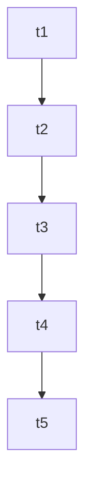

# Task Breakdown: Global Error Handler

## Checklist

- [ ] **Wave 1: Implementation**
  - [ ] Implement `FriendlyErrorWidget` and `_logGlobalError` in `lib/main.dart` <!-- id: t1 -->
  - [ ] Setup `FlutterError.onError`, `PlatformDispatcher.instance.onError`, and `ErrorWidget.builder` in `main()` <!-- id: t2 -->

- [ ] **Wave 2: Verification**
  - [ ] Run `flutter analyze` to ensure static analysis passes cleanly <!-- id: t3 -->
  - [ ] Run `flutter test` to verify all unit/database/widget tests pass <!-- id: t4 -->
  - [ ] Run the master checklist script to confirm project compliance <!-- id: t5 -->

---

## Task Mapping

| Task ID | Agent | Skill | Verification Criteria |
|---------|-------|-------|-----------------------|
| `t1` | mobile-developer | clean-code | FriendlyErrorWidget is defined and adapts to dynamic ThemeData |
| `t2` | mobile-developer | clean-code | Global handlers are successfully initialized in main() |
| `t3` | mobile-developer | verify-changes | `flutter analyze` returns zero errors and warnings |
| `t4` | mobile-developer | verify-changes | All unit and widget tests pass successfully |
| `t5` | mobile-developer | verify-changes | Checklist script completes with a green/success exit code |

---

## Dependency Waves

