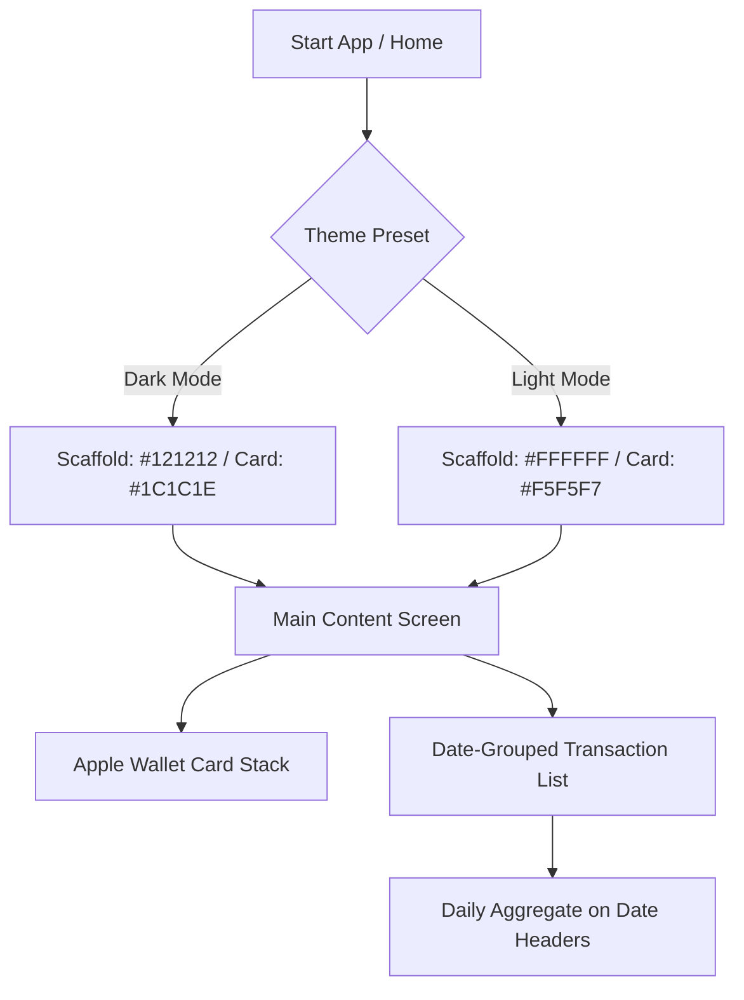

# Design: Ivy UX Integration & Theme Minimalization

This document details the architectural changes, UI/UX tokens, and file-level modifications required to integrate the new minimalist theme, layout structure, category redesign, amount calculator, and fluid line chart.

---

## 1. Theme and Color Tokens

### 1.1 Apple-Style Light Mode
Designed to feel clean, airy, and high-end, inspired by Apple's minimalist aesthetic:
* **Scaffold Background**: `#FFFFFF` (Pure white)
* **Card / Container Surfaces**: `#F5F5F7` (Soft light gray for clean grouping)
* **Input Fields / Secondary Fills**: `#ECECEF` (Slightly darker contrast for inputs)
* **Primary Text**: `#1D1D1F` (Near-black charcoal for readability)
* **Secondary Text**: `#86868B` (Medium neutral gray)
* **Primary Accent Color**: `#5E17EB` (Vibrant deep purple/indigo)
* **Borders / Dividers**: `#E5E5EA` (Ultra-subtle boundaries)
* **Shadows**: Soft, blurry, diffuse shadow with very low opacity (`Colors.black.withOpacity(0.02)`)

### 1.2 Premium Dark Gray Dark Mode
Designed to be gentle on the eyes while retaining high contrast for colorful elements:
* **Scaffold Background**: `#121212` (Material standard Dark Gray)
* **Card / Container Surfaces**: `#1C1C1E` (Lighter gray surface contrast)
* **Input Fields / Secondary Fills**: `#2C2C2E` (Secondary input surface)
* **Primary Text**: `#F5F5F7` (Bright off-white for low glare)
* **Secondary Text**: `#8E8E93` (Subtle gray)
* **Primary Accent Color**: `#9D7BFF` (Luminous violet accent)
* **Borders / Dividers**: `#2C2C2E` (Subtle boundary lines)
* **Shadows**: None (rely strictly on borders and elevations)

---

## 2. File Modification Plans

### 2.1 [theme_provider.dart](file:///c:/Codingg/duasaku_app/lib/core/theme/theme_provider.dart)
- Remove `AppThemePreset.rosePine` and `AppThemePreset.cyberpunk` from the `AppThemePreset` enum.
- Keep `AppThemePreset.defaultPurple` to represent our core Minimalist theme.
- Update `ThemePresets.getDetails` switch block to remove `rosePine` and `cyberpunk` cases entirely.
- Update `ThemePresets.getDetails` for the core preset to use the exact color hex codes described above:
  - **Dark mode colors**: `bgColor = Color(0xFF121212)`, `surfaceColor = Color(0xFF1C1C1E)`, `textColor = Color(0xFFF5F5F7)`, `accentColor = Color(0xFF9D7BFF)`.
  - **Light mode colors**: `bgColor = Color(0xFFFFFFFF)`, `surfaceColor = Color(0xFFF5F5F7)`, `textColor = Color(0xFF1D1D1F)`, `accentColor = Color(0xFF5E17EB)`.

### 2.2 [liquid_glass_theme.dart](file:///c:/Codingg/duasaku_app/lib/core/theme/liquid_glass_theme.dart)
- Remove factory constructors `rosePineDark()`, `rosePineLight()`, `cyberpunkDark()`, and `cyberpunkLight()`.
- Update `defaultPurpleDark()` and `defaultPurpleLight()` to align with the new base surface colors.
- Adjust `borderGlowColor` opacity to keep the glass lines clean.

### 2.3 [home_screen.dart](file:///c:/Codingg/duasaku_app/lib/features/transactions/presentation/screens/home_screen.dart)
- Restructure the scrollable content to divide into the two hybrid sections:
  - **Hero Stack**: The existing `_WalletStackedLayout` widget.
  - **Grouped Feed**: Retrieve transactions, group them in memory by date (ignoring time), and calculate daily sums (Daily Income - Daily Expense).
  - Use custom slivers or a date-grouped rendering delegate to output sticky headers for dates with daily aggregations written in bold on the right side of the headers.

### 2.4 [transaction_draft_bottom_sheet.dart](file:///c:/Codingg/duasaku_app/lib/features/transactions/presentation/widgets/transaction_draft_bottom_sheet.dart)
- Modify the item builder inside `GridView.builder` for category selections:
  - Apply `BackdropFilter` with `ImageFilter.blur(sigmaX: 5, sigmaY: 5)` inside the selection container or use `GlassCard`.
  - Enclose the category icon in a circular `Container` with a background color set to `catColor.withOpacity(0.12)`.
  - Change category labels to use monochrome color matching the primary/secondary text of the theme.
  - For the active category selection (`isSelected`), apply a thicker border (`width: 2.0`) in the category's signature color, and add a subtle glowing `BoxShadow` colored with the category color.

---

## 3. UI/UX Flow & Architecture



---

## 4. Amount Field Calculator Engine

To support mathematical operations inside input fields (e.g., `12000 + 5000`), we will introduce a safe math evaluation engine in a utility helper class.

### 4.1 Implementation of [math_parser.dart](file:///c:/Codingg/duasaku_app/lib/core/utils/math_parser.dart) [NEW]
We will implement a custom, lightweight, fully offline parser to evaluate basic expressions safely without crashing. 
The parser will:
1. Strip out thousand-separator formatting (dots/commas depending on locale) to parse raw digits.
2. Validate the expression syntax using regex: `^[0-9+\-*/().\s]+$` to prevent code injection.
3. Compute the result using standard precedence (PEMDAS/BODMAS) or a simple stack evaluator.

```dart
class MathParser {
  /// Evaluates a simple mathematical expression. Returns null if invalid.
  static double? eval(String expression) {
    // Sanitize input
    String sanitized = expression
        .replaceAll(RegExp(r'\s+'), '') // Remove whitespace
        .replaceAll('.', '');           // Remove thousand dots (IDR format)
    
    // Replace comma with dot if decimals are entered
    sanitized = sanitized.replaceAll(',', '.');

    // Only allow digits and basic operators
    final validPattern = RegExp(r'^[0-9+\-*/().]+$');
    if (!validPattern.hasMatch(sanitized)) return null;

    try {
      return _parseExpression(sanitized);
    } catch (_) {
      return null;
    }
  }

  static double _parseExpression(String expr) {
    // A simple parser implementation handling +, -, *, /
    // ... Stack or recursive descent parser ...
    return 0.0; // Placeholder for actual evaluator code
  }
}
```

### 4.2 Integration in Amount Input Fields
In [transaction_draft_bottom_sheet.dart](file:///c:/Codingg/duasaku_app/lib/features/transactions/presentation/widgets/transaction_draft_bottom_sheet.dart) and manual amount input fields:
- Keep `TextInputType.text` or numeric-friendly character sets (allowing operators).
- Attach a listener or use the `onEditingComplete` / `onChanged` logic to evaluate the expression.
- If a user types `15000 + 5000` and taps "Done" or moves focus, the controller text updates to `20.000` (formatting with the thousands utility).

---

## 5. Visual Analytics Overhaul (Fluid Charts)

### 5.1 Fluid Line Chart (Trend View) in [insights_screen.dart](file:///c:/Codingg/duasaku_app/lib/features/insights/presentation/screens/insights_screen.dart)
We will introduce a trend-line chart on the Financial Insights screen showing cumulative or daily spending over the month.

The chart will use the following specific `fl_chart` configuration properties to look clean, fluid, and uncluttered:

* **Grid Customization**:
  ```dart
  FlGridData(show: false) // Completely remove horizontal and vertical gridlines
  ```
* **Border Customization**:
  ```dart
  FlBorderData(show: false) // Remove bounding box borders
  ```
* **Titles / Labels**:
  ```dart
  FlTitlesData(
    show: true,
    topTitles: const AxisTitles(sideTitles: SideTitles(showTitles: false)),
    rightTitles: const AxisTitles(sideTitles: SideTitles(showTitles: false)),
    leftTitles: const AxisTitles(sideTitles: SideTitles(showTitles: false)), // Hide y-axis scale
    bottomTitles: AxisTitles(
      sideTitles: SideTitles(
        showTitles: true,
        reservedSize: 30,
        interval: 7, // Show tick marks weekly (e.g. Day 1, 8, 15, 22, 29)
        getTitlesWidget: (value, meta) {
          // Return lightweight date labels (e.g., "7 Jun", "14 Jun")
        },
      ),
    ),
  )
  ```
* **Line Configuration (`LineChartBarData`)**:
  ```dart
  LineChartBarData(
    isCurved: true,
    curveSmoothness: 0.35, // Smooth curves instead of sharp angles
    barWidth: 4,
    color: theme.colorScheme.primary, // Luminous primary accent color
    dotData: const FlDotData(show: false), // Hide dots along the line for minimalist look
    belowBarData: BarAreaData(
      show: true,
      gradient: LinearGradient(
        colors: [
          theme.colorScheme.primary.withOpacity(0.30), // 30% Opacity at top
          theme.colorScheme.primary.withOpacity(0.00), // Fades to transparent at bottom
        ],
        begin: Alignment.topCenter,
        end: Alignment.bottomCenter,
      ),
    ),
  )
  ```
