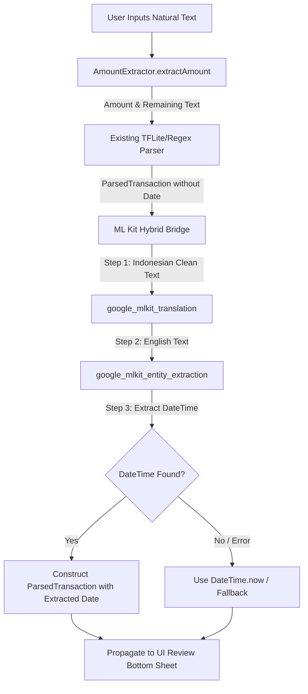

# Design Document: Level 4 Hybrid Parser Pipeline

## 1. System Architecture
The Level 4 Hybrid Parser Pipeline is built on top of the existing transaction parser system in `duasaku_app`. It separates financial information parsing (handled by TFLite/Regex) from temporal (date/time) parsing (handled by ML Kit).



---

## 2. Component Structure

### A. Core Models

#### `ParsedTransaction`
Add `final DateTime? date` to the `ParsedTransaction` model:
```dart
class ParsedTransaction {
  final double amount;
  final String category;
  final String type; // 'income', 'expense'
  final String? walletId;
  final String notes;
  final DateTime? date; // <--- NEW

  const ParsedTransaction({
    required this.amount,
    required this.category,
    required this.type,
    this.walletId,
    required this.notes,
    this.date, // <--- NEW
  });
}
```

---

### B. Services

#### `SmartInputMlService` (New)
A service class `SmartInputMlService` (`lib/services/smart_input_ml_service.dart`) responsible for managing ML Kit model states, offline translation, and entity extraction.

* **Interface:**
  ```dart
  abstract class SmartInputMlService {
    Future<void> initializeSilently();
    Future<DateTime?> extractDateTime(String text, {DateTime? referenceDate});
    Future<void> close();
  }
  ```
* **Implementation details:**
  - Uses `OnDeviceTranslatorModelManager` and `EntityExtractorModelManager` to check if models are downloaded.
  - Trigger model downloads in the background asynchronously during `initializeSilently()`.
  - Performs translation from ID to EN, followed by EN Entity Extraction to obtain a `DateTimeEntity` timestamp.

---

### C. State Management & DI (Riverpod)

#### `smartInputMlProvider` (New)
We will introduce `smartInputMlProvider` in `lib/services/service_providers.dart`:
```dart
final smartInputMlServiceProvider = Provider<SmartInputMlService>((ref) {
  return SmartInputMlServiceImpl();
});
```

We will also update `transactionParserServiceProvider` to inject `smartInputMlServiceProvider` into the `SmartParserOrchestrator`.

---

### D. Pipeline Execution (`SmartParserOrchestrator`)
We will upgrade `SmartParserOrchestrator` to perform the sequential hybrid logic:
```dart
class SmartParserOrchestrator implements TransactionParserServiceInterface {
  final TfliteTransactionParserService tfliteService;
  final LocalTransactionParserService localService;
  final SmartInputMlService mlService; // <--- NEW Injection
  final Duration timeout;

  // ...

  @override
  Future<ParsedTransaction> parseTransaction({
    required String inputText,
    required List<WalletInfo> wallets,
    required List<CategoryInfo> categories,
  }) async {
    // 1. Run standard TFLite / Regex parser first
    ParsedTransaction parsedResult;
    try {
      parsedResult = await tfliteService.parseTransaction(
        inputText: inputText,
        wallets: wallets,
        categories: categories,
      ).timeout(timeout);
    } catch (_) {
      parsedResult = localService.parseTransactionSync(
        inputText: inputText,
        wallets: wallets,
        categories: categories,
      );
    }

    // 2. Extract remaining text without money tokens (already handled by AmountExtractor)
    final extraction = AmountExtractor.extractAmount(inputText);
    final textWithoutAmount = extraction.textWithoutAmount;

    // 3. Pass to ML Kit service to get date/time
    DateTime? parsedDate;
    try {
      parsedDate = await mlService.extractDateTime(textWithoutAmount).timeout(timeout);
    } catch (e) {
      debugPrint('[SmartParserOrchestrator] ML Kit date extraction failed: $e');
    }

    // 4. Return combined ParsedTransaction
    return ParsedTransaction(
      amount: parsedResult.amount,
      category: parsedResult.category,
      type: parsedResult.type,
      walletId: parsedResult.walletId,
      notes: parsedResult.notes,
      date: parsedDate ?? DateTime.now(), // Fallback to now
    );
  }
}
```

---

## 3. UI Integration & Database Lifecycle
1. **Startup Initialization:**
   In `main.dart`, we read `smartInputMlServiceProvider` using the `ProviderContainer` to run `initializeSilently()` immediately, triggering model downloads in the background.
2. **Review Bottom Sheet (`TransactionDraftBottomSheet`):**
   - Read the parsed date (`widget.draftData.date ?? DateTime.now()`) and bind it to a state variable `_selectedDate`.
   - Add a styled date/time picker button to the review modal, so the user can see and edit the parsed date before saving.
   - When calling `ref.read(transactionNotifierProvider.notifier).createTransaction(...)`, pass `createdAt: _selectedDate`.
3. **Database Integration:**
   `createTransaction` will pass the custom `createdAt` date to `TransactionModel`, which is then persisted to the database.
