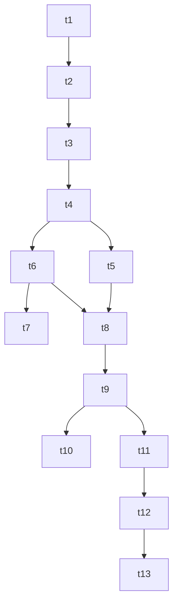

# Task Breakdown: Level 3 Joint NLP Model Integration

## Checklist

- [x] **Wave 1: Asset Setup & Package Dependencies**
  - [x] Copy TFLite model and metadata files to `assets/ml/` <!-- id: t1 -->
  - [x] Add `tflite_flutter` dependency and configure assets block in `pubspec.yaml` <!-- id: t2 -->
  - [x] Run `flutter pub get` and verify dependency integration <!-- id: t3 -->

- [x] **Wave 2: Service Contracts & Tokenizer Implementation**
  - [x] Create `TransactionParserServiceInterface` to decouple parsing service <!-- id: t4 -->
  - [x] Update `LocalTransactionParserService` & `TransactionParserService` (Level 1) to implement the interface <!-- id: t5 -->
  - [x] Create `DartTokenizer` in `lib/core/utils/dart_tokenizer.dart` with lowercase + punct stripping + mapping + pad/truncating <!-- id: t6 -->
  - [x] Create unit tests for `DartTokenizer` in `test/core/utils/dart_tokenizer_test.dart` and verify standard inputs <!-- id: t7 -->

- [x] **Wave 3: TFLite Service Implementation**
  - [x] Create `TfliteTransactionParserService` in `lib/features/transactions/services/tflite_transaction_parser_service.dart` <!-- id: t8 -->
  - [x] Implement TFLite interpreter loading, multiple inputs/outputs routing, dynamic shape evaluation, argmax mapping, and amount multiplier parsing <!-- id: t9 -->
  - [x] Create unit tests for `TfliteTransactionParserService` using mock/stub and verify model parsing behaves correctly <!-- id: t10 -->

- [x] **Wave 4: Provider Wiring & Verification**
  - [x] Update `lib/services/service_providers.dart` to expose `TransactionParserServiceInterface` and swap Level 1 with Level 3 `TfliteTransactionParserService` <!-- id: t11 -->
  - [x] Update usages in `TransactionNotifier` and related components to reference the interface <!-- id: t12 -->
  - [x] Run manual verification via debug builds and check if transactions are correctly parsed <!-- id: t13 -->

---

## Task Mapping

| Task ID | Agent | Skill | Verification Criteria |
|---------|-------|-------|-----------------------|
| `t1` | mobile-developer | clean-code | Files copied to `assets/ml/` |
| `t2` | mobile-developer | clean-code | `pubspec.yaml` has `tflite_flutter` and `assets/ml/` |
| `t3` | mobile-developer | clean-code | Build succeeds with new assets |
| `t4` | mobile-developer | clean-code | Interface class is defined |
| `t5` | mobile-developer | clean-code | Level 1 compiles successfully |
| `t6` | mobile-developer | clean-code | String tokenization output matches Python pipeline |
| `t7` | mobile-developer | testing-patterns | Tests pass with various punctuation and edge cases |
| `t8` | mobile-developer | clean-code | Service class skeleton compiles |
| `t9` | mobile-developer | clean-code | Multi-dimensional output tensors are correctly decoded |
| `t10` | mobile-developer | testing-patterns | In-memory evaluation and inference tests pass |
| `t11` | mobile-developer | clean-code | Riverpod provider returns `TransactionParserServiceInterface` |
| `t12` | mobile-developer | clean-code | Application builds successfully without type errors |
| `t13` | mobile-developer | verify-changes | Android/iOS build runs and handles transaction entry bottom sheet |

---

## Dependency Waves

