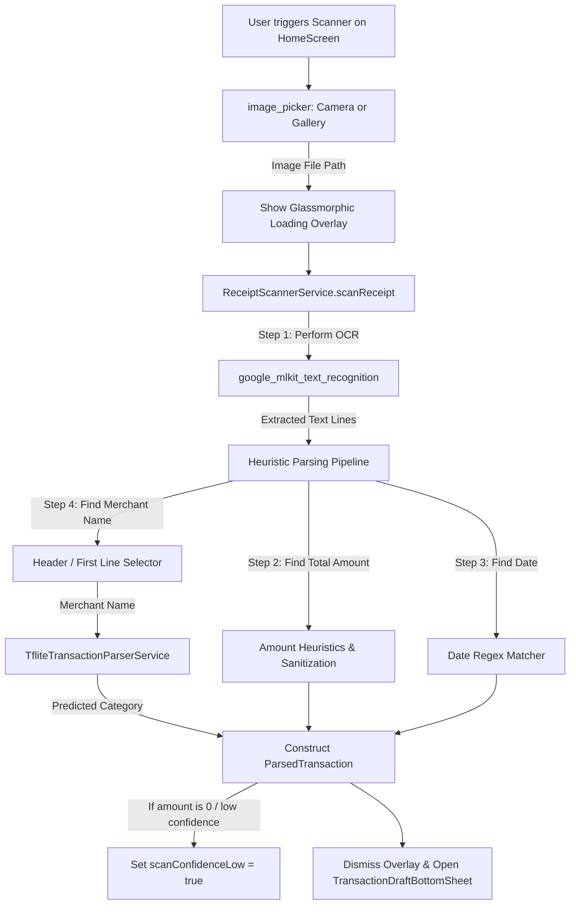

# Design Document: Offline Receipt Scanner

## 1. System Architecture
The offline receipt scanner integrates Google ML Kit's Text Recognition SDK to perform OCR on a receipt image. The raw text blocks are parsed using a local heuristic parser to extract the financial amount, date, and merchant name. The merchant name is then classified by the existing TFLite model to automatically assign a category.



---

## 2. Component Structures & Logic

### A. Core Model Extension
We will update `ParsedTransaction` to include metadata about the scanning process:
```dart
class ParsedTransaction {
  final double amount;
  final String category;
  final String type; // 'income', 'expense'
  final String? walletId;
  final String notes;
  final DateTime? date;
  final bool isReceiptScan;        // <--- NEW
  final bool scanConfidenceLow;    // <--- NEW

  const ParsedTransaction({
    required this.amount,
    required this.category,
    required this.type,
    this.walletId,
    required this.notes,
    this.date,
    this.isReceiptScan = false,
    this.scanConfidenceLow = false,
  });
}
```

---

### B. Heuristics & OCR Text Parsing Pipeline
The parser runs inside `ReceiptScannerService` (under `lib/services/receipt_scanner_service.dart`).

#### 1. Price Token Sanitization
OCR engines often mistake numbers for letters. We must sanitize price strings:
- If a word is adjacent to a currency or total keyword and consists mostly of digits mixed with letters 'O' or 'o', replace 'O'/'o' with '0'.
- Remove currency prefixes/suffixes (e.g., "rp", "idr", "rupiah", ",-", ".00").
- Example: `"1O.OOO"` becomes `"10.000"`, which parses to `10000.0`.

#### 2. Amount Heuristic Selection
- **Keyword Regex:** Match lines against `(?i)\b(total|grand|netto|bayar|cash|jumlah|payment|tagihan)\b`.
- **Search Logic:**
  1. For each matching keyword line, extract numeric tokens in that line or the lines immediately following it.
  2. Parse these tokens into numeric values.
  3. Sort all candidate numbers found in the entire document. The largest number is usually the total amount (since individual items cost less than the total).
  4. If the largest number is adjacent to a total keyword, we mark it as high confidence. If no total keywords match or the largest number is not near one, fallback to the largest number found but set `scanConfidenceLow = true`.

#### 3. Date Matcher
- Run regex matching over all lines to capture typical Indonesian date strings:
  - DD/MM/YYYY or DD-MM-YYYY: `\b\d{1,2}[/\-]\d{1,2}[/\-]\d{2,4}\b`
  - Indonesian Month Names: `\b\d{1,2}\s+(jan|feb|mar|apr|mei|jun|jul|agu|sep|okt|nov|des)[a-z]*\s+\d{2,4}\b` (case insensitive).
- If multiple dates are found, pick the first one. If none are found, use `DateTime.now()`.

#### 4. Merchant Name Selection
- The merchant name is usually located in the first 1-3 lines of the receipt.
- Exclude address lines, phone numbers, email addresses, or website patterns:
  - Phone: `\+?\d[\d\-\s]{7,}\d`
  - Web: `\b(www\.|http:|https:)[^\s]+` or `\.com\b`
- Select the first non-empty, non-noise line as the Merchant Name, cleaned of leading/trailing non-word characters.

---

### C. Services & Riverpod Providers
Create `receiptScannerServiceProvider` in `lib/services/service_providers.dart`:
```dart
final receiptScannerServiceProvider = Provider<ReceiptScannerService>((ref) {
  final tfliteService = ref.watch(transactionParserServiceProvider);
  return ReceiptScannerServiceImpl(tfliteService);
});
```

---

## 3. UI/UX Flow & Fallback Integration

### A. Scanning Trigger & Camera/Gallery Picker
In `HomeScreen`, add a camera icon next to the Smart Input submit button.
Clicking the camera icon shows a modal popup styled with liquid glass borders:
- **Button 1:** "Ambil Foto" (Camera)
- **Button 2:** "Pilih dari Galeri" (Gallery)

```dart
Future<void> _scanReceipt(ImageSource source) async {
  final ImagePicker picker = ImagePicker();
  final XFile? image = await picker.pickImage(source: source);
  if (image == null) return;

  setState(() => _isProcessingAI = true); // Triggers glass loading overlay
  
  try {
    final draft = await ref.read(receiptScannerServiceProvider).scanReceipt(image.path);
    if (mounted) {
      showModalBottomSheet(
        context: context,
        isScrollControlled: true,
        backgroundColor: Colors.transparent,
        builder: (context) => TransactionDraftBottomSheet(draftData: draft),
      );
    }
  } catch (e) {
    if (mounted) {
      ScaffoldMessenger.of(context).showSnackBar(
        SnackBar(content: Text('Gagal memproses struk: $e')),
      );
    }
  } finally {
    if (mounted) setState(() => _isProcessingAI = false);
  }
}
```

### B. Fallback UX Warning Badge
In `TransactionDraftBottomSheet` (`lib/features/transactions/presentation/widgets/transaction_draft_bottom_sheet.dart`), if `widget.draftData.isReceiptScan` is `true` and `widget.draftData.scanConfidenceLow` is `true`, render a subtle, warm amber warning box directly under the Amount field:

```dart
if (widget.draftData.isReceiptScan && widget.draftData.scanConfidenceLow)
  Container(
    margin: const EdgeInsets.only(top: 8),
    padding: const EdgeInsets.symmetric(horizontal: 16, vertical: 12),
    decoration: BoxDecoration(
      color: Colors.amber.withValues(alpha: 0.1),
      borderRadius: BorderRadius.circular(12),
      border: Border.all(color: Colors.amber.withValues(alpha: 0.25)),
    ),
    child: Row(
      children: [
        const Icon(Icons.warning_amber_rounded, color: Colors.amber, size: 20),
        const SizedBox(width: 10),
        Expanded(
          child: Text(
            'bottom_sheet.ocr_low_confidence_warning'.tr(),
            style: const TextStyle(
              color: Colors.amber,
              fontSize: 12,
              fontWeight: FontWeight.w500,
            ),
          ),
        ),
      ],
    ),
  ),
```
