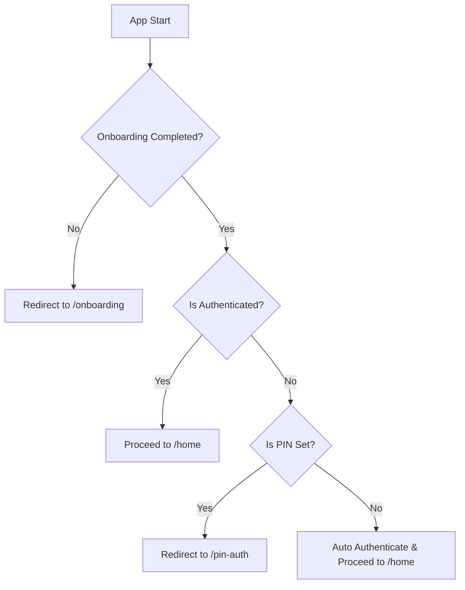
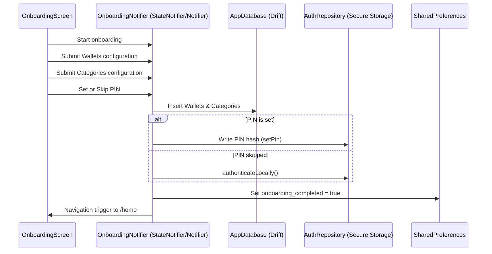

# Specification: Onboarding & Optional PIN Setup Flow - Design

## 1. Routing Architecture

GoRouter redirect logic in `app_router.dart` will be modified to support `/onboarding`:



### Route Registration
* `/onboarding`: Points to `OnboardingScreen`. It is a root route (not nested in StatefulShellRoute).

---

## 2. Onboarding Screen Data Pipeline



---

## 3. Storage & State Configurations

### SharedPreferences
* Key: `onboarding_completed` (bool)
  * `false` or missing: Needs onboarding.
  * `true`: Onboarding has been completed.

### AuthRepository Startup Check
On construction, `AuthRepository` will check the status of onboarding and PIN setup:
```dart
Future<void> checkInitialState() async {
  final prefs = await SharedPreferences.getInstance();
  final onboardingDone = prefs.getBool('onboarding_completed') ?? false;
  final hasPin = await hasPinSet();
  
  if (onboardingDone && !hasPin) {
    _isAuthenticated = true;
    _currentUser = User(id: AppConstants.defaultUserId, email: AppConstants.defaultUserEmail);
    notifyListeners();
  }
}
```

---

## 4. UI Layout & Component Styling
* **Overlay**: Use `PremiumBackground` as the canvas.
* **Containers**: Glassmorphism rounded boxes with border highlighting.
* **Interactive Elements**: Large buttons (48dp target) with micro-animations and haptic vibration feedback.
