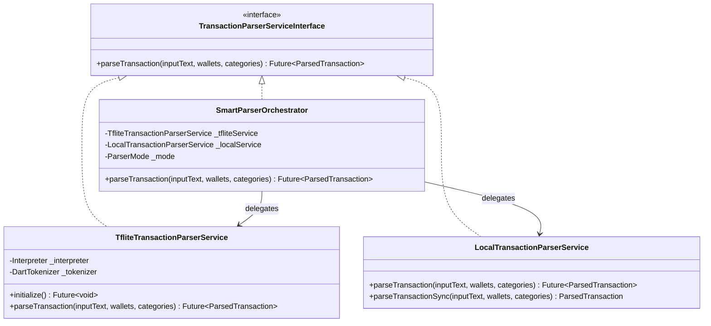
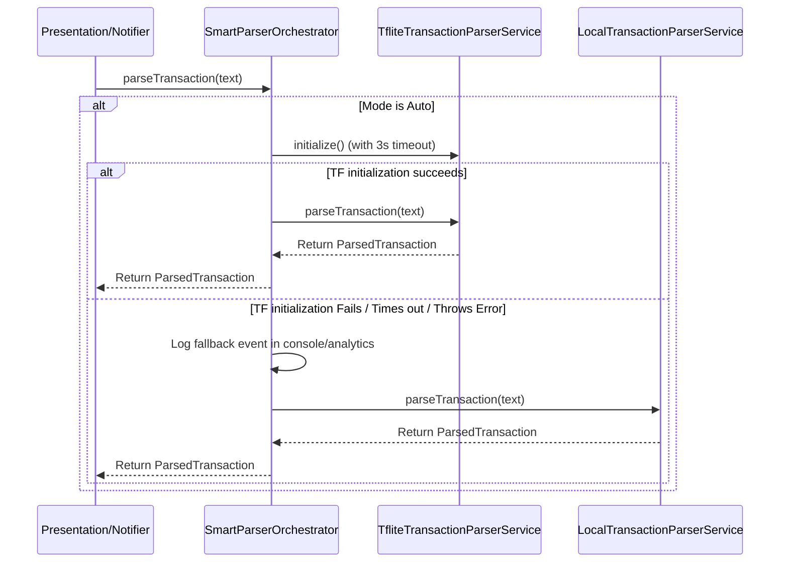
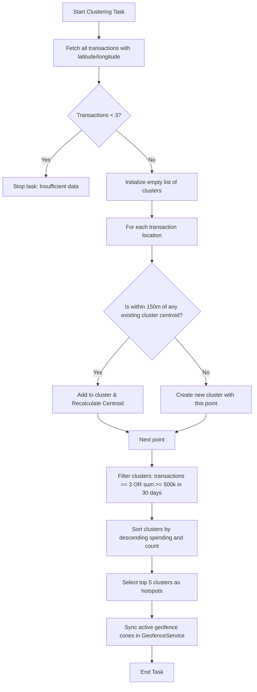

# Technical Design: Smart Parser Orchestrator & Dynamic Contextual Geofencing

This document details the architectural design, database schemas, class relationships, and background processing pipelines for both features.

---

## 1. Smart Parser Orchestrator Design

### 1.1 Class Diagram & Interfaces
We will use the **Adapter/Orchestrator Pattern** to wrap the Level 3 (TFLite) and Level 1 (Local Regex) parsers under the unified `TransactionParserServiceInterface`.



### 1.2 State & Provider Wiring
We will define an enum `ParserMode` and load it from `SharedPreferences` within a dedicated state notifier.

```dart
enum ParserMode {
  auto,        // TFLite with Regex fallback
  tfliteOnly,  // Exclusively TFLite
  regexOnly,   // Exclusively Regex/Fuzzy
}

// Managed preferences provider
final parserModeProvider = StateProvider<ParserMode>((ref) {
  // Initialized at startup via SharedPreferences
  return ParserMode.auto;
});

// Orchestrated service provider
final transactionParserServiceProvider = Provider<TransactionParserServiceInterface>((ref) {
  final mode = ref.watch(parserModeProvider);
  final tfliteService = TfliteTransactionParserService();
  final localService = LocalTransactionParserService();

  switch (mode) {
    case ParserMode.tfliteOnly:
      return tfliteService;
    case ParserMode.regexOnly:
      return localService;
    case ParserMode.auto:
      return SmartParserOrchestrator(
        tfliteService: tfliteService,
        localService: localService,
      );
  }
});
```

### 1.3 Orchestration Flow
When `parseTransaction` is called on the `SmartParserOrchestrator`:



---

## 2. Dynamic Contextual Geofencing Design

### 2.1 Database Schema Migration (Drift)
To support transaction coordinates, we modify the `Transactions` table definition in `lib/core/local_db/app_database.dart`:

```dart
class Transactions extends Table {
  IntColumn get id => integer().autoIncrement()();
  TextColumn get userId => text()();
  TextColumn get walletId => text().nullable().references(Wallets, #id, onDelete: KeyAction.restrict)();
  TextColumn get fromWalletId => text().nullable().references(Wallets, #id, onDelete: KeyAction.restrict)();
  TextColumn get toWalletId => text().nullable().references(Wallets, #id, onDelete: KeyAction.restrict)();
  TextColumn get categoryId => text().nullable().references(Categories, #id, onDelete: KeyAction.setNull)();
  RealColumn get amount => real()();
  TextColumn get notes => text().nullable()();
  DateTimeColumn get date => dateTime()();
  TextColumn get type => text()();
  TextColumn get badge => text().nullable()();
  
  // NEW: Location coordinates
  RealColumn get latitude => real().nullable()();
  RealColumn get longitude => real().nullable()();
}
```

#### Migration Logic (v8 to v9)
In `AppDatabase`'s `onUpgrade` block:
```dart
if (from < 9) {
  await m.addColumn(transactions, transactions.latitude);
  await m.addColumn(transactions, transactions.longitude);
}
```
*Note: Since SQLite doesn't require default values for nullable columns, this column add operation is non-destructive and safe for pre-existing transactions.*

### 2.2 Offline Location-Based Hotspot Clustering
We will implement `LocationClusteringService`. It reads from the local database and aggregates coordinates.

#### Clustering Pipeline (Haversine Distance-Based Centroids)
A lightweight centroid clustering algorithm suitable for offline mobile runtimes:



#### Haversine Formula Helper
To calculate distance between coordinates locally in Dart:
```dart
import 'dart:math' as math;

double calculateDistance(double lat1, double lon1, double lat2, double lon2) {
  const R = 6371000; // Earth radius in meters
  final dLat = _toRadians(lat2 - lat1);
  final dLon = _toRadians(lon2 - lon1);
  final a = math.sin(dLat / 2) * math.sin(dLat / 2) +
      math.cos(_toRadians(lat1)) * math.cos(_toRadians(lat2)) *
      math.sin(dLon / 2) * math.sin(dLon / 2);
  final c = 2 * math.atan2(math.sqrt(a), math.sqrt(1 - a));
  return R * c;
}

double _toRadians(double degree) => degree * math.pi / 180;
```

### 2.3 Geofence Synchronization
The `GeofenceService` will expose an interface to accept a new set of hotspots:

```dart
class GeofenceHotspot {
  final String id;
  final double latitude;
  final double longitude;
  final String name; // e.g., "Food Spot", "Shopping Mall" based on top category in cluster
  
  GeofenceHotspot({required this.id, required this.latitude, required this.longitude, required this.name});
}

abstract class GeofenceServiceInterface {
  Future<void> initialize();
  Future<void> startMonitoring();
  Future<void> updateGeofences(List<GeofenceHotspot> hotspots);
  void dispose();
}
```

In the concrete `GeofenceService`, `updateGeofences` will:
1. Fetch currently registered geofences.
2. Unregister geofences that are no longer in the new hotspot list.
3. Register new hotspot coordinates (radius: 150m, triggers on Entry).
4. Save the current geofence configurations to `SharedPreferences` to persist state across app lifecycles.
