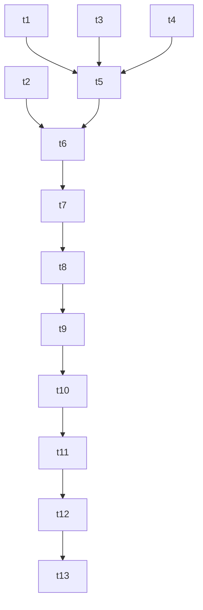

# Task Breakdown: Gemini Decommissioning & Mobile Audit Fixes

## Checklist

- [x] **Wave 1: Gemini UI and Route Deletion**
  - [x] Remove AI Settings group label, card, and `_showGeminiKeyDialog` from `profile_screen.dart` <!-- id: t1 -->
  - [x] Remove OCR scan button, Lottie, and `_scanReceipt` method from `home_screen.dart` <!-- id: t2 -->
  - [x] Remove `/ai-chat` route and imports from `app_router.dart` and delete the `lib/features/ai_chat` directory <!-- id: t3 -->
  - [x] Remove Gemini API key settings and storage variables from `env.dart` <!-- id: t4 -->

- [x] **Wave 2: Service & Provider Decommissioning**
  - [x] Delete `lib/services/gemini_service.dart` and remove `geminiServiceProvider` from `service_providers.dart` <!-- id: t5 -->
  - [x] Remove Gemini service imports, fields, watchers, and `parseReceipt()` from `transaction_provider.dart` <!-- id: t6 -->
  - [x] Remove `google_generative_ai` from `pubspec.yaml` and run `flutter pub get` <!-- id: t7 -->

- [x] **Wave 3: Touch Targets & Haptic feedback**
  - [x] Adjust NTP recheck button height to minimum 48dp in `main.dart` <!-- id: t8 -->
  - [x] Fix touch target sizes for elements in `home_screen.dart` and `profile_screen.dart` <!-- id: t9 -->
  - [x] Add haptic feedback to transaction/transfer creation in `TransactionNotifier` and goals in `goal_detail_screen.dart`/`goal_form_screen.dart` <!-- id: t10 -->

- [x] **Wave 4: Verification**
  - [x] Run `flutter analyze` and fix any compile or analysis errors <!-- id: t11 -->
  - [x] Run `flutter test` to ensure all tests pass successfully <!-- id: t12 -->
  - [x] Run checklist script `$env:PYTHONUTF8=1; python .agent/scripts/checklist.py .` <!-- id: t13 -->

---

## Task Mapping

| Task ID | Agent | Skill | Verification Criteria |
|---------|-------|-------|-----------------------|
| `t1` | mobile-developer | clean-code | Profile screen has no Gemini settings or dialog code |
| `t2` | mobile-developer | clean-code | Home screen has no OCR scan button or camera controller logic |
| `t3` | mobile-developer | clean-code | AI Chat route removed, `ai_chat` directory deleted |
| `t4` | mobile-developer | clean-code | `env.dart` contains no Gemini keys |
| `t5` | mobile-developer | clean-code | `gemini_service.dart` deleted, `service_providers.dart` compiles |
| `t6` | mobile-developer | clean-code | `transaction_provider.dart` compiles with no references to Gemini |
| `t7` | mobile-developer | clean-code | `pubspec.yaml` has no `google_generative_ai` dependency |
| `t8` | mobile-developer | mobile-design | NTP button has height/minimumSize >= 48dp |
| `t9` | mobile-developer | mobile-design | Touch targets conform to standard |
| `t10` | mobile-developer | mobile-design | Taktil haptic trigger occurs on key events |
| `t11` | mobile-developer | verify-changes | `flutter analyze` returns no issues |
| `t12` | mobile-developer | verify-changes | All unit/widget tests pass cleanly |
| `t13` | mobile-developer | verify-changes | Master checklist script returns green/pass |

---

## Dependency Waves

