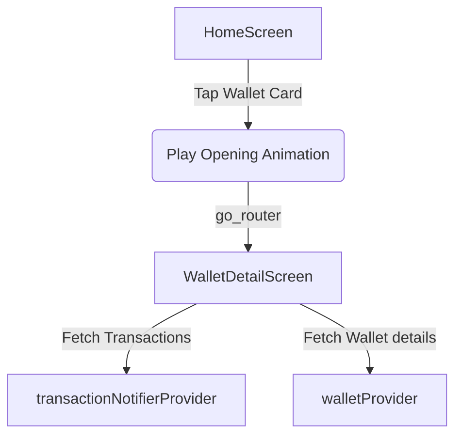

# Design — Wallet Redesign and Security Bug Fixes

## 1. Component Architecture

### 1.1 Stacked Wallet Widget (`_WalletStackedLayout`)
- Located in `home_screen.dart`.
- Instead of using a standard `PageView`, it renders a `Stack` of horizontal (landscape-style) cards.
- The height of the stack is computed dynamically to prevent excessive screen usage:
  `Stack Height = Card Height + (Wallet Count * Overlap Step)`
  where:
  - `Card Height = 130.0`
  - `Overlap Step = 40.0`
- Cards are ordered from bottom-to-top in the Stack's children list:
  - Child 0 (bottom-most, back): Wallet N
  - ...
  - Child N-1: Wallet 1
  - Child N (top-most, front): Total Assets Card
- Translation/Scale formula for card at index `i` (from `0` to `L`):
  - Card `L` (front): `offsetY = 0`, `scale = 1.0`, `opacity = 1.0`
  - Card `i` (where `0 <= i < L`):
    - `step = 80.0 / L`
    - `offsetY = - (L - i) * step`
    - `scale = 1.0 - (L - i) * 0.03`
    - `opacity = 0.7 + (i / L) * 0.3`

### 1.2 Wallet Detail Screen (`WalletDetailScreen`)
- Paths: `lib/features/wallets/presentation/screens/wallet_detail_screen.dart`
- UI elements:
  - Back button, settings/delete shortcuts.
  - Large premium wallet card matching the selected wallet type (gradient: Bank, E-Wallet, Cash).
  - Transaction section showing a filtered list of `TransactionModel` instances.
  - Filters to toggle viewing Income, Expense, or all transactions for this wallet.
- Filter criteria:
  `tx.walletId == walletId || tx.fromWalletId == walletId || tx.toWalletId == walletId`

## 2. Navigation Flow & State Management



- **WalletDetailScreen Route:**
  `/wallets/:walletId`
- **Security Check Bypass:**
  In `main.dart`, `SecurityWrapper` wraps routes:
  ```dart
  final authRepo = ref.watch(authRepositoryProvider);
  if (securityState.isLocked && authRepo.isOnboardingCompleted) {
    return const PinAuthScreen();
  }
  ```
